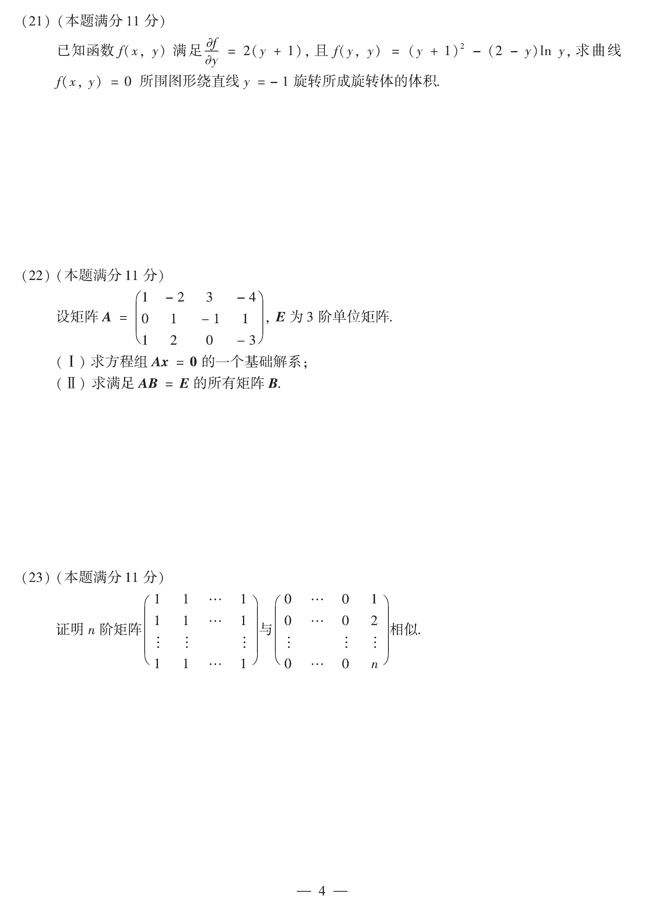

# 2014 数学二第 23 题

## 题目

证明 $n$ 阶矩阵
$$
A=
\begin{pmatrix}
1&1&\cdots&1\\
1&1&\cdots&1\\
\vdots&\vdots&\ddots&\vdots\\
1&1&\cdots&1
\end{pmatrix}
\quad\text{与}\quad
B=
\begin{pmatrix}
0&0&\cdots&0&1\\
0&0&\cdots&0&2\\
\vdots&\vdots&\ddots&\vdots&\vdots\\
0&0&\cdots&0&n
\end{pmatrix}
$$
相似。

## 标准答案

见解析

## 解析

先求 $A$ 的特征多项式。注意到 $A$ 的秩为 1，且向量 $(1,1,\dots,1)^\mathrm T$ 是其特征向量，对应特征值 $n$；其余与该向量正交的 $n-1$ 维子空间上均对应特征值 $0$。因此
$$
A\sim \operatorname{diag}(n,0,\dots,0).
$$

对矩阵 $B$，其特征多项式同样为
$$
\lambda^{\,n-1}(\lambda-n),
$$
即特征值也是 $n,0,\dots,0$。又由 $r(B)=1$，可知零特征值对应有 $n-1$ 个线性无关特征向量，因此 $B$ 也可相似对角化，且
$$
B\sim \operatorname{diag}(n,0,\dots,0).
$$
二者都与同一对角矩阵相似，所以 $A$ 与 $B$ 相似。

## 来源

- 题目来源：`math2_2014_questions.md`
- 答案来源：`math2_2014_answers.md`
