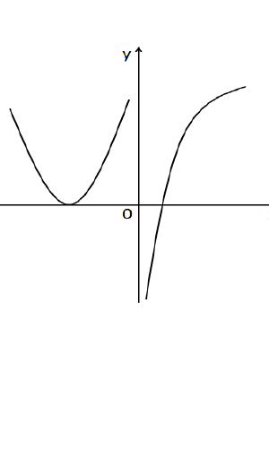

# 2015 数学二第 4 题

## 题目

设函数 $f(x)$ 在 $(-\infty,+\infty)$ 内连续，其中二阶导数 $f''(x)$ 的图形如图所示，则曲线
$$
y=f(x)
$$
的拐点个数为（ ）

(A) $0$

(B) $1$

(C) $2$

(D) $3$

## 标准答案

C

## 解析

拐点对应于 $f''(x)$ 变号的点。由图像可见，$f''(x)$ 恰有两处变号，
因此曲线 $y=f(x)$ 有两个拐点，故选 C。

## 来源

- 题目来源：`math2_2015_questions.md`
- 答案来源：`math2_2015_answers.md`
