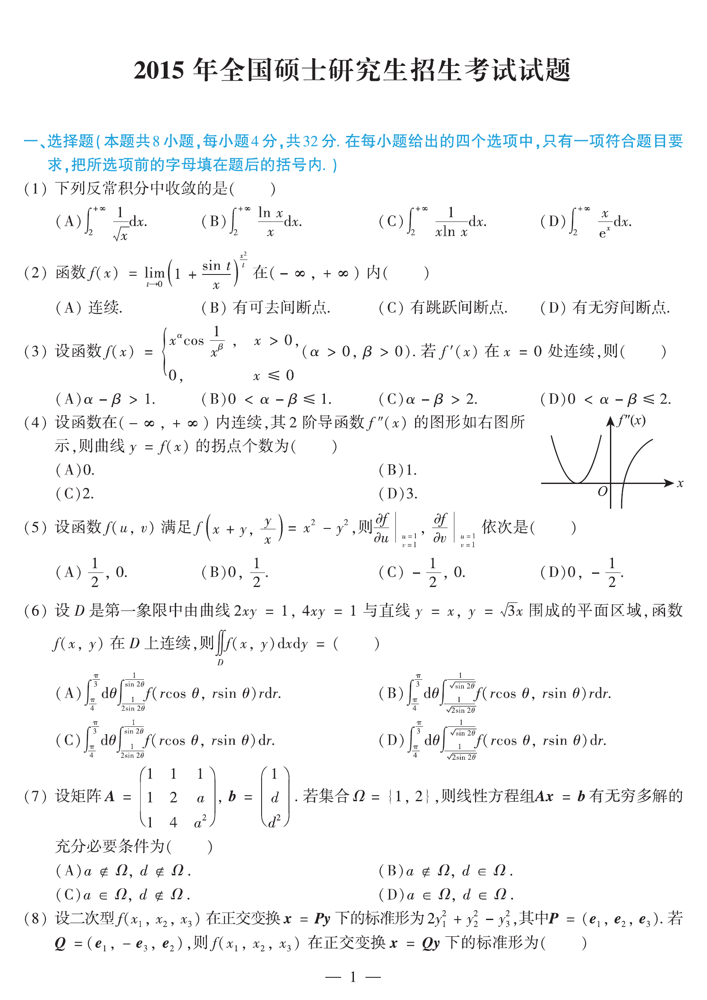

# 2015 数学二第 5 题

## 题目

设函数 $f(u,v)$ 满足
$$
f\!\left(x+y,\frac{y}{x}\right)=x^2-y^2,
$$
则
$$
\left.\frac{\partial f}{\partial u}\right|_{(1,1)}
\quad\text{与}\quad
\left.\frac{\partial f}{\partial v}\right|_{(1,1)}
$$
依次是（ ）

(A) $\left(\dfrac12,0\right)$

(B) $\left(0,\dfrac12\right)$

(C) $\left(-\dfrac12,0\right)$

(D) $\left(0,-\dfrac12\right)$

## 标准答案

D

## 解析

令
$$
u=x+y,\qquad v=\frac{y}{x},
$$
解得
$$
x=\frac{u}{1+v},\qquad y=\frac{uv}{1+v}.
$$
于是
$$
f(u,v)=x^2-y^2
=\left(\frac{u}{1+v}\right)^2-\left(\frac{uv}{1+v}\right)^2
=\frac{u^2(1-v)}{1+v}.
$$
因而
$$
\frac{\partial f}{\partial u}=\frac{2u(1-v)}{1+v},\qquad
\frac{\partial f}{\partial v}=-\frac{2u^2}{(1+v)^2}.
$$
在 $(u,v)=(1,1)$ 处有
$$
\left.\frac{\partial f}{\partial u}\right|_{(1,1)}=0,\qquad
\left.\frac{\partial f}{\partial v}\right|_{(1,1)}=-\frac12.
$$
故选 D。

## 来源

- 题目来源：`math2_2015_questions.md`
- 答案来源：`math2_2015_answers.md`
