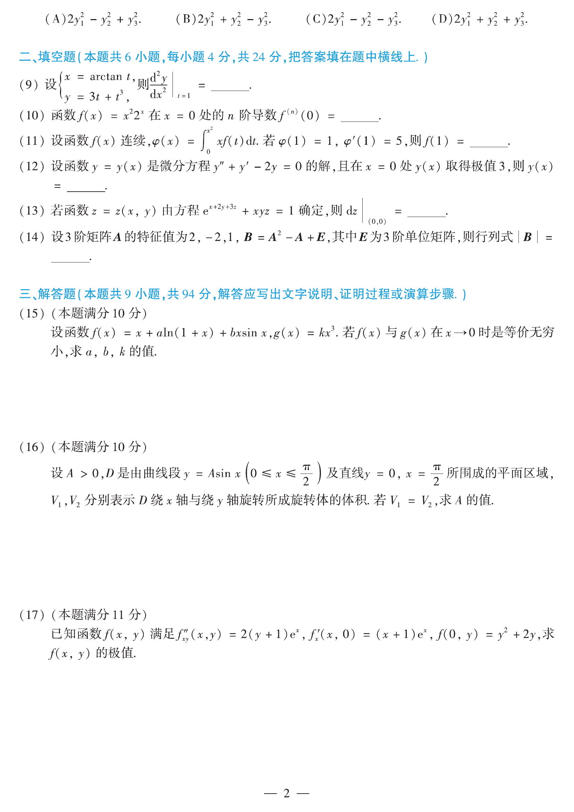

# 2015 数学二第 8 题

## 题目

设二次型 $f(x_1,x_2,x_3)$ 在正交变换 $x=Py$ 下的标准形为
$$
2y_1^2+y_2^2-y_3^2,
$$
其中 $P=(e_1,e_2,e_3)$。若
$$
Q=(e_1,-e_3,e_2),
$$
则 $f(x_1,x_2,x_3)$ 在正交变换 $x=Qy$ 下的标准形为（ ）

(A) $2y_1^2-y_2^2+y_3^2$

(B) $2y_1^2+y_2^2-y_3^2$

(C) $2y_1^2-y_2^2-y_3^2$

(D) $2y_1^2+y_2^2+y_3^2$

## 标准答案

A

## 解析

由 $x=Py$，可知
$$
f=x^{\mathsf T}Ax=y^{\mathsf T}(P^{\mathsf T}AP)y
=2y_1^2+y_2^2-y_3^2,
$$
因而
$$
P^{\mathsf T}AP=
\begin{pmatrix}
2&0&0\\
0&1&0\\
0&0&-1
\end{pmatrix}.
$$
又
$$
Q=PC,\qquad
C=
\begin{pmatrix}
1&0&0\\
0&0&1\\
0&-1&0
\end{pmatrix},
$$
所以
$$
Q^{\mathsf T}AQ=C^{\mathsf T}(P^{\mathsf T}AP)C=
\begin{pmatrix}
2&0&0\\
0&-1&0\\
0&0&1
\end{pmatrix}.
$$
因此新标准形为
$$
2y_1^2-y_2^2+y_3^2,
$$
故选 A。

## 来源

- 题目来源：`math2_2015_questions.md`
- 答案来源：`math2_2015_answers.md`
