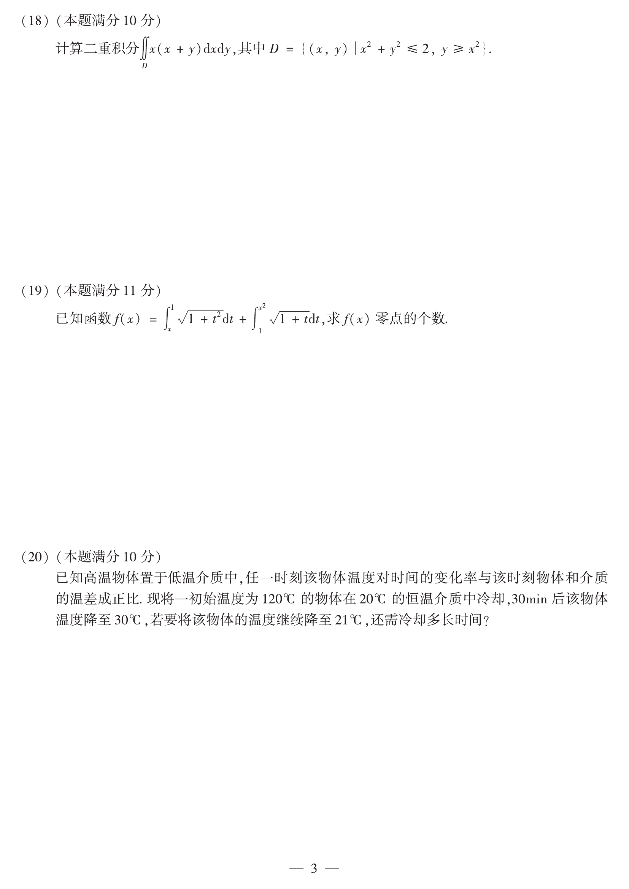

# 2015 数学二第 18 题

## 题目

计算二重积分
$$
\iint_D x(x+y)\,dxdy,
$$
其中
$$
D=\{(x,y)\mid x^2+y^2\le 2,\ y\ge x^2\}.
$$

## 标准答案

$\dfrac{\pi}{4}-\dfrac{2}{5}$

## 解析

由积分区域关于 $y$ 轴对称，且 $xy$ 关于 $y$ 轴为奇函数，
所以
$$
\iint_D xy\,dxdy=0.
$$
因而原积分化为
$$
\iint_D x^2\,dxdy.
$$
可写成
$$
2\int_0^1\int_{x^2}^{\sqrt{2-x^2}}x^2\,dydx
=2\int_0^1x^2\bigl(\sqrt{2-x^2}-x^2\bigr)\,dx.
$$
即
$$
2\int_0^1x^2\sqrt{2-x^2}\,dx-\frac{2}{5}.
$$
令 $x=\sqrt2\sin t$，则
$$
2\int_0^1x^2\sqrt{2-x^2}\,dx
=2\int_0^{\pi/4}2\sin^2t\cdot \sqrt2\cos t\cdot \sqrt2\cos t\,dt
=4\int_0^{\pi/4}\sin^2t\cos^2t\,dt.
$$
又
$$
4\sin^2t\cos^2t=\sin^22t,
$$
因而
$$
4\int_0^{\pi/4}\sin^2t\cos^2t\,dt
=\int_0^{\pi/4}\sin^22t\,dt
=\frac12\int_0^{\pi/2}\sin^2u\,du
=\frac{\pi}{4}.
$$
所以原积分为
$$
\frac{\pi}{4}-\frac{2}{5}.
$$

## 来源

- 题目来源：`math2_2015_questions.md`
- 答案来源：`math2_2015_answers.md`
