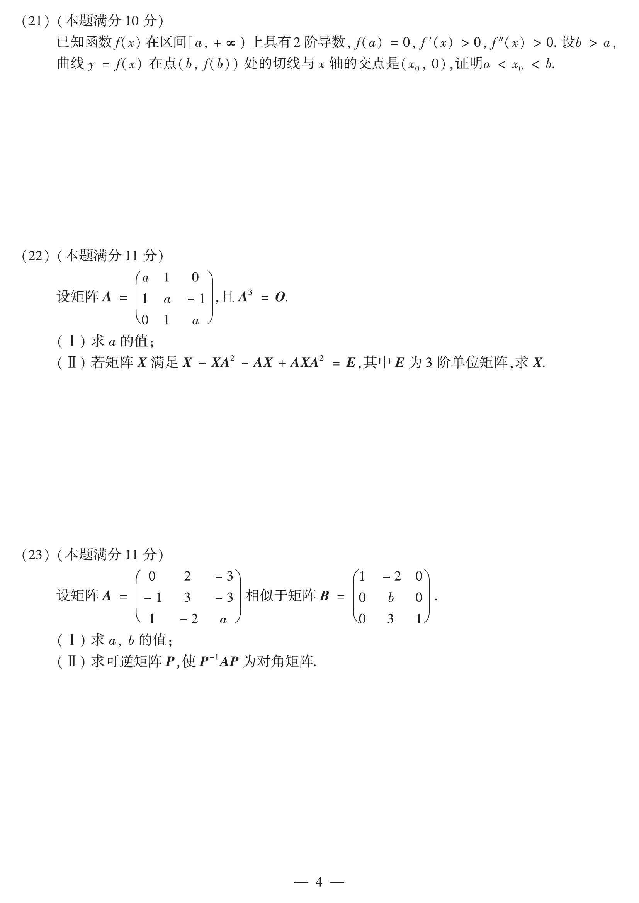

# 2015 数学二第 22 题

## 题目

设矩阵
$$
A=\begin{pmatrix}
a&1&0\\
1&a&-1\\
0&1&a
\end{pmatrix},
\qquad A^3=O.
$$
(1) 求 $a$ 的值；

(2) 若矩阵 $X$ 满足
$$
X-XA^2-AX+AXA^2=E,
$$
其中 $E$ 为 $3$ 阶单位阵，求 $X$。

## 标准答案

(1) $a=0$；

(2) $X=\begin{pmatrix}
3&1&-2\\
1&1&-1\\
2&1&-1
\end{pmatrix}$。

## 解析

由 $A^3=O$ 可知 $A$ 为幂零矩阵，因此
$$
|A|=0.
$$
计算
$$
|A|=a^3,
$$
所以
$$
a=0.
$$

代入后，原方程化为
$$
X(E-A^2)-AX(E-A^2)=E,
$$
即
$$
(E-A)X(E-A^2)=E.
$$
因为 $A^3=O$，所以 $E-A$ 与 $E-A^2$ 都可逆，从而
$$
X=(E-A)^{-1}(E-A^2)^{-1}
=\bigl[(E-A^2)(E-A)\bigr]^{-1}
=(E-A^2-A)^{-1}.
$$
当 $a=0$ 时，
$$
A=\begin{pmatrix}
0&1&0\\
1&0&-1\\
0&1&0
\end{pmatrix},
\qquad
E-A^2-A=
\begin{pmatrix}
0&-1&1\\
-1&1&1\\
-1&-1&2
\end{pmatrix}.
$$
直接求逆得
$$
X=
\begin{pmatrix}
3&1&-2\\
1&1&-1\\
2&1&-1
\end{pmatrix}.
$$

将该 $X$ 代回
$X-XA^2-AX+AXA^2=E$
可验证等式成立。

## 来源

- 题目来源：`math2_2015_questions.md`
- 答案来源：`math2_2015_answers.md`
