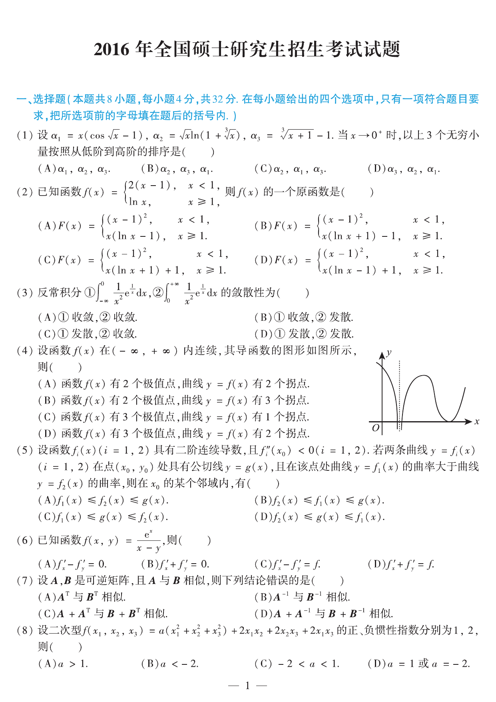

# 2016 数学二第 1 题

## 题目

设
$$
\alpha_1=x(\cos\sqrt{x}-1),\quad
\alpha_2=\sqrt{x}\ln(1+\sqrt[3]{x}),\quad
\alpha_3=\sqrt[3]{x+1}-1.
$$
当 $x\to0^+$ 时，以上 3 个无穷小量按阶从低到高的排序是（）

(A) $\alpha_1,\alpha_2,\alpha_3$

(B) $\alpha_2,\alpha_3,\alpha_1$

(C) $\alpha_2,\alpha_1,\alpha_3$

(D) $\alpha_3,\alpha_2,\alpha_1$

## 标准答案

B

## 解析

由
$\cos\sqrt{x}-1\sim-\dfrac{x}{2}$，
$\ln(1+\sqrt[3]{x})\sim \sqrt[3]{x}$，
$\sqrt[3]{x+1}-1\sim\dfrac{x}{3}$，
得
$$
\alpha_1\sim -\frac{x^2}{2},\qquad
\alpha_2\sim x^{5/6},\qquad
\alpha_3\sim \frac{x}{3}.
$$
比较幂次可知从低阶到高阶为 $\alpha_2,\alpha_3,\alpha_1$，故选 B。

## 来源

- 题目来源：`math2_2016_questions.md`
- 答案来源：`math2_2016_answers.md`
