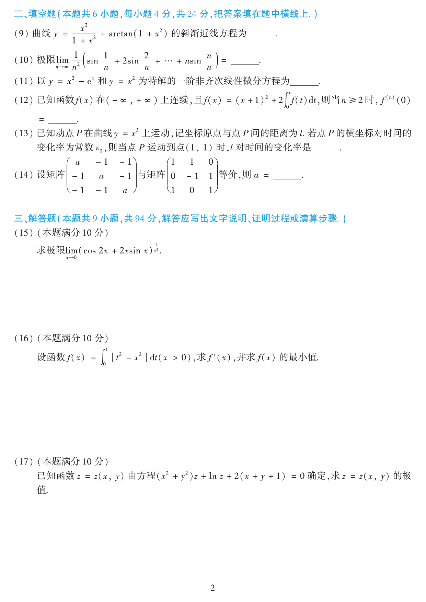

# 2016 数学二第 9 题

## 题目

曲线
$$
y=\frac{x^3}{1+x^2}+\arctan(1+x^2)
$$
的斜渐近线方程为 ________。

## 标准答案

$y=x+\dfrac{\pi}{2}$

## 解析

记 $f(x)=\dfrac{x^3}{1+x^2}+\arctan(1+x^2)$。则
$$
\lim_{x\to\infty}\frac{f(x)}{x}
=\lim_{x\to\infty}\left(\frac{x^2}{1+x^2}+\frac{\arctan(1+x^2)}{x}\right)=1.
$$
再算截距：
$$
\lim_{x\to\infty}[f(x)-x]
=\lim_{x\to\infty}\left(-\frac{x}{1+x^2}+\arctan(1+x^2)\right)=\frac{\pi}{2}.
$$
故斜渐近线为 $y=x+\dfrac{\pi}{2}$。

## 来源

- 题目来源：`math2_2016_questions.md`
- 答案来源：`math2_2016_answers.md`
