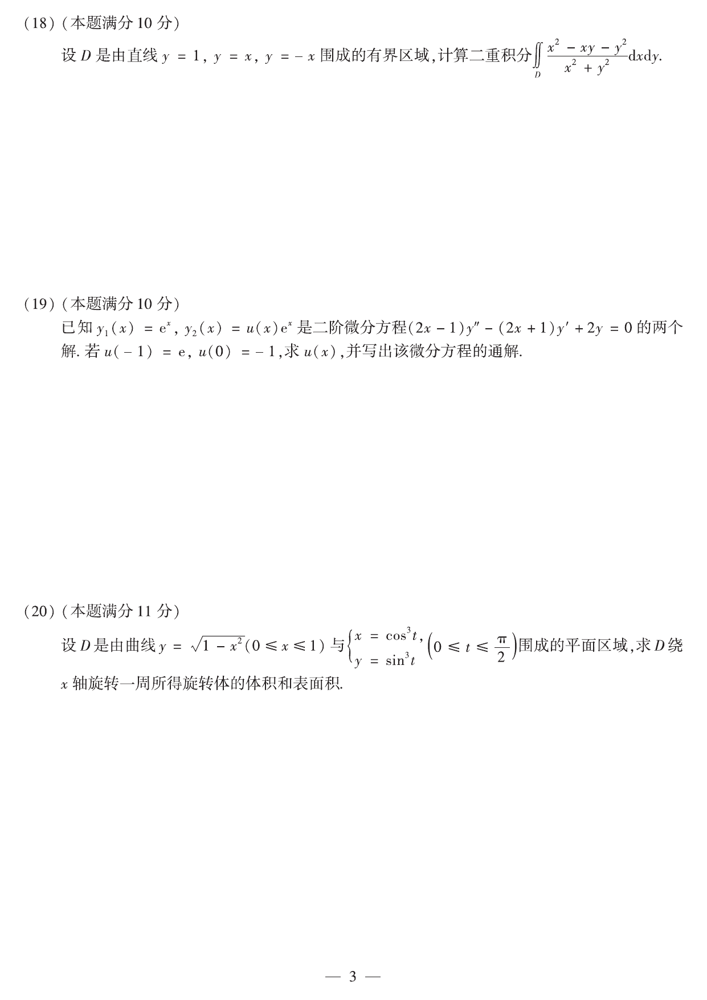

# 2016 数学二第 20 题

## 题目

设 $D$ 是由曲线
$$
y=\sqrt{1-x^2}\quad (0\le x\le1)
$$
与
$$
\begin{cases}
x=\cos^3 t,\\
y=\sin^3 t,
\end{cases}
\quad 0\le t\le\frac{\pi}{2}
$$
围成的平面区域，求 $D$ 绕 $x$ 轴旋转一周所得旋转体的体积和表面积。

## 标准答案

$$
V=\frac{18\pi}{35},\qquad S=\frac{16\pi}{5}.
$$

## 解析

外边界为四分之一单位圆 $y=\sqrt{1-x^2}$，内边界为星形线第一象限弧
$x^{2/3}+y^{2/3}=1$。体积由垫片法得
$$
V=\pi\int_0^1\left[(1-x^2)-\left(1-x^{2/3}\right)^3\right]dx
=\frac{18\pi}{35}.
$$
表面积等于两条母线旋转所得面积之和。圆弧部分
$$
S_1=2\pi\int_0^1 y\sqrt{1+(y')^2}\,dx=2\pi.
$$
星形线用参数方程计算：
$$
x=\cos^3 t,\quad y=\sin^3 t,\quad
ds=\sqrt{\left(\frac{dx}{dt}\right)^2+\left(\frac{dy}{dt}\right)^2}\,dt
=3\sin t\cos t\,dt.
$$
故
$$
S_2=2\pi\int_0^{\pi/2} y\,ds
=2\pi\int_0^{\pi/2}\sin^3 t\cdot 3\sin t\cos t\,dt
=\frac{6\pi}{5}.
$$
因此
$$
S=S_1+S_2=2\pi+\frac{6\pi}{5}=\frac{16\pi}{5}.
$$

## 来源

- 题目来源：`math2_2016_questions.md`
- 答案来源：`math2_2016_answers.md`
