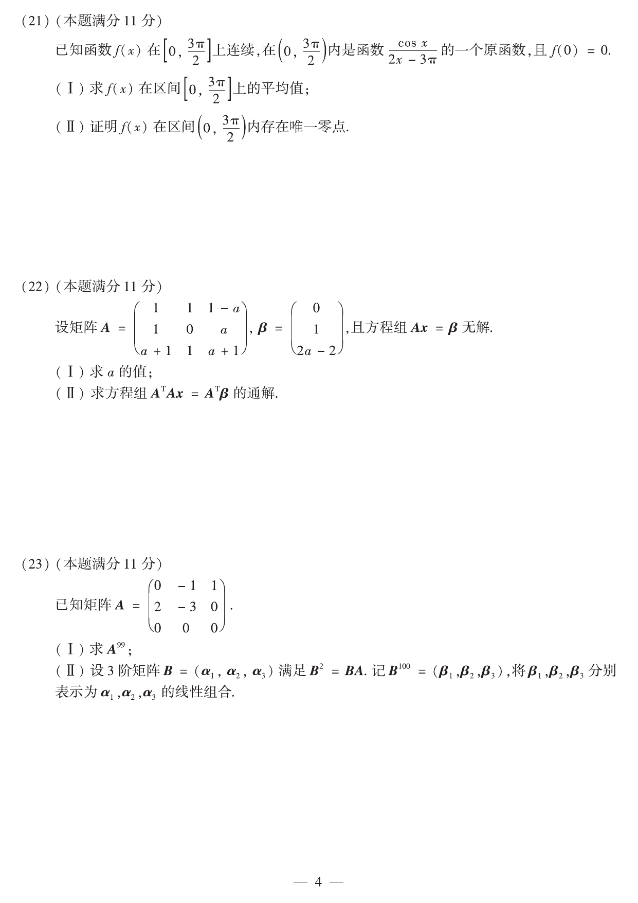

# 2016 数学二第 23 题

## 题目

已知矩阵
$$
A=
\begin{pmatrix}
0&-1&1\\
2&-3&0\\
0&0&0
\end{pmatrix}.
$$

(I) 求 $A^{99}$；

(II) 设 3 阶矩阵 $B=(\alpha_1,\alpha_2,\alpha_3)$ 满足 $B^2=BA$。记
$$
B^{100}=(\beta_1,\beta_2,\beta_3),
$$
将 $\beta_1,\beta_2,\beta_3$ 分别表示为 $\alpha_1,\alpha_2,\alpha_3$ 的线性组合。

## 标准答案

$$
A^{99}=
\begin{pmatrix}
2^{99}-2 & -(2^{99}-1) & -(2^{98}-2)\\
2^{100}-2 & -(2^{100}-1) & -(2^{99}-2)\\
0&0&0
\end{pmatrix}.
$$

因而
$$
\beta_1=(2^{99}-2)\alpha_1+(2^{100}-2)\alpha_2,
$$
$$
\beta_2=-(2^{99}-1)\alpha_1-(2^{100}-1)\alpha_2,
$$
$$
\beta_3=-(2^{98}-2)\alpha_1-(2^{99}-2)\alpha_2.
$$

## 解析

由直接乘法可归纳得到
$$
A^n=
\begin{pmatrix}
(-1)^{n-1}(2^n-2) & (-1)^n(2^n-1) & (-1)^n(2^{n-1}-2)\\
(-1)^{n-1}(2^{n+1}-2) & (-1)^n(2^{n+1}-1) & (-1)^n(2^n-2)\\
0&0&0
\end{pmatrix}\quad(n\ge1).
$$
取 $n=99$ 即得
$$
A^{99}=
\begin{pmatrix}
2^{99}-2 & -(2^{99}-1) & -(2^{98}-2)\\
2^{100}-2 & -(2^{100}-1) & -(2^{99}-2)\\
0&0&0
\end{pmatrix}.
$$

又由 $B^2=BA$，可归纳得
$$
B^n=BA^{n-1}\qquad(n\ge2).
$$
因此
$$
B^{100}=BA^{99}.
$$
因 $B=(\alpha_1,\alpha_2,\alpha_3)$，右乘矩阵时各列恰对应 $\alpha_1,\alpha_2,\alpha_3$ 的线性组合，所以 $B^{100}$ 的三列正是 $A^{99}$ 三列作为系数得到的组合。第三行全为 0，故三列都不含 $\alpha_3$ 项，结果如上。

## 来源

- 题目来源：`math2_2016_questions.md`
- 答案来源：`math2_2016_answers.md`
