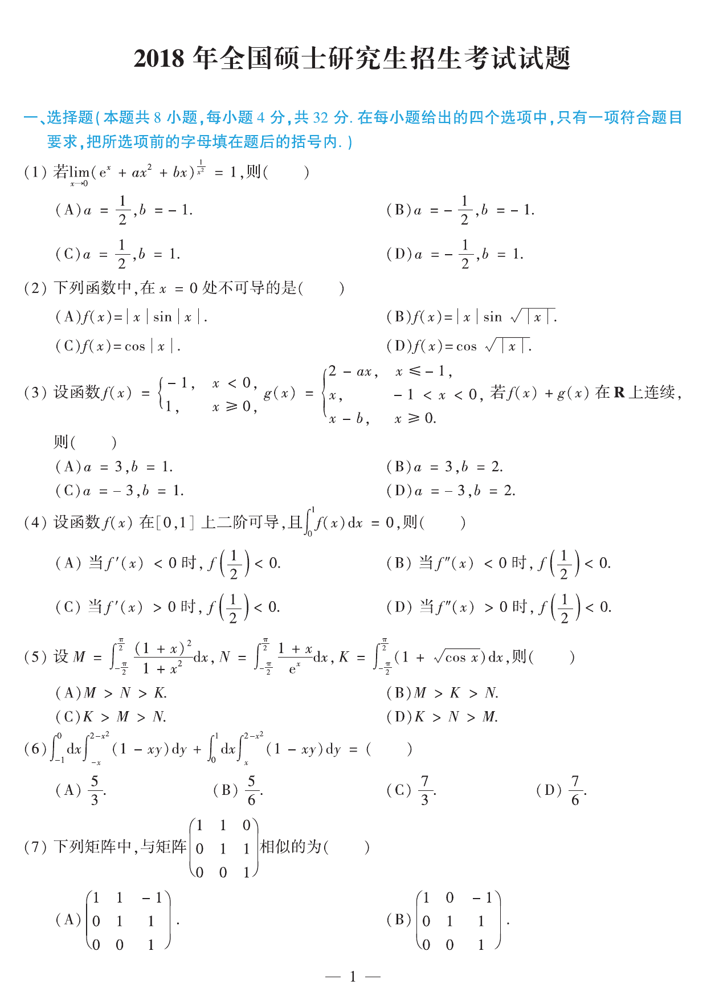
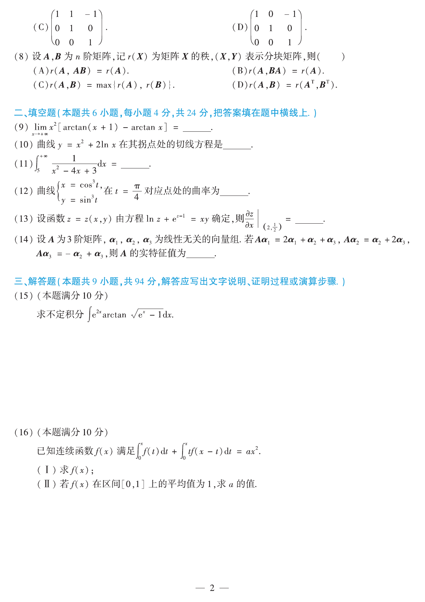
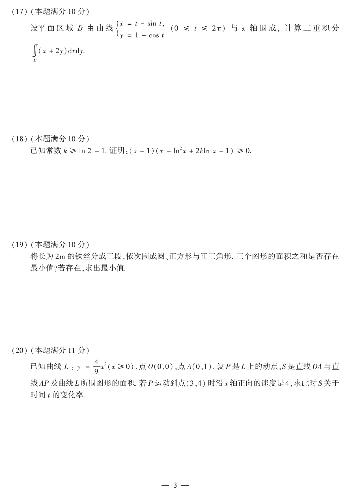
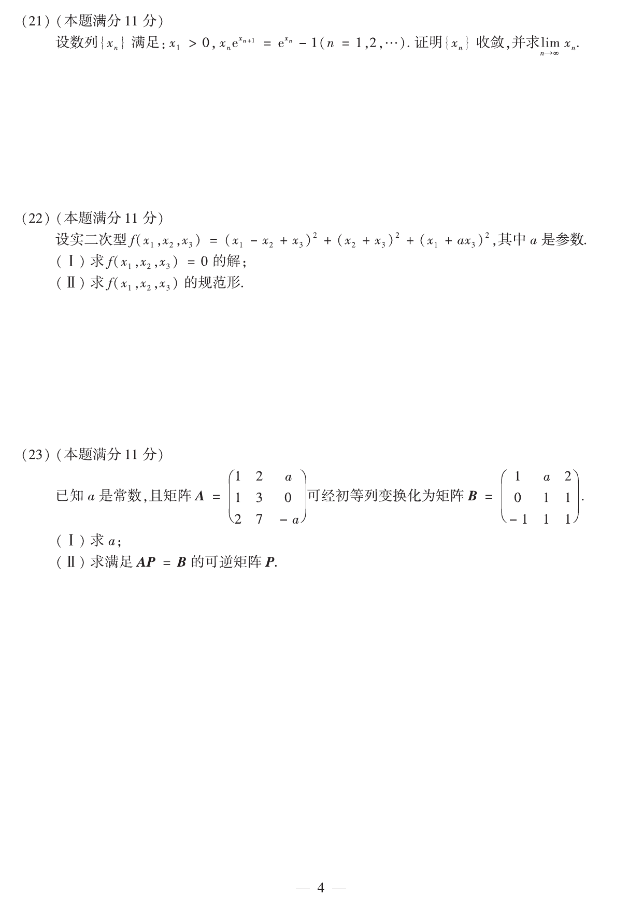

# 2018 年数学二真题

资料类型：考研数学二历年真题
年份：2018
科目：数学二
整理状态：按真题 PDF 与答案解析 PDF 交叉校对整理。

**第 1-7 题题图**

## 第 1 题
- 题型：选择题
- 分值：4
- 模块：高等数学
- 考点：极限、指数型极限、等价无穷小

若
$$
\lim_{x\to0}\left(e^x+ax^2+bx\right)^{1/x^2}=1,
$$
则（ ）

(A) $a=\dfrac12,\ b=-1$

(B) $a=-\dfrac12,\ b=-1$

(C) $a=\dfrac12,\ b=1$

(D) $a=-\dfrac12,\ b=1$

## 第 2 题
- 题型：选择题
- 分值：4
- 模块：高等数学
- 考点：导数定义、可导性、分段与绝对值函数

下列函数中，在 $x=0$ 处不可导的是（ ）

(A) $f(x)=|x|\sin|x|$

(B) $f(x)=|x|\sin\sqrt{|x|}$

(C) $f(x)=\cos|x|$

(D) $f(x)=\cos\sqrt{|x|}$

## 第 3 题
- 题型：选择题
- 分值：4
- 模块：高等数学
- 考点：分段函数、连续性、参数讨论

设函数
$$
f(x)=
\begin{cases}
-1,& x<0,\\
1,& x\ge 0,
\end{cases}
\qquad
g(x)=
\begin{cases}
2-ax,& x\le -1,\\
x,& -1<x<0,\\
x-b,& x\ge 0.
\end{cases}
$$
若 $f(x)+g(x)$ 在 $\mathbb R$ 上连续，则（ ）

(A) $a=3,\ b=1$

(B) $a=3,\ b=2$

(C) $a=-3,\ b=1$

(D) $a=-3,\ b=2$

## 第 4 题
- 题型：选择题
- 分值：4
- 模块：高等数学
- 考点：泰勒公式、凸函数、积分不等式

设函数 $f(x)$ 在 $[0,1]$ 上二阶可导，且
$$
\int_0^1 f(x)\,dx=0,
$$
则（ ）

(A) 当 $f'(x)<0$ 时，$f\!\left(\dfrac12\right)<0$

(B) 当 $f''(x)<0$ 时，$f\!\left(\dfrac12\right)<0$

(C) 当 $f'(x)>0$ 时，$f\!\left(\dfrac12\right)<0$

(D) 当 $f''(x)>0$ 时，$f\!\left(\dfrac12\right)<0$

## 第 5 题
- 题型：选择题
- 分值：4
- 模块：高等数学
- 考点：定积分比较、奇偶性、不等式

设
$$
M=\int_{-\pi/2}^{\pi/2}\frac{(1+x)^2}{1+x^2}\,dx,\quad
N=\int_{-\pi/2}^{\pi/2}\frac{1+x}{e^x}\,dx,\quad
K=\int_{-\pi/2}^{\pi/2}(1+\sqrt{\cos x})\,dx,
$$
则（ ）

(A) $M>N>K$

(B) $M>K>N$

(C) $K>M>N$

(D) $K>N>M$

## 第 6 题
- 题型：选择题
- 分值：4
- 模块：高等数学
- 考点：二重积分、区域对称性、积分计算

$$
\int_{-1}^0dx\int_{-x}^{2-x^2}(1-xy)\,dy+\int_0^1dx\int_x^{2-x^2}(1-xy)\,dy=(\ )
$$

(A) $\dfrac53$

(B) $\dfrac56$

(C) $\dfrac73$

(D) $\dfrac76$

## 第 7 题
- 题型：选择题
- 分值：4
- 模块：线性代数
- 考点：矩阵相似、Jordan块、相似变换

下列矩阵中，与矩阵
$$
\begin{pmatrix}
1&1&0\\
0&1&1\\
0&0&1
\end{pmatrix}
$$
相似的是（ ）

(A)
$$
\begin{pmatrix}
1&1&-1\\
0&1&1\\
0&0&1
\end{pmatrix}
$$

(B)
$$
\begin{pmatrix}
1&0&-1\\
0&1&1\\
0&0&1
\end{pmatrix}
$$

(C)
$$
\begin{pmatrix}
1&1&-1\\
0&1&0\\
0&0&1
\end{pmatrix}
$$

(D)
$$
\begin{pmatrix}
1&0&-1\\
0&1&0\\
0&0&1
\end{pmatrix}
$$

**第 8-16 题题图**

## 第 8 题
- 题型：选择题
- 分值：4
- 模块：线性代数
- 考点：矩阵秩、分块矩阵、反例法

设 $A,B$ 为 $n$ 阶矩阵，记 $r(X)$ 为矩阵 $X$ 的秩，$(X,Y)$ 表示分块矩阵，则（ ）

(A) $r(A,AB)=r(A)$

(B) $r(A,BA)=r(A)$

(C) $r(A,B)=\max\{r(A),r(B)\}$

(D) $r(A,B)=r(A^{\mathsf T},B^{\mathsf T})$

## 第 9 题
- 题型：填空题
- 分值：4
- 模块：高等数学
- 考点：极限、拉格朗日中值定理、反三角函数

$$
\lim_{x\to+\infty}x^2[\arctan(x+1)-\arctan x]=\underline{\qquad}.
$$

## 第 10 题
- 题型：填空题
- 分值：4
- 模块：高等数学
- 考点：拐点、切线方程、导数应用

曲线 $y=x^2+2\ln x$ 在其拐点处的切线方程是 $\underline{\qquad}$。

## 第 11 题
- 题型：填空题
- 分值：4
- 模块：高等数学
- 考点：反常积分、部分分式

$$
\int_5^{+\infty}\frac{1}{x^2-4x+3}\,dx=\underline{\qquad}.
$$

## 第 12 题
- 题型：填空题
- 分值：4
- 模块：高等数学
- 考点：参数方程、曲率

曲线
$$
\begin{cases}
x=\cos^3 t,\\
y=\sin^3 t
\end{cases}
$$
在 $t=\dfrac{\pi}{4}$ 对应点处的曲率为 $\underline{\qquad}$。

## 第 13 题
- 题型：填空题
- 分值：4
- 模块：高等数学
- 考点：隐函数求导、偏导数

设函数 $z=z(x,y)$ 由方程
$$
\ln z+e^{z-1}=xy
$$
确定，则
$$
\left.\frac{\partial z}{\partial x}\right|_{(2,\frac12)}=\underline{\qquad}.
$$

## 第 14 题
- 题型：填空题
- 分值：4
- 模块：线性代数
- 考点：特征值、线性变换、基下矩阵

设 $A$ 为 $3$ 阶矩阵，$\alpha_1,\alpha_2,\alpha_3$ 为线性无关的向量组。若
$$
A\alpha_1=2\alpha_1+\alpha_2+\alpha_3,\quad
A\alpha_2=\alpha_2+2\alpha_3,\quad
A\alpha_3=-\alpha_2+\alpha_3,
$$
则 $|A|=\underline{\qquad}$。

## 第 15 题
- 题型：解答题
- 分值：10
- 模块：高等数学
- 考点：不定积分、分部积分、换元积分

求不定积分
$$
\int e^{2x}\arctan\sqrt{e^x-1}\,dx.
$$

## 第 16 题
- 题型：解答题
- 分值：10
- 模块：高等数学
- 考点：积分方程、微积分基本定理、平均值

已知连续函数 $f(x)$ 满足
$$
\int_0^x f(t)\,dt+\int_0^x t\,f(x-t)\,dt=ax^2.
$$

(1) 求 $f(x)$；

(2) 若 $f(x)$ 在区间 $[0,1]$ 上的平均值为 $1$，求 $a$ 的值。

**第 17-20 题题图**

## 第 17 题
- 题型：解答题
- 分值：10
- 模块：高等数学
- 考点：参数曲线围成区域、二重积分、换元

设平面区域 $D$ 由曲线
$$
\begin{cases}
x=t-\sin t,\\
y=1-\cos t
\end{cases}
\qquad (0\le t\le2\pi)
$$
与 $x$ 轴围成，计算二重积分
$$
\iint_D (x+2y)\,dxdy.
$$

## 第 18 题
- 题型：证明题
- 分值：10
- 模块：高等数学
- 考点：函数单调性、不等式证明、对数函数

已知常数 $k\ge \ln2-1$，证明：
$$
(x-1)(x-\ln^2x+2k\ln x-1)\ge0,\qquad x>0.
$$

## 第 19 题
- 题型：解答题
- 分值：10
- 模块：高等数学
- 考点：极值问题、拉格朗日乘子法、几何应用

将长为 $2\text{m}$ 的铁丝分成三段，依次围成圆、正方形与正三角形。三个图形的面积和是否存在最小值？若存在，求出最小值。

## 第 20 题
- 题型：解答题
- 分值：11
- 模块：高等数学
- 考点：相关变化率、定积分面积、导数应用

已知曲线 $L:y=\dfrac49x^2\ (x\ge0)$，点 $O(0,0)$，点 $A(0,1)$。设 $P$ 是 $L$ 上的动点，$S$ 是直线 $OA$ 与直线 $AP$ 及曲线 $L$ 所围图形的面积。若 $P$ 运动到点 $(3,4)$ 时沿 $x$ 轴正向的速度是 $4$，求此时 $S$ 关于时间 $t$ 的变化率。

**第 21-23 题题图**

## 第 21 题
- 题型：证明题
- 分值：11
- 模块：高等数学
- 考点：数列极限、单调有界、递推数列

设数列 $\{x_n\}$ 满足：$x_1>0$，
$$
x_ne^{x_{n+1}}=e^{x_n}-1\qquad(n=1,2,\cdots).
$$
证明 $\{x_n\}$ 收敛，并求 $\lim\limits_{n\to\infty}x_n$。

## 第 22 题
- 题型：解答题
- 分值：11
- 模块：线性代数
- 考点：二次型、规范形、秩与特征值

设实二次型
$$
f(x_1,x_2,x_3)=(x_1-x_2+x_3)^2+(x_2+x_3)^2+(x_1+ax_3)^2,
$$
其中 $a$ 是参数。

(1) 求 $f(x_1,x_2,x_3)=0$ 的解；

(2) 求 $f(x_1,x_2,x_3)$ 的规范形。

## 第 23 题
- 题型：解答题
- 分值：11
- 模块：线性代数
- 考点：矩阵方程、初等列变换、可逆矩阵

已知 $a$ 是常数，且矩阵
$$
A=
\begin{pmatrix}
1&2&a\\
1&3&0\\
2&7&-a
\end{pmatrix}
$$
可经初等列变换化为矩阵
$$
B=
\begin{pmatrix}
1&a&2\\
0&1&1\\
-1&1&1
\end{pmatrix}.
$$

(1) 求 $a$；

(2) 求满足 $AP=B$ 的可逆矩阵 $P$。
