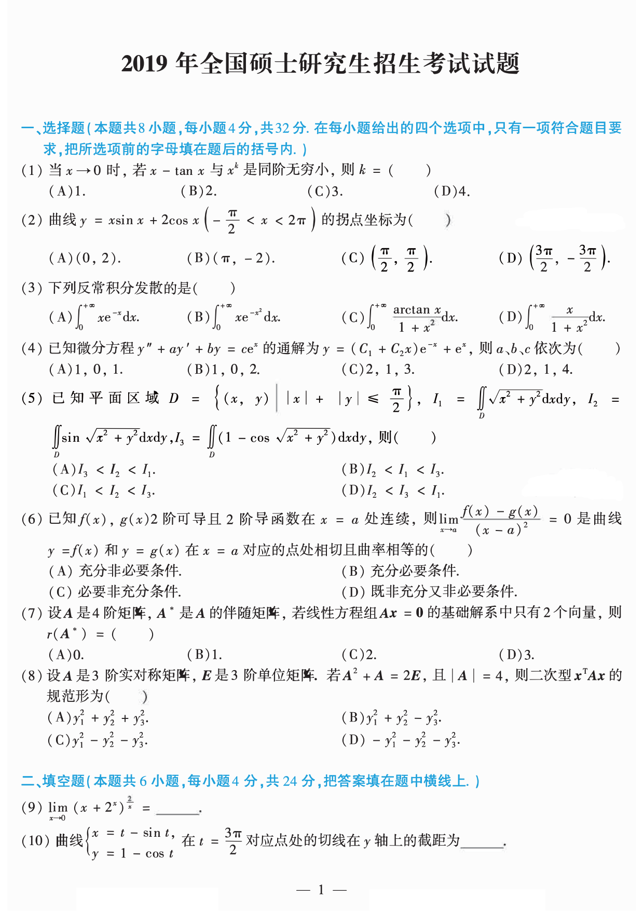

# 2019 数学二第 5 题

## 题目

已知平面区域
$$
D=\left\{(x,y)\mid |x|+|y|\le\frac{\pi}{2}\right\},
$$
$$
I_1=\iint_D\sqrt{x^2+y^2}\,dxdy,\quad
I_2=\iint_D\sin\sqrt{x^2+y^2}\,dxdy,\quad
I_3=\iint_D(1-\cos\sqrt{x^2+y^2})\,dxdy,
$$
则（ ）

(A) $I_3<I_2<I_1$

(B) $I_2<I_1<I_3$

(C) $I_1<I_2<I_3$

(D) $I_2<I_3<I_1$

## 标准答案

A

## 解析

设 $r=\sqrt{x^2+y^2}$。因 $r\ge0$ 且 $\sin r\le r$，可知 $I_2<I_1$。又
$$
1-\cos r=2\sin^2\frac r2,\qquad
\sin r=2\sin\frac r2\cos\frac r2.
$$
在区域 $D$ 内有 $r\le \dfrac{\pi}{2}$，故 $\dfrac r2\in[0,\dfrac{\pi}{4}]$，从而
$$
\sin\frac r2\le\cos\frac r2.
$$
因此
$$
1-\cos r\le\sin r,
$$
即 $I_3<I_2$。综上 $I_3<I_2<I_1$，选 A。

## 来源

- 题目来源：`math2_2019_questions.md`
- 答案来源：`math2_2019_answers.md`
