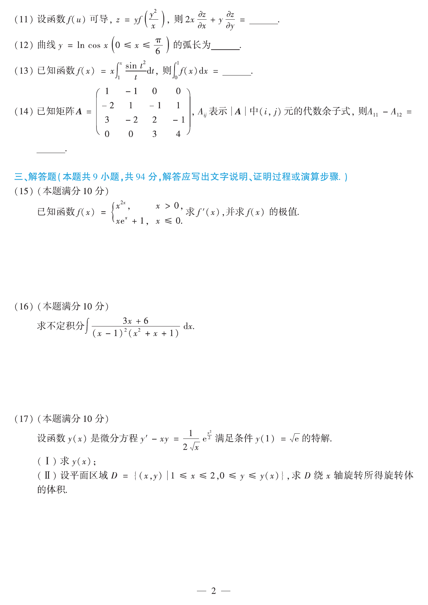

# 2019 数学二第 17 题

## 题目

设函数 $y(x)$ 是微分方程
$$
y'-xy=\frac{1}{2\sqrt{x}}e^{x^2/2}
$$
满足条件 $y(1)=\sqrt e$ 的特解。

(1) 求 $y(x)$；

(2) 设平面区域
$$
D=\{(x,y)\mid 1\le x\le2,\ 0\le y\le y(x)\},
$$
求 $D$ 绕 $x$ 轴旋转所得旋转体的体积。

## 标准答案

(1) $y(x)=\sqrt{x}\,e^{x^2/2}$；

(2) $V=\dfrac{\pi}{2}(e^4-e)$。

## 解析

这是线性微分方程。乘积分因子 $e^{-x^2/2}$，得
$$
\left(ye^{-x^2/2}\right)'=\frac{1}{2\sqrt{x}}.
$$
积分后
$$
ye^{-x^2/2}=\sqrt{x}+C,
$$
即
$$
y=(\sqrt{x}+C)e^{x^2/2}.
$$
由 $y(1)=\sqrt e$ 得 $C=0$，故
$$
y(x)=\sqrt{x}\,e^{x^2/2}.
$$

旋转体体积
$$
V=\pi\int_1^2 y^2\,dx
=\pi\int_1^2 xe^{x^2}\,dx
=\frac{\pi}{2}e^{x^2}\Big|_1^2
=\frac{\pi}{2}(e^4-e).
$$

## 来源

- 题目来源：`math2_2019_questions.md`
- 答案来源：`math2_2019_answers.md`
