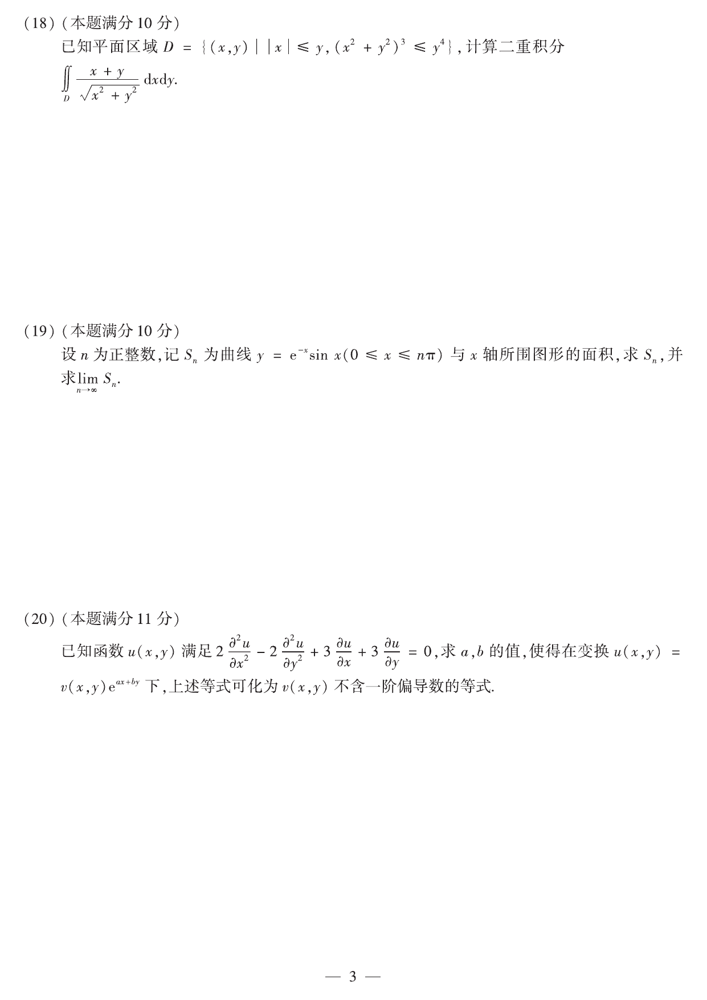

# 2019 数学二第 18 题

## 题目

已知平面区域
$$
D=\{(x,y)\mid |x|\le y,\ (x^2+y^2)^3\le y^4\},
$$
计算二重积分
$$
\iint_D \frac{x+y}{\sqrt{x^2+y^2}}\,dxdy.
$$

## 标准答案

$\dfrac{43\sqrt2}{120}$

## 解析

由对称性，含 $x$ 的奇部积分为 $0$，原式化为
$$
\iint_D \frac{y}{\sqrt{x^2+y^2}}\,dxdy.
$$
取极坐标
$$
x=r\cos\theta,\qquad y=r\sin\theta.
$$
条件 $|x|\le y$ 化为
$$
\frac{\pi}{4}\le\theta\le\frac{3\pi}{4},
$$
而
$$
(x^2+y^2)^3\le y^4
$$
化为
$$
0\le r\le \sin^2\theta.
$$
所以
$$
\iint_D \frac{x+y}{\sqrt{x^2+y^2}}\,dxdy
=\int_{\pi/4}^{3\pi/4}\int_0^{\sin^2\theta} \sin\theta \cdot r\,dr\,d\theta
=\frac12\int_{\pi/4}^{3\pi/4}\sin^5\theta\,d\theta
=\frac{43\sqrt2}{120}.
$$

## 来源

- 题目来源：`math2_2019_questions.md`
- 答案来源：`math2_2019_answers.md`
