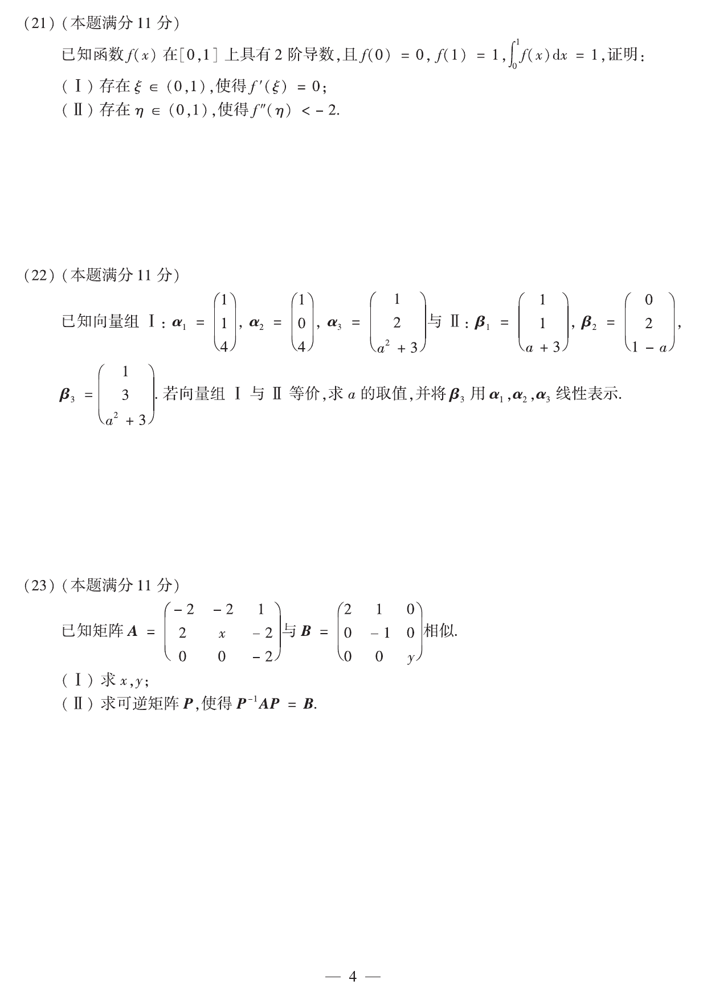

# 2019 数学二第 21 题

## 题目

已知函数 $f(x)$ 在 $[0,1]$ 上具有 2 阶导数，且
$$
f(0)=0,\qquad f(1)=1,\qquad \int_0^1f(x)\,dx=1,
$$
证明：

(I) 存在 $\xi\in(0,1)$，使得 $f'(\xi)=0$；

(II) 存在 $\eta\in(0,1)$，使得 $f''(\eta)<-2$。

## 标准答案

结论成立

## 解析

设
$$
F(x)=\int_0^x f(t)\,dt,
$$
则 $F'(x)=f(x)$。由积分中值定理，存在 $c\in(0,1)$ 使
$$
\int_0^1f(x)\,dx=f(c)(1-0),
$$
即 $f(c)=1$。而已知 $f(1)=1$，故由罗尔定理，存在 $\xi\in(c,1)\subset(0,1)$ 使
$$
f'(\xi)=0.
$$

再设
$$
\varphi(x)=f(x)+x^2.
$$
则
$$
\varphi(0)=0,\qquad \varphi(c)=1+c^2,\qquad \varphi(1)=2.
$$
由拉格朗日中值定理，存在 $\eta_1\in(0,c),\ \eta_2\in(c,1)$ 使
$$
\varphi'(\eta_1)=\frac{1+c^2}{c}=c+\frac1c,\qquad
\varphi'(\eta_2)=\frac{2-(1+c^2)}{1-c}=1+c.
$$
再对 $\varphi'$ 用拉格朗日中值定理，存在 $\eta\in(\eta_1,\eta_2)$ 使
$$
\varphi''(\eta)=\frac{\varphi'(\eta_2)-\varphi'(\eta_1)}{\eta_2-\eta_1}
=\frac{1-\frac1c}{\eta_2-\eta_1}<0.
$$
又 $\varphi''=f''+2$，故
$$
f''(\eta)+2<0 \Rightarrow f''(\eta)<-2.
$$

## 来源

- 题目来源：`math2_2019_questions.md`
- 答案来源：`math2_2019_answers.md`
