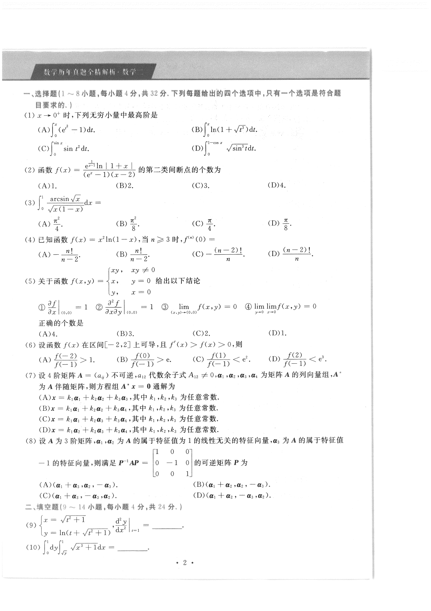

# 2020 数学二第 7 题

## 题目

设 $4$ 阶矩阵 $A=(a_{ij})$ 不可逆，$a_{12}$ 代数余子式 $A_{12}\ne 0$，$\alpha_1,\alpha_2,\alpha_3,\alpha_4$ 为矩阵 $A^*$ 的列向量组，$A^*$ 为 $A$ 的伴随矩阵，则方程组
$$
A^*x=0
$$
通解为

(A) $x=k_1\alpha_1+k_2\alpha_2+k_3\alpha_3$

(B) $x=k_1\alpha_1+k_2\alpha_2+k_3\alpha_4$

(C) $x=k_1\alpha_1+k_2\alpha_3+k_3\alpha_4$

(D) $x=k_1\alpha_2+k_2\alpha_3+k_3\alpha_4$

其中 $k_1,k_2,k_3$ 为任意常数。

## 标准答案

C

## 解析

因 $A$ 不可逆且某个三阶代数余子式 $A_{12}\ne 0$，可知 $r(A)=3$。于是
$$
r(A^*)=1.
$$
故齐次方程组 $A^*x=0$ 的解空间维数为
$$
4-r(A^*)=3.
$$
又因 $A^*$ 的列向量都属于同一维列空间，而由 $A_{12}\ne 0$ 可知 $\alpha_1\ne 0$，从而其余三列可张成零空间的一组基。对应选项为
$$
x=k_1\alpha_1+k_2\alpha_3+k_3\alpha_4.
$$
故选 $C$。

## 来源

- 题目来源：`math2_2020_questions.md`
- 答案来源：`math2_2020_answers.md`
