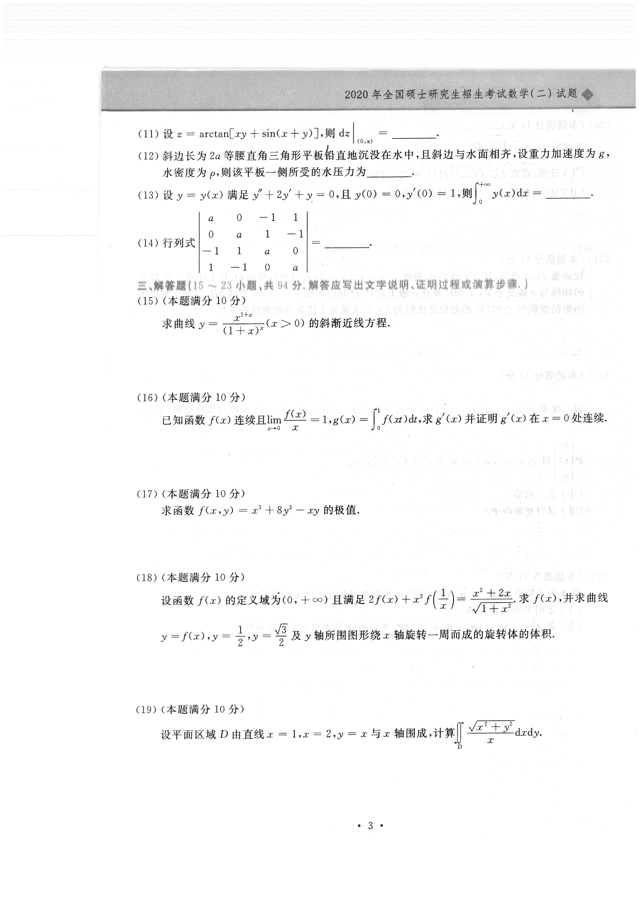

# 2020 数学二第 17 题

## 题目

求函数
$$
f(x,y)=x^3+8y^3-xy
$$
的极值。

## 标准答案

极小值为 $-\dfrac{1}{216}$（在 $\left(\dfrac16,\dfrac1{12}\right)$ 处），无极大值

## 解析

先求驻点：
$$
f_x=3x^2-y,\qquad f_y=24y^2-x.
$$
解方程组
$$
3x^2-y=0,\qquad 24y^2-x=0
$$
得
$$
(x,y)=(0,0),\qquad \left(\frac16,\frac1{12}\right).
$$

二阶偏导为
$$
f_{xx}=6x,\qquad f_{yy}=48y,\qquad f_{xy}=-1.
$$
Hessian 判别式
$$
D=f_{xx}f_{yy}-f_{xy}^2.
$$

在 $(0,0)$ 处，
$$
D=-1<0,
$$
故为鞍点。

在 $\left(\dfrac16,\dfrac1{12}\right)$ 处，
$$
D=1>0,\qquad f_{xx}=1>0,
$$
故为极小值点。

极小值为
$$
f\left(\frac16,\frac1{12}\right)
=\frac{1}{216}+\frac{1}{216}-\frac{1}{72}
=-\frac{1}{216}.
$$
因此函数无极大值，极小值为 $-\dfrac1{216}$。

## 来源

- 题目来源：`math2_2020_questions.md`
- 答案来源：`math2_2020_answers.md`
