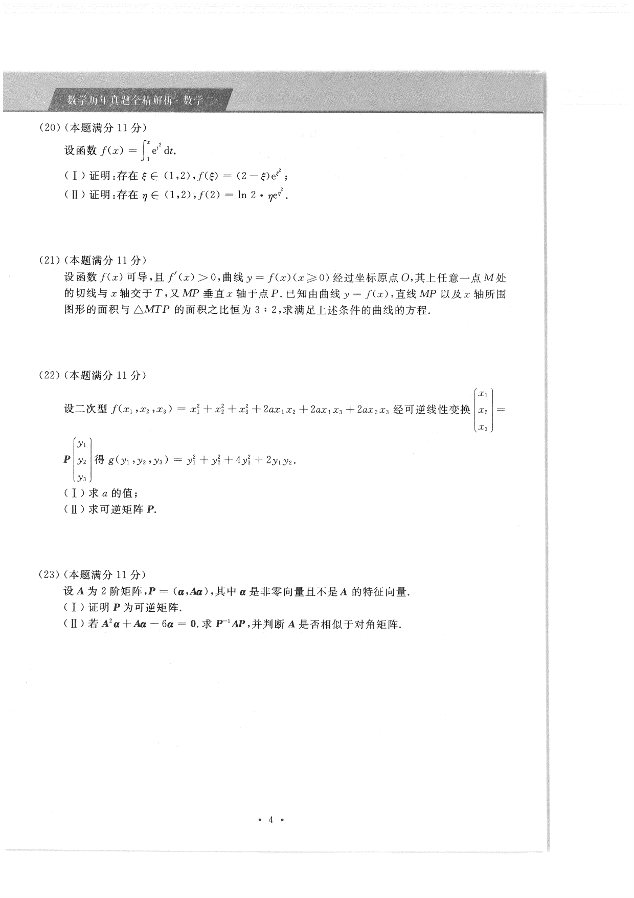

# 2020 数学二第 22 题

## 题目

设二次型
$$
f(x_1,x_2,x_3)=x_1^2+x_2^2+x_3^2+2ax_1x_2+2ax_1x_3+2ax_2x_3
$$
经可逆线性变换
$$
P
\begin{pmatrix}
y_1\\
y_2\\
y_3
\end{pmatrix}
=
\begin{pmatrix}
x_1\\
x_2\\
x_3
\end{pmatrix}
$$
得
$$
g(y_1,y_2,y_3)=y_1^2+y_2^2+4y_3^2+2y_1y_2.
$$

（I）求 $a$ 的值；

（II）求可逆矩阵 $P$。

## 标准答案

（I）$a=-\dfrac12$；

（II）可取
$$
P=
\begin{pmatrix}
\dfrac{1}{\sqrt3} & 1+\dfrac{1}{\sqrt3} & \dfrac23\\[4pt]
-\dfrac{1}{\sqrt3} & 1-\dfrac{1}{\sqrt3} & \dfrac23\\[4pt]
0 & 1 & -\dfrac43
\end{pmatrix}.
$$

## 解析

原二次型对应矩阵为
$$
A=
\begin{pmatrix}
1&a&a\\
a&1&a\\
a&a&1
\end{pmatrix}.
$$
化后矩阵为
$$
B=
\begin{pmatrix}
1&1&0\\
1&1&0\\
0&0&4
\end{pmatrix}.
$$
由合同变换保持秩，可知 $r(A)=r(B)=2$。

而矩阵 $A$ 的特征值为
$$
1-a,\ 1-a,\ 1+2a.
$$
要使秩为 $2$，只能有且仅有一个特征值为零，因此
$$
1+2a=0\Longrightarrow a=-\frac12.
$$

代入后
$$
f=x_1^2+x_2^2+x_3^2-x_1x_2-x_1x_3-x_2x_3.
$$
选取合适的新基可把它化为
$$
y_1^2+y_2^2+2y_1y_2+4y_3^2.
$$
上述给出的 $P$ 满足
$$
P^{\mathsf T}AP=B,
$$
因而是所求的一个可逆矩阵。

## 来源

- 题目来源：`math2_2020_questions.md`
- 答案来源：`math2_2020_answers.md`
