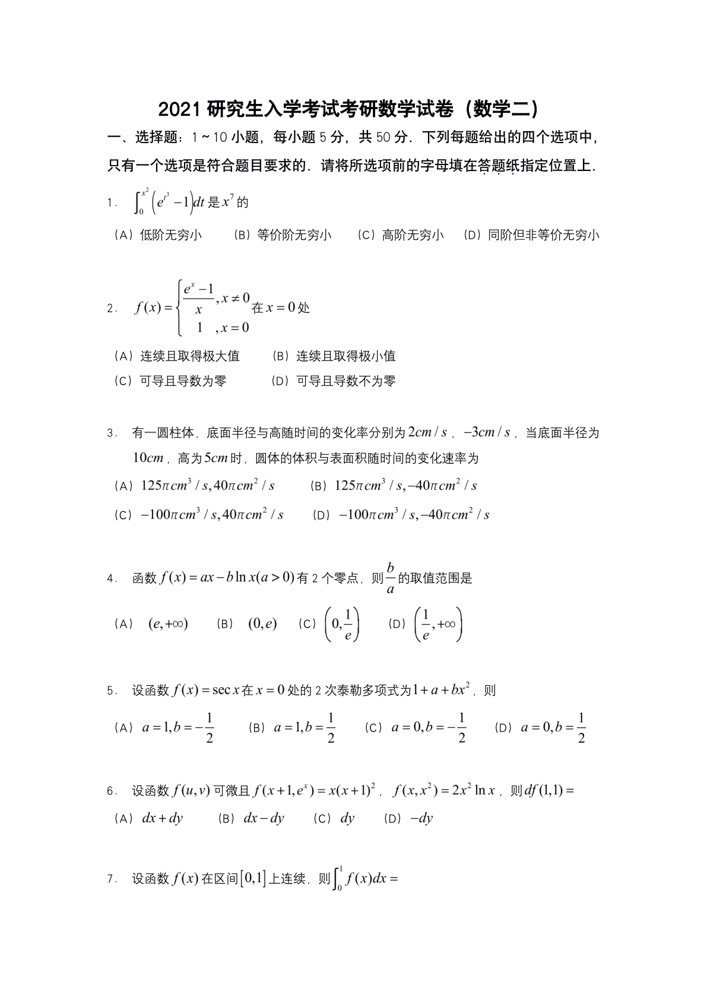

# 2021 数学二第 7 题

## 题目

设函数 \(f(x)\) 在区间 \([0,1]\) 上连续，则
\[
\int_0^1 f(x)\,dx=
\]
A. \(\lim_{n\to\infty}\sum_{k=1}^{n} f\!\left(\dfrac{2k-1}{2n}\right)\dfrac{1}{2n}\)
B. \(\lim_{n\to\infty}\sum_{k=1}^{n} f\!\left(\dfrac{2k-1}{2n}\right)\dfrac{1}{n}\)
C. \(\lim_{n\to\infty}\sum_{k=1}^{2n} f\!\left(\dfrac{k-1}{2n}\right)\dfrac{1}{n}\)
D. \(\lim_{n\to\infty}\sum_{k=1}^{2n} f\!\left(\dfrac{k}{2n}\right)\dfrac{2}{n}\)

## 标准答案

B

## 解析

区间 \([0,1]\) 等分为 \(n\) 份，每份长度为 \(\Delta x=\dfrac1n\)，第 \(k\) 个小区间中点为 \(\dfrac{2k-1}{2n}\)。因此积分的黎曼和表示为
\[
\int_0^1 f(x)\,dx=
\lim_{n\to\infty}\sum_{k=1}^{n} f\!\left(\frac{2k-1}{2n}\right)\frac1n.
\]
故选 B。

## 来源

- 题目来源：`math2_2021_questions.md`
- 答案来源：`math2_2021_answers.md`
