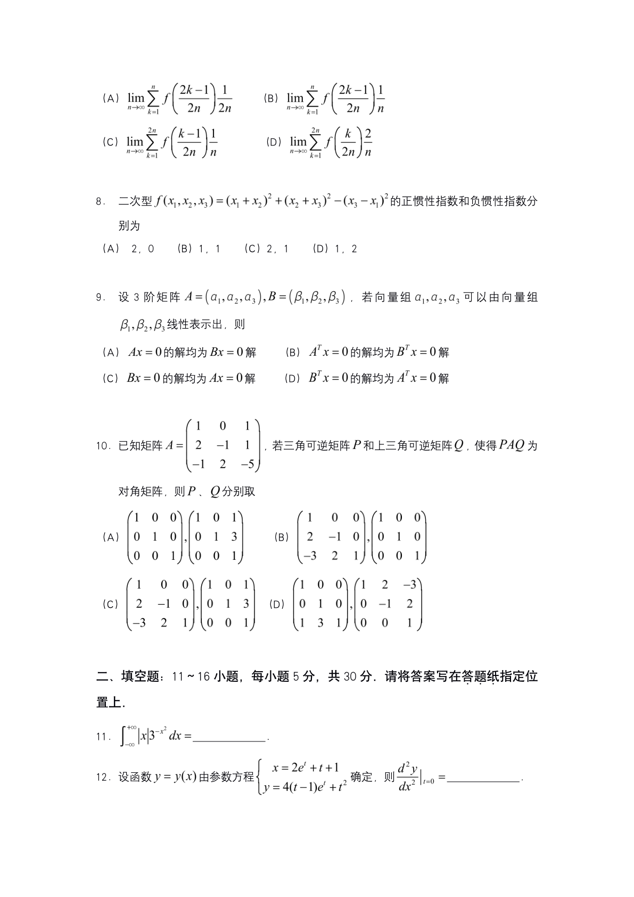
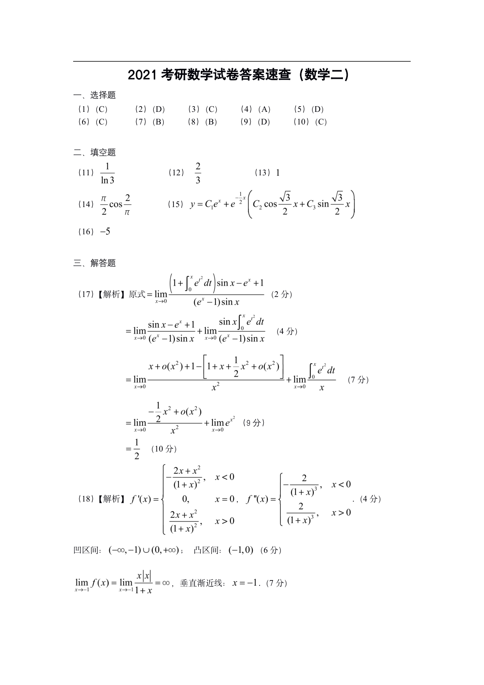

# 2021 数学二第 8 题

## 题目

二次型
\[
f(x_1,x_2,x_3)=(x_1+x_2)^2+(x_2+x_3)^2-(x_3-x_1)^2
\]
的正惯性指数和负惯性指数分别为
A. \(2,0\)
B. \(1,1\)
C. \(2,1\)
D. \(1,2\)

## 标准答案

B

## 解析

展开得
\[
f=2x_2^2+2x_1x_2+2x_2x_3+2x_1x_3.
\]
对应对称矩阵为
\[
A=\begin{pmatrix}
0&1&1\\
1&2&1\\
1&1&0
\end{pmatrix}.
\]
求特征值可得 \(\lambda=3,-1,0\)。因此正特征值、负特征值、零特征值各一个，所以正惯性指数与负惯性指数分别为 \((1,1)\)。

## 来源

- 题目来源：`math2_2021_questions.md`
- 答案来源：`math2_2021_answers.md`
