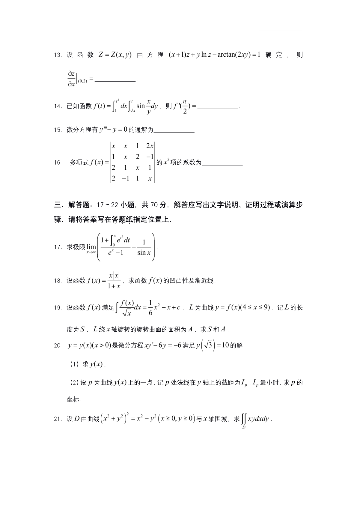
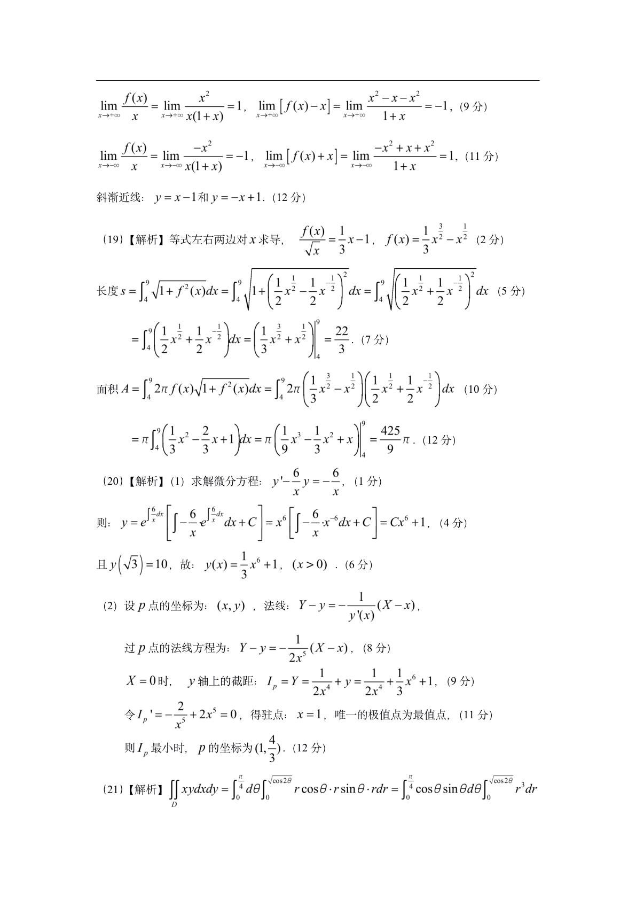

# 2021 数学二第 16 题

## 题目

多项式 $f(x)=\begin{vmatrix}x&x&1&2x\\1&x&2&-1\\2&1&x&1\\2&-1&1&x\end{vmatrix}$ 的 $x^3$ 项的系数为 \underline{\qquad}。

## 标准答案

-5

## 解析

按第一行展开并整理：
$M_{11}=x^3-4x-3$，$M_{12}=x^2-2x+1$，$M_{13}=-2x^2+3x+5$，$M_{14}=2x^2-x-7$。
故
$f(x)=xM_{11}-xM_{12}+M_{13}-2xM_{14}=x^4-5x^3-2x^2+13x+5$，所以 $x^3$ 项系数为 $-5$。

## 来源

- 题目来源：`math2_2021_questions.md`
- 答案来源：`math2_2021_answers.md`
