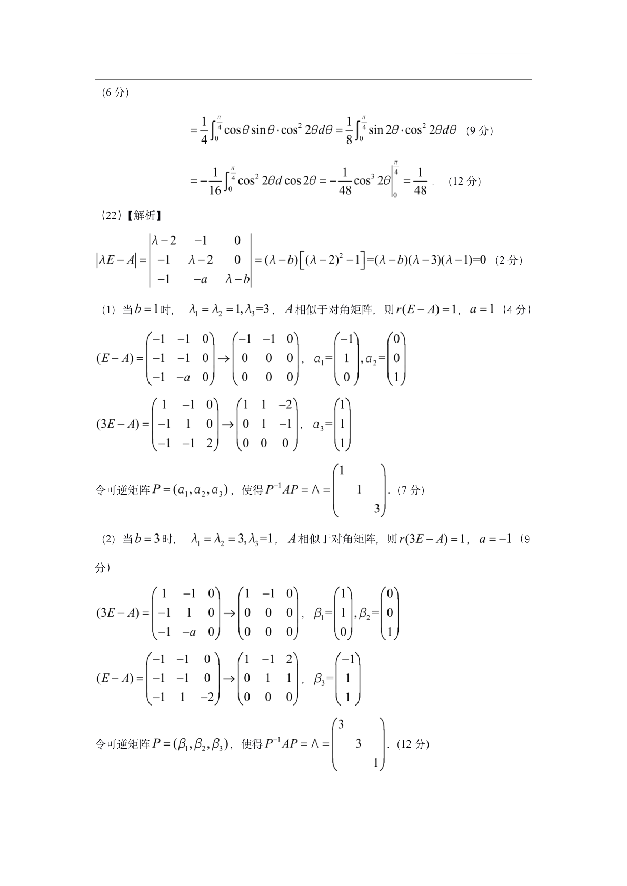

# 2021 数学二第 19 题

## 题目

设函数 $f(x)$ 满足
$$\int \frac{f(x)}{\sqrt{x}}\,dx=\frac16x^2-x+c,$$
$L$ 为曲线 $y=f(x)\,(4\le x\le 9)$。记 $L$ 的长度为 $S$，$L$ 绕 $x$ 轴旋转的旋转曲面的面积为 $A$，求 $S$ 和 $A$。

## 标准答案

$$S=\frac{22}{3},\qquad A=\frac{425\pi}{9}.$$

## 解析

由不定积分两边求导得
$$\frac{f(x)}{\sqrt{x}}=\frac13x-1,$$
故
$$f(x)=\frac13x^{3/2}-x^{1/2},\qquad f'(x)=\frac12x^{1/2}-\frac12x^{-1/2}.$$ 
于是
$$\sqrt{1+[f'(x)]^2}=\frac12x^{1/2}+\frac12x^{-1/2}.$$ 
弧长
$$S=\int_4^9\sqrt{1+[f'(x)]^2}\,dx=\int_4^9\left(\frac12x^{1/2}+\frac12x^{-1/2}\right)dx=\frac{22}{3}.$$ 
旋转曲面面积
$$A=\int_4^9 2\pi f(x)\sqrt{1+[f'(x)]^2}\,dx=\pi\int_4^9\left(\frac13x^2-\frac23x+1\right)dx=\frac{425\pi}{9}.$$

## 来源

- 题目来源：`math2_2021_questions.md`
- 答案来源：`math2_2021_answers.md`
