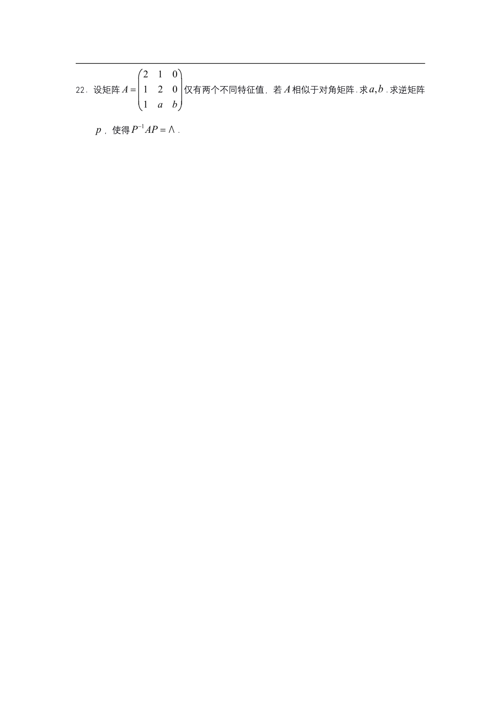

# 2021 数学二第 22 题

## 题目

设矩阵
$$A=\begin{pmatrix}2&1&0\\1&2&0\\1&a&b\end{pmatrix}$$
仅有两个不同特征值，若 $A$ 相似于对角矩阵，求 $a,b$，并求可逆矩阵 $P$，使得
$$P^{-1}AP=\Lambda.$$

## 标准答案

有两组解：

1. 当 $b=1,\ a=1$ 时，
$$
\Lambda=\operatorname{diag}(1,1,3),\quad
P=\begin{pmatrix}-1&0&1\\1&0&1\\0&1&1\end{pmatrix}.
$$

2. 当 $b=3,\ a=-1$ 时，
$$
\Lambda=\operatorname{diag}(3,3,1),\quad
P=\begin{pmatrix}1&0&-1\\1&0&1\\0&1&1\end{pmatrix}.
$$

## 解析

特征多项式为
$$
\lvert\lambda E-A\rvert
=\begin{vmatrix}\lambda-2&-1&0\\-1&\lambda-2&0\\-1&-a&\lambda-b\end{vmatrix}
=(\lambda-b)\big((\lambda-2)^2-1\big)
=(\lambda-b)(\lambda-3)(\lambda-1).
$$
因仅有两个不同特征值，所以 $b=1$ 或 $b=3$。

当 $b=1$ 时，为使矩阵可对角化，特征值 $1$ 的几何重数需为 $2$，由 $r(E-A)=1$ 得 $a=1$。此时可取特征向量
$$\alpha_1=(-1,1,0)^T,\ \alpha_2=(0,0,1)^T,\ \alpha_3=(1,1,1)^T,$$
组成
$$P=(\alpha_1,\alpha_2,\alpha_3).$$

当 $b=3$ 时，同理需特征值 $3$ 的几何重数为 $2$，由 $r(3E-A)=1$ 得 $a=-1$。此时可取特征向量
$$\beta_1=(1,1,0)^T,\ \beta_2=(0,0,1)^T,\ \beta_3=(-1,1,1)^T,$$
组成
$$P=(\beta_1,\beta_2,\beta_3).$$

## 来源

- 题目来源：`math2_2021_questions.md`
- 答案来源：`math2_2021_answers.md`
