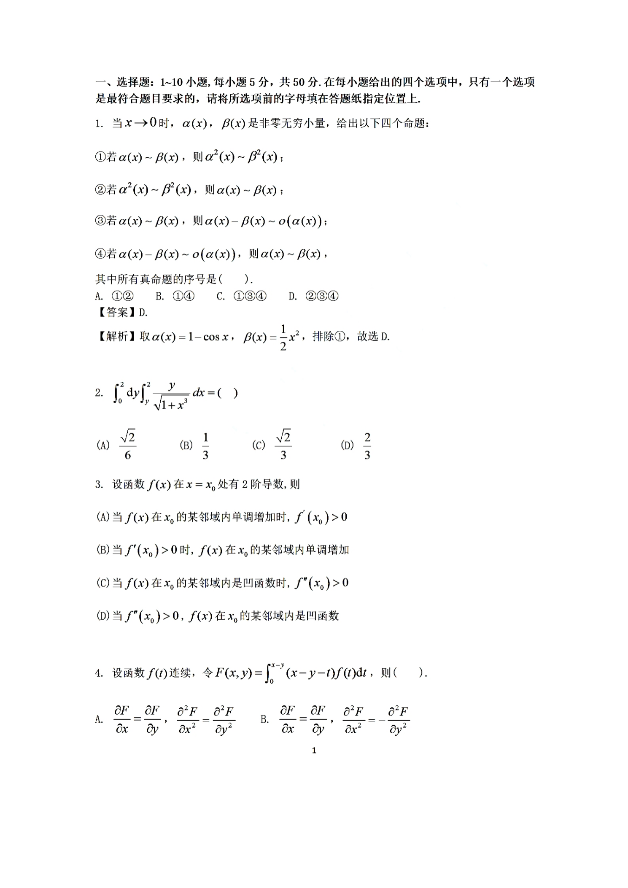
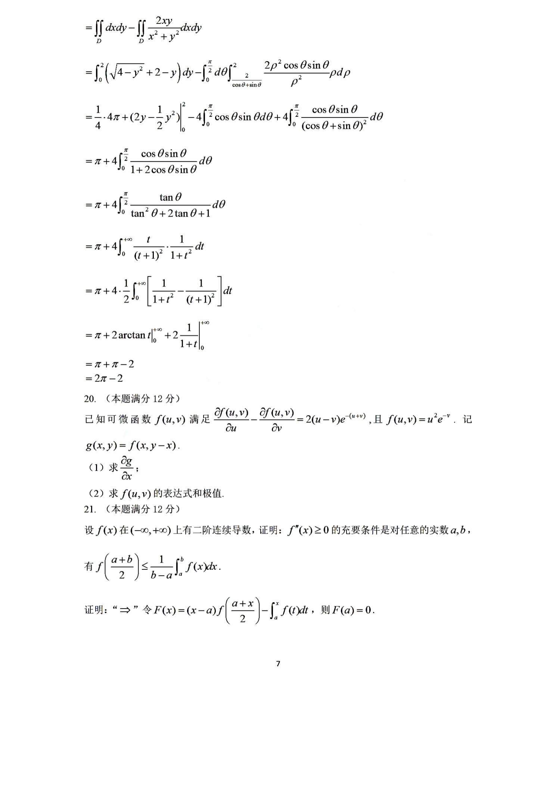

# 2022 年数学二答案解析

资料类型：考研数学二答案解析
年份：2022
科目：数学二
整理状态：以答案解析页图为主，辅以人工验算补全空缺答案。

**答案页图 1**

**答案页图 2**

**答案页图 3**

**答案页图 4**

**答案页图 5**

**答案页图 6**

**答案页图 7**

**答案页图 8**

**答案页图 9**

## 答案速查

| 题号 | 题型 | 答案 |
|---|---|---|
| 1 | 选择题 | D |
| 2 | 选择题 | B |
| 3 | 选择题 | B |
| 4 | 选择题 | C |
| 5 | 选择题 | A |
| 6 | 选择题 | D |
| 7 | 选择题 | A |
| 8 | 选择题 | B |
| 9 | 选择题 | D |
| 10 | 选择题 | C |
| 11 | 填空题 | $e^{1/2}$ |
| 12 | 填空题 | $-\dfrac{31}{32}$ |
| 13 | 填空题 | $\dfrac{8\pi}{3\sqrt3}$ |
| 14 | 填空题 | $C_1+e^x(C_2\cos2x+C_3\sin2x)$ |
| 15 | 填空题 | $\dfrac{\pi}{12}$ |
| 16 | 填空题 | $-1$ |
| 17 | 解答题 | $f'(1)=1$ |
| 18 | 解答题 | $e^2-\dfrac12$ |
| 19 | 解答题 | $2\pi-2$ |
| 20 | 解答题 | （I） $\frac{\partial g}{\partial x}=2(2x-y)e^{-y}.$ （II） $f(u,v)=(u^2+v^2)e^{-(u+v)},$ 最小值为 $0$（在 $(0,0)$ 处取得），无最大值。 |
| 21 | 证明题 | 结论成立：$f''(x)\ge 0$ 当且仅当对任意不同实数 $a,b$，有 $f\left(\frac{a+b}{2}\right)\le \frac1{b-a}\int_a^b f(x)\,dx.$ |
| 22 | 解答题 | （I）可化为标准形 $2y_1^2+4y_2^2+4y_3^2,$ 其中可取 $Q=\begin{pmatrix} \frac1{\sqrt2}&\frac1{\sqrt2}&0\\ 0&0&1\\ -\frac1{\sqrt2}&\frac1{\sqrt2}&0 \end{pmatrix}.$ （II） $\min_{x\ne 0}\frac{f(x)}{x^{\mathsf T}x}=2.$ |

## 详细解析

### 第 1 题

- 答案：D

① 不一定成立。取
$$
\alpha(x)=1-\cos x,\qquad \beta(x)=\frac12x^2,
$$
则 $\alpha(x)\sim\beta(x)$，从而可排除只含 ① 的选项。

② 若 $\alpha^2(x)\sim\beta^2(x)$，则
$$
\left(\frac{\alpha(x)}{\beta(x)}\right)^2\to 1.
$$
由于 $\alpha,\beta$ 同为非零无穷小量，故 $\alpha(x)/\beta(x)\to 1$，于是 $\alpha(x)\sim\beta(x)$。

③ 由 $\alpha(x)\sim\beta(x)$ 得
$$
\frac{\alpha(x)-\beta(x)}{\alpha(x)}
=1-\frac{\beta(x)}{\alpha(x)}\to 0,
$$
故 $\alpha(x)-\beta(x)=o(\alpha(x))$。

④ 由 $\alpha(x)-\beta(x)=o(\alpha(x))$ 得
$$
\beta(x)=\alpha(x)\bigl(1+o(1)\bigr),
$$
因而 $\beta(x)/\alpha(x)\to 1$，即 $\alpha(x)\sim\beta(x)$。

所有真命题为 ②③④，选 $D$。

### 第 2 题

- 答案：B

积分区域为
$$
D=\{(x,y)\mid 0\le y\le 2,\ y\le x\le 2\},
$$
交换积分次序得
$$
D=\{(x,y)\mid 0\le x\le 2,\ 0\le y\le x\}.
$$
因而
$$
\int_0^2dy\int_y^2\frac{y}{\sqrt{1+x^3}}\,dx
=\int_0^2dx\int_0^x\frac{y}{\sqrt{1+x^3}}\,dy
=\int_0^2\frac{x^2}{2\sqrt{1+x^3}}\,dx.
$$
令 $u=1+x^3$，则 $du=3x^2dx$，所以
$$
\int_0^2\frac{x^2}{2\sqrt{1+x^3}}\,dx
=\frac16\int_1^9u^{-1/2}\,du
=\frac13.
$$
故选 $B$。

### 第 3 题

- 答案：B

选项 (A) 不对，例如 $f(x)=x^3$ 在 $x_0=0$ 的某邻域内单调增加，但 $f'(0)=0$。

选项 (B) 正确。由导数定义与导数的局部保号性知，若 $f'(x_0)>0$，则在 $x_0$ 的某邻域内有 $f'(x)>0$，故函数在该邻域内单调增加。

选项 (C) 不对。若函数在邻域内为凹函数，则通常有 $f''(x_0)\le 0$，而不是 $>0$。

选项 (D) 不对。$f''(x_0)>0$ 表明邻域内应当是凸的，而不是凹的。

故选 $B$。

### 第 4 题

- 答案：C

将积分拆开：
$$
F(x,y)
=(x-y)\int_0^{x-y}f(t)\,dt-\int_0^{x-y}tf(t)\,dt.
$$
对 $x$ 求偏导得
$$
\frac{\partial F}{\partial x}
=\int_0^{x-y}f(t)\,dt.
$$
对 $y$ 求偏导得
$$
\frac{\partial F}{\partial y}
=-\int_0^{x-y}f(t)\,dt.
$$
故
$$
\frac{\partial F}{\partial x}=-\frac{\partial F}{\partial y}.
$$

再求二阶偏导：
$$
\frac{\partial^2F}{\partial x^2}=f(x-y),\qquad
\frac{\partial^2F}{\partial y^2}=f(x-y).
$$
所以
$$
\frac{\partial^2F}{\partial x^2}=\frac{\partial^2F}{\partial y^2}.
$$
故选 $C$。

### 第 5 题

- 答案：A

只需考察 $x=0$ 与 $x=1$ 两端点。

当 $x\to 0^+$ 时，
$$
\frac{\ln x}{x^p(1-x)^{1-p}}\sim \frac{\ln x}{x^p},
$$
因而收敛条件为
$$
p<1.
$$

当 $x\to 1^-$ 时，利用 $\ln x\sim x-1=-(1-x)$，得
$$
\frac{\ln x}{x^p(1-x)^{1-p}}
\sim -(1-x)^p.
$$
故在 $x=1$ 附近收敛当且仅当 $p>-1$。

综合得
$$
-1<p<1.
$$
故选 $A$。

### 第 6 题

- 答案：D

对于选项 (A)、(B)，取
$$
x_n=\begin{cases}
1,& n\text{ 为奇数},\\
-1,& n\text{ 为偶数},
\end{cases}
$$
则
$$
\cos(\sin x_n),\ \sin(\cos x_n)
$$
都有极限，但 $x_n$ 本身无极限，因此 (A)、(B) 错误。

对于 (C)，由于 $y=\sin x$ 在区间 $\left[-\dfrac\pi2,\dfrac\pi2\right]$ 上单调增加且连续，若 $\sin x_n$ 有极限，则 $x_n$ 必有极限，所以 (C) 错误。

对于 (D)，仍取上面的交错数列，则
$$
\cos x_n=\cos 1,\qquad \sin(\cos x_n)=\sin(\cos 1)
$$
都有极限，但 $x_n$ 无极限，因此 (D) 正确。

### 第 7 题

- 答案：A

当 $0<x<1$ 时，有
$$
\frac{x}{2}<\frac{x}{1+x}<\ln(1+x)<x.
$$
因此
$$
\frac{x}{2(1+\cos x)}
<\frac{\ln(1+x)}{1+\cos x}
<\frac{x}{1+\cos x}.
$$
又因为在 $0<x<1$ 上有 $\sin x<\cos x$ 不恒成立，直接比较分母更方便：
$$
1+\sin x<2(1+\cos x)
$$
从而
$$
\frac{x}{1+\cos x}<\frac{2x}{1+\sin x}.
$$
综上
$$
\frac{x}{2(1+\cos x)}
<\frac{\ln(1+x)}{1+\cos x}
<\frac{2x}{1+\sin x},
$$
积分后得
$$
I_1<I_2<I_3.
$$
故选 $A$。

### 第 8 题

- 答案：B

若 $A=P\Lambda P^{-1}$，则 $A$ 与 $\Lambda$ 相似，相似矩阵有相同特征多项式，因此特征值同为 $1,-1,0$。

反过来，若 $A$ 的特征值恰为 $1,-1,0$，三个特征值互不相同，所以 $A$ 可相似对角化，且其相似对角矩阵正是
$$
\Lambda=\operatorname{diag}(1,-1,0).
$$
因而存在可逆矩阵 $P$ 使
$$
A=P\Lambda P^{-1}.
$$
故选 $B$。

### 第 9 题

- 答案：D

考虑增广矩阵
$$
(A,b)=
\begin{pmatrix}
1&1&1&1\\
1&a&a^2&2\\
1&b&b^2&4
\end{pmatrix}
\xrightarrow{R_2-R_1,\ R_3-R_1}
\begin{pmatrix}
1&1&1&1\\
0&a-1&a^2-1&1\\
0&b-1&b^2-1&3
\end{pmatrix}.
$$
当 $a\ne b$ 且 $a\ne 1$ 时，系数矩阵满秩，线性方程组有唯一解；对称地，$a\ne b$ 且 $b\ne 1$ 时也有唯一解。

当 $a=b=1$ 时，
$$
r(A,b)=2>r(A)=1,
$$
无解。

当 $a=b\ne 1$ 时，
$$
r(A,b)=3>r(A)=2,
$$
也无解。

因此该方程组只可能“有唯一解或无解”，故选 $D$。

### 第 10 题

- 答案：C

计算两个三阶行列式：
$$
|\alpha_1,\alpha_2,\alpha_3|
=\begin{vmatrix}
\lambda&1&1\\
1&\lambda&1\\
1&1&\lambda
\end{vmatrix}
=\lambda^3-3\lambda+2
=(\lambda-1)^2(\lambda+2),
$$
$$
|\alpha_1,\alpha_2,\alpha_4|
=\begin{vmatrix}
\lambda&1&1\\
1&\lambda&\lambda\\
1&1&\lambda^2
\end{vmatrix}
=\lambda^4-2\lambda^2+1
=(\lambda-1)^2(\lambda+1)^2.
$$

当 $\lambda=1$ 时，两组向量都退化成同一组向量，仍然等价。

当 $\lambda=-2$ 时，
$$
r(\alpha_1,\alpha_2,\alpha_3)=2<r(\alpha_1,\alpha_2,\alpha_4)=3,
$$
不等价。

当 $\lambda=-1$ 时，
$$
r(\alpha_1,\alpha_2,\alpha_3)=3>r(\alpha_1,\alpha_2,\alpha_4)=1,
$$
也不等价。

除此之外，两组向量秩相同且张成同一空间，因此
$$
\lambda\in\mathbb R,\ \lambda\ne -1,\ \lambda\ne -2.
$$
故选 $C$。

### 第 11 题

- 答案：$e^{1/2}$

记原式为 $L$，取对数得
$$
\ln L=\cot x\cdot \ln\left(\frac{1+e^x}{2}\right).
$$
当 $x\to 0$ 时，
$$
\ln\left(\frac{1+e^x}{2}\right)
=\ln\left(1+\frac{e^x-1}{2}\right)
\sim \frac{e^x-1}{2}\sim \frac{x}{2}.
$$
又 $\cot x\sim \dfrac1x$，故
$$
\ln L\to \frac12.
$$
因而
$$
L=e^{1/2}.
$$

### 第 12 题

- 答案：$-\dfrac{31}{32}$

先由方程
$$
x^2+xy+y^3=3
$$
在 $x=1$ 处求对应的 $y$，得 $y(1)=1$。

对原式求导：
$$
2x+y+xy'+3y^2y'=0.
$$
代入 $(x,y)=(1,1)$ 得
$$
2+1+y'+3y'=0,
$$
所以
$$
y'(1)=-\frac34.
$$

再求导：
$$
2+2y'+xy''+6y(y')^2+3y^2y''=0.
$$
代入 $x=1,\ y=1,\ y'(1)=-\dfrac34$，有
$$
2-\frac32+4y''+\frac{27}{8}=0.
$$
解得
$$
4y''=-\frac{31}{8},
\qquad
y''(1)=-\frac{31}{32}.
$$

### 第 13 题

- 答案：$\dfrac{8\pi}{3\sqrt3}$

将分子拆成
$$
2x+3=(2x-1)+4.
$$
因而
$$
\int_0^1\frac{2x+3}{x^2-x+1}\,dx
=\int_0^1\frac{2x-1}{x^2-x+1}\,dx
+4\int_0^1\frac{dx}{x^2-x+1}.
$$

第一项为
$$
\left.\ln(x^2-x+1)\right|_0^1=0.
$$
对第二项配方：
$$
x^2-x+1=\left(x-\frac12\right)^2+\frac34.
$$
所以
$$
\int_0^1\frac{dx}{x^2-x+1}
=\frac{2}{\sqrt3}\left.\arctan\frac{2x-1}{\sqrt3}\right|_0^1
=\frac{2}{\sqrt3}\cdot\frac{\pi}{3}.
$$
因而原积分为
$$
4\cdot \frac{2\pi}{3\sqrt3}
=\frac{8\pi}{3\sqrt3}.
$$

### 第 14 题

- 答案：$C_1+e^x(C_2\cos2x+C_3\sin2x)$

特征方程为
$$
r^3-2r^2+5r=0,
$$
即
$$
r(r^2-2r+5)=0.
$$
所以特征根为
$$
r_1=0,\qquad r_{2,3}=1\pm 2i.
$$
因而微分方程的通解为
$$
y(x)=C_1+e^x(C_2\cos2x+C_3\sin2x).
$$

### 第 15 题

- 答案：$\dfrac{\pi}{12}$

极坐标下所围面积为
$$
S=\frac12\int_0^{\pi/3}r^2\,d\theta
=\frac12\int_0^{\pi/3}\sin^2(3\theta)\,d\theta.
$$
令 $u=3\theta$，则 $d\theta=\dfrac13\,du$，积分上下限变为 $0$ 到 $\pi$，故
$$
S=\frac16\int_0^\pi \sin^2u\,du
=\frac16\cdot \frac{\pi}{2}
=\frac{\pi}{12}.
$$

### 第 16 题

- 答案：$-1$

设
$$
B=\begin{pmatrix}
-2&1&-1\\
1&-1&0\\
-1&0&0
\end{pmatrix}.
$$
依题意，$B$ 是由 $A$ 经过两步初等变换得到的，因此按逆变换还原：

先将 $B$ 的第二列的 $1$ 倍加到第一列，再交换第二、三行，得到
$$
A=\begin{pmatrix}
-1&1&-1\\
-1&0&0\\
0&-1&0
\end{pmatrix}.
$$
计算得
$$
A^{-1}=
\begin{pmatrix}
0&-1&0\\
0&0&-1\\
-1&1&-1
\end{pmatrix}.
$$
因而
$$
\operatorname{tr}(A^{-1})=0+0+(-1)=-1.
$$

### 第 17 题

- 答案：$f'(1)=1$

由题设极限存在可得
$$
\lim_{x\to 0}\bigl(f(e^{x^2})-3f(1+\sin^2x)\bigr)=0,
$$
即 $f(1)=0$。

于是
$$
\lim_{x\to 0}\frac{f(e^{x^2})-3f(1+\sin^2x)}{x^2}
=
\lim_{x\to 0}\frac{f(e^{x^2})-f(1)}{x^2}
-3\lim_{x\to 0}\frac{f(1+\sin^2x)-f(1)}{x^2}.
$$
分别写成导数形式：
$$
\lim_{x\to 0}\frac{f(e^{x^2})-f(1)}{e^{x^2}-1}\cdot \frac{e^{x^2}-1}{x^2}
=f'(1),
$$
$$
\lim_{x\to 0}\frac{f(1+\sin^2x)-f(1)}{\sin^2x}\cdot \frac{\sin^2x}{x^2}
=f'(1).
$$
故原极限等于
$$
f'(1)-3f'(1)=-2f'(1).
$$
结合题设值为 $2$，得
$$
-2f'(1)=2,
$$
从而
$$
f'(1)=1.
$$

### 第 18 题

- 答案：$e^2-\dfrac12$

由方程
$$
2xy'-4y=2\ln x-1
$$
可化为
$$
y'-\frac{2}{x}y=\frac{\ln x}{x}-\frac{1}{2x}.
$$
试作
$$
y(x)=-\frac12\ln x+Cx^2,
$$
代入原方程可验证成立。由初值条件 $y(1)=\dfrac14$ 得
$$
C=\frac14,
$$
所以
$$
y(x)=-\frac12\ln x+\frac14x^2.
$$

求导得
$$
y'(x)=\frac{x}{2}-\frac{1}{2x}.
$$
因而
$$
1+(y')^2
=1+\frac14\left(x-\frac1x\right)^2
=\frac14\left(x+\frac1x\right)^2.
$$
在 $[1,e]$ 上有 $x+\dfrac1x>0$，故
$$
\sqrt{1+(y')^2}=\frac12\left(x+\frac1x\right).
$$
弧长为
$$
s=\int_1^e \frac12\left(x+\frac1x\right)\,dx
=\left.\left(\frac{x^2}{4}+\frac12\ln x\right)\right|_1^e
=e^2-\frac12.
$$

### 第 19 题

- 答案：$2\pi-2$

先化简被积函数：
$$
\frac{(x-y)^2}{x^2+y^2}
=\frac{x^2-2xy+y^2}{x^2+y^2}
=1-\frac{2xy}{x^2+y^2}.
$$
因而
$$
I=\iint_D1\,dxdy-\iint_D\frac{2xy}{x^2+y^2}\,dxdy.
$$

第一项就是区域面积：
$$
\iint_D1\,dxdy=\int_0^2\bigl(\sqrt{4-y^2}+2-y\bigr)\,dy=\pi+2.
$$

第二项转为极坐标。由边界可知
$$
0\le \theta\le \frac\pi2,\qquad \frac{2}{\cos\theta+\sin\theta}\le \rho\le 2.
$$
又
$$
\frac{2xy}{x^2+y^2}=2\cos\theta\sin\theta.
$$
所以
$$
\iint_D\frac{2xy}{x^2+y^2}\,dxdy
=\int_0^{\pi/2}\!\!\int_{2/(\cos\theta+\sin\theta)}^2
2\cos\theta\sin\theta\,\rho\,d\rho\,d\theta.
$$
计算后可化为
$$
4\int_0^{\pi/2}\frac{\cos\theta\sin\theta}{1+2\cos\theta\sin\theta}\,d\theta.
$$
令 $t=\tan\theta$，则上式等于
$$
2\int_0^{+\infty}\left(\frac{1}{1+t^2}-\frac{1}{(1+t)^2}\right)\,dt
=2\left(\frac{\pi}{2}-1\right)=\pi-2.
$$

故
$$
I=(\pi+2)-(\pi-2)=2\pi-2.
$$

### 第 20 题

- 答案：（I）
$$
\frac{\partial g}{\partial x}=2(2x-y)e^{-y}.
$$

（II）
$$
f(u,v)=(u^2+v^2)e^{-(u+v)},
$$
最小值为 $0$（在 $(0,0)$ 处取得），无最大值。

（I）由链式法则，
$$
g(x,y)=f(u,v),\quad u=x,\ v=y-x,
$$
故
$$
\frac{\partial g}{\partial x}
=f_u\frac{\partial u}{\partial x}+f_v\frac{\partial v}{\partial x}
=f_u-f_v.
$$
由题设
$$
f_u-f_v=2(u-v)e^{-(u+v)},
$$
代入 $u=x,\ v=y-x$ 得
$$
\frac{\partial g}{\partial x}=2(2x-y)e^{-y}.
$$

（II）令
$$
\xi=u-v,\qquad \eta=u+v,
$$
并设 $F(\xi,\eta)=f(u,v)$。则
$$
f_u=F_\xi+F_\eta,\qquad f_v=-F_\xi+F_\eta,
$$
所以
$$
f_u-f_v=2F_\xi=2\xi e^{-\eta}.
$$
从而
$$
F_\xi=\xi e^{-\eta}.
$$
对 $\xi$ 积分得
$$
F(\xi,\eta)=\frac12\xi^2e^{-\eta}+C(\eta).
$$

利用条件 $f(u,0)=u^2e^{-u}$，此时 $\xi=\eta=u$，故
$$
\frac12u^2e^{-u}+C(u)=u^2e^{-u},
$$
得
$$
C(u)=\frac12u^2e^{-u}.
$$
所以
$$
f(u,v)
=\frac12(u-v)^2e^{-(u+v)}+\frac12(u+v)^2e^{-(u+v)}
=(u^2+v^2)e^{-(u+v)}.
$$

再求极值。显然
$$
f(u,v)\ge 0,
$$
且在 $(u,v)=(0,0)$ 时取到 $0$，故最小值为 $0$。

当 $u=v=-t,\ t\to+\infty$ 时，
$$
f(-t,-t)=2t^2e^{2t}\to+\infty,
$$
因此无最大值。

### 第 21 题

- 答案：结论成立：$f''(x)\ge 0$ 当且仅当对任意不同实数 $a,b$，有
$$
f\left(\frac{a+b}{2}\right)\le \frac1{b-a}\int_a^b f(x)\,dx.
$$

充分性：设 $f''(x)\ge 0$。令
$$
F(x)=(x-a)f\left(\frac{a+x}{2}\right)-\int_a^x f(t)\,dt.
$$
则 $F(a)=0$，且
$$
F'(x)
=\frac12(x-a)f'\left(\frac{a+x}{2}\right)+f\left(\frac{a+x}{2}\right)-f(x).
$$
再对后两项用拉格朗日中值定理，可写成
$$
F'(x)=\frac12(x-a)\left[f'\left(\frac{a+x}{2}\right)-f'(\xi)\right].
$$
由于 $f''(x)\ge 0$，故 $f'(x)$ 单调增加，于是当 $x>a$ 时有
$$
f'\left(\frac{a+x}{2}\right)\le f'(\xi),
$$
从而 $F'(x)\le 0$，即 $F(x)\le 0$。令 $x=b$ 即得
$$
f\left(\frac{a+b}{2}\right)\le \frac1{b-a}\int_a^b f(x)\,dx.
$$

必要性：对任意 $x_0$ 和任意 $h>0$，取
$$
a=x_0-h,\qquad b=x_0+h,
$$
则题设不等式化为
$$
f(x_0)\le \frac1{2h}\int_{x_0-h}^{x_0+h}f(x)\,dx.
$$
移项得
$$
\frac{1}{2h^3}\left(\int_{x_0-h}^{x_0+h}f(x)\,dx-2hf(x_0)\right)\ge 0.
$$
令 $h\to 0$，利用二阶导数存在并连续，可得
$$
\lim_{h\to 0}\frac{1}{2h^3}\left(\int_{x_0-h}^{x_0+h}f(x)\,dx-2hf(x_0)\right)
=\frac16f''(x_0).
$$
因此
$$
f''(x_0)\ge 0.
$$
由 $x_0$ 任意，结论成立。

### 第 22 题

- 答案：（I）可化为标准形
$$
2y_1^2+4y_2^2+4y_3^2,
$$
其中可取
$$
Q=\begin{pmatrix}
\frac1{\sqrt2}&\frac1{\sqrt2}&0\\
0&0&1\\
-\frac1{\sqrt2}&\frac1{\sqrt2}&0
\end{pmatrix}.
$$

（II）
$$
\min_{x\ne 0}\frac{f(x)}{x^{\mathsf T}x}=2.
$$

二次型对应矩阵为
$$
A=\begin{pmatrix}
3&0&1\\
0&4&0\\
1&0&3
\end{pmatrix}.
$$
其特征多项式为
$$
|A-\lambda E|
=\begin{vmatrix}
3-\lambda&0&1\\
0&4-\lambda&0\\
1&0&3-\lambda
\end{vmatrix}
=-(\lambda-2)(\lambda-4)^2.
$$
所以特征值为
$$
2,\ 4,\ 4.
$$

对应于 $\lambda=2$，可取特征向量
$$
\alpha_1=(1,0,-1)^{\mathsf T}.
$$
对应于 $\lambda=4$，可取两个线性无关的特征向量
$$
\alpha_2=(1,0,1)^{\mathsf T},\qquad \alpha_3=(0,1,0)^{\mathsf T}.
$$
这三个向量两两正交，单位化得
$$
\gamma_1=\frac1{\sqrt2}(1,0,-1)^{\mathsf T},\quad
\gamma_2=\frac1{\sqrt2}(1,0,1)^{\mathsf T},\quad
\gamma_3=(0,1,0)^{\mathsf T}.
$$
令
$$
Q=(\gamma_1,\gamma_2,\gamma_3),
$$
则 $Q$ 为正交矩阵，并且经正交变换 $x=Qy$，有
$$
f(x)=2y_1^2+4y_2^2+4y_3^2.
$$

于是
$$
f(x)=f(Qy)=2y_1^2+4y_2^2+4y_3^2.
$$
又因 $Q$ 为正交矩阵，
$$
x^{\mathsf T}x=y^{\mathsf T}y=y_1^2+y_2^2+y_3^2.
$$
因此
$$
2(y_1^2+y_2^2+y_3^2)\le 2y_1^2+4y_2^2+4y_3^2,
$$
从而
$$
\frac{f(x)}{x^{\mathsf T}x}\ge 2.
$$
当 $y_2=y_3=0,\ y_1\ne 0$ 时取等号，所以
$$
\min_{x\ne 0}\frac{f(x)}{x^{\mathsf T}x}=2.
$$
