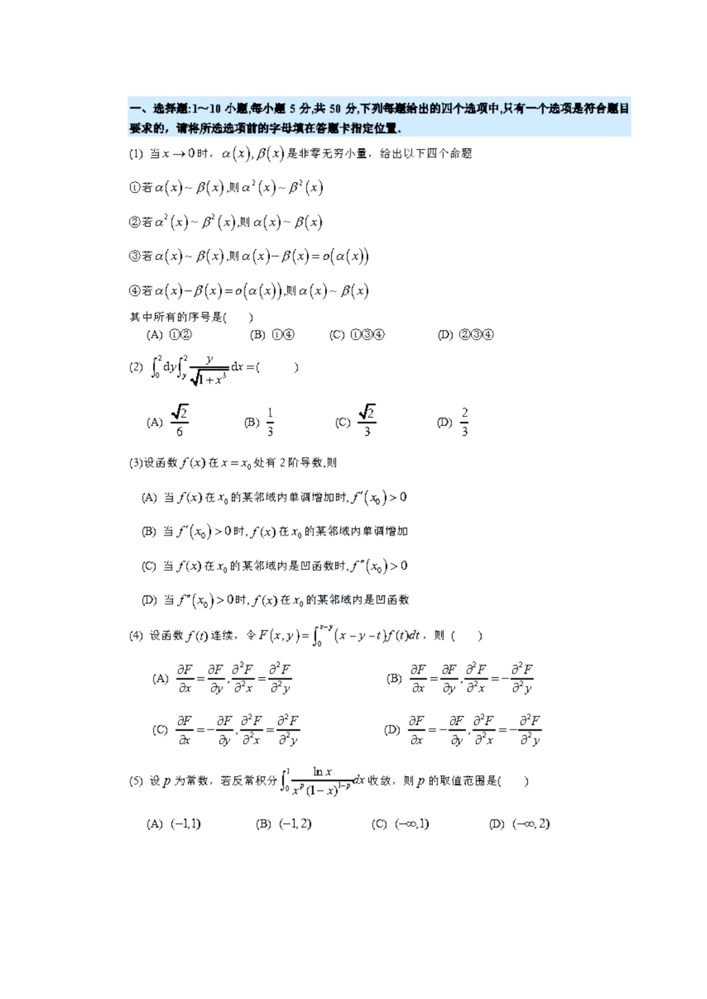

# 2022 年数学二真题

资料类型：考研数学二历年真题
年份：2022
科目：数学二
整理状态：按题面 PDF 页图人工转写，并与答案解析页逐题校对。

**第 1-5 题题图**

## 第 1 题
- 题型：选择题
- 分值：5
- 模块：高等数学
- 考点：等价无穷小、高阶无穷小、渐近关系

当 $x\to 0$ 时，$\alpha(x),\beta(x)$ 是非零无穷小量，给出以下四个命题：

① 若 $\alpha(x)\sim \beta(x)$，则 $\alpha^2(x)\sim \beta^2(x)$；

② 若 $\alpha^2(x)\sim \beta^2(x)$，则 $\alpha(x)\sim \beta(x)$；

③ 若 $\alpha(x)\sim \beta(x)$，则 $\alpha(x)-\beta(x)=o(\alpha(x))$；

④ 若 $\alpha(x)-\beta(x)=o(\alpha(x))$，则 $\alpha(x)\sim \beta(x)$。

其中所有真命题的序号是

(A) ①②

(B) ①④

(C) ①③④

(D) ②③④

## 第 2 题
- 题型：选择题
- 分值：5
- 模块：高等数学
- 考点：二重积分、交换积分次序、换元

$$
\int_0^2dy\int_y^2\frac{y}{\sqrt{1+x^3}}\,dx=
$$

(A) $\dfrac{\sqrt2}{6}$

(B) $\dfrac13$

(C) $\dfrac{\sqrt2}{3}$

(D) $\dfrac23$

## 第 3 题
- 题型：选择题
- 分值：5
- 模块：高等数学
- 考点：导数应用、单调性、凹凸性

设函数 $f(x)$ 在 $x=x_0$ 处有二阶导数，则

(A) 当 $f(x)$ 在 $x_0$ 的某邻域内单调增加时，$f'(x_0)>0$

(B) 当 $f'(x_0)>0$ 时，$f(x)$ 在 $x_0$ 的某邻域内单调增加

(C) 当 $f(x)$ 在 $x_0$ 的某邻域内是凹函数时，$f''(x_0)>0$

(D) 当 $f''(x_0)>0$ 时，$f(x)$ 在 $x_0$ 的某邻域内是凹函数

## 第 4 题
- 题型：选择题
- 分值：5
- 模块：高等数学
- 考点：积分定义函数、偏导数、Leibniz公式

设函数 $f(t)$ 连续，令
$$
F(x,y)=\int_0^{x-y}(x-y-t)f(t)\,dt,
$$
则

(A) $\dfrac{\partial F}{\partial x}=\dfrac{\partial F}{\partial y},\ \dfrac{\partial^2F}{\partial x^2}=\dfrac{\partial^2F}{\partial y^2}$

(B) $\dfrac{\partial F}{\partial x}=\dfrac{\partial F}{\partial y},\ \dfrac{\partial^2F}{\partial x^2}=-\dfrac{\partial^2F}{\partial y^2}$

(C) $\dfrac{\partial F}{\partial x}=-\dfrac{\partial F}{\partial y},\ \dfrac{\partial^2F}{\partial x^2}=\dfrac{\partial^2F}{\partial y^2}$

(D) $\dfrac{\partial F}{\partial x}=-\dfrac{\partial F}{\partial y},\ \dfrac{\partial^2F}{\partial x^2}=-\dfrac{\partial^2F}{\partial y^2}$

## 第 5 题
- 题型：选择题
- 分值：5
- 模块：高等数学
- 考点：反常积分、瑕积分收敛性

设 $p$ 为常数，若反常积分
$$
\int_0^1\frac{\ln x}{x^p(1-x)^{1-p}}\,dx
$$
收敛，则 $p$ 的取值范围是

(A) $(-1,1)$

(B) $(-1,2)$

(C) $(-\infty,1)$

(D) $(-\infty,2)$

**第 6-12 题题图**

## 第 6 题
- 题型：选择题
- 分值：5
- 模块：高等数学
- 考点：数列极限、复合函数、连续性

已知数列 $\{x_n\}$，其中 $-\dfrac{\pi}{2}\le x_n\le \dfrac{\pi}{2}$，则

(A) 若 $\lim\limits_{n\to\infty}\cos(\sin x_n)$ 存在时，则 $\lim\limits_{n\to\infty}x_n$ 存在

(B) 若 $\lim\limits_{n\to\infty}\sin(\cos x_n)$ 存在时，则 $\lim\limits_{n\to\infty}x_n$ 存在

(C) 若 $\lim\limits_{n\to\infty}\cos(\sin x_n)$ 存在且 $\lim\limits_{n\to\infty}\sin x_n$ 存在，则 $\lim\limits_{n\to\infty}x_n$ 不一定存在

(D) 若 $\lim\limits_{n\to\infty}\sin(\cos x_n)$ 存在且 $\lim\limits_{n\to\infty}\cos x_n$ 存在，则 $\lim\limits_{n\to\infty}x_n$ 不一定存在

## 第 7 题
- 题型：选择题
- 分值：5
- 模块：高等数学
- 考点：定积分比较、不等式

已知
$$
I_1=\int_0^1\frac{x}{2(1+\cos x)}\,dx,\qquad
I_2=\int_0^1\frac{\ln(1+x)}{1+\cos x}\,dx,\qquad
I_3=\int_0^1\frac{2x}{1+\sin x}\,dx,
$$
则

(A) $I_1<I_2<I_3$

(B) $I_2<I_1<I_3$

(C) $I_1<I_3<I_2$

(D) $I_2<I_3<I_1$

## 第 8 题
- 题型：选择题
- 分值：5
- 模块：线性代数
- 考点：特征值、相似对角化

设 $A$ 为 $3$ 阶矩阵，
$$
\Lambda=\begin{pmatrix}
1&0&0\\
0&-1&0\\
0&0&0
\end{pmatrix},
$$
则 $A$ 的特征值为 $1,-1,0$ 的充分必要条件是

(A) 存在可逆矩阵 $P,Q$，使得 $A=P\Lambda Q$

(B) 存在可逆矩阵 $P$，使得 $A=P\Lambda P^{-1}$

(C) 存在正交矩阵 $Q$，使得 $A=Q\Lambda Q^{-1}$

(D) 存在可逆矩阵 $P$，使得 $A=P\Lambda P^{\mathsf T}$

## 第 9 题
- 题型：选择题
- 分值：5
- 模块：线性代数
- 考点：线性方程组、矩阵秩、增广矩阵

设矩阵
$$
A=\begin{pmatrix}
1&1&1\\
1&a&a^2\\
1&b&b^2
\end{pmatrix},
\qquad
b=\begin{pmatrix}
1\\
2\\
4
\end{pmatrix},
$$
则线性方程组 $Ax=b$ 解的情况为

(A) 无解

(B) 有解

(C) 有无穷多解或无解

(D) 有唯一解或无解

## 第 10 题
- 题型：选择题
- 分值：5
- 模块：线性代数
- 考点：向量组等价、秩、行列式

设
$$
\alpha_1=\begin{pmatrix}\lambda\\1\\1\end{pmatrix},\quad
\alpha_2=\begin{pmatrix}1\\\lambda\\1\end{pmatrix},\quad
\alpha_3=\begin{pmatrix}1\\1\\\lambda\end{pmatrix},\quad
\alpha_4=\begin{pmatrix}1\\\lambda\\\lambda^2\end{pmatrix},
$$
若向量组 $\alpha_1,\alpha_2,\alpha_3$ 与 $\alpha_1,\alpha_2,\alpha_4$ 等价，则 $\lambda$ 的取值范围是

(A) $\{\,\lambda\mid \lambda\in\mathbb R\,\}$

(B) $\{\,\lambda\mid \lambda\in\mathbb R,\ \lambda\ne -1\,\}$

(C) $\{\,\lambda\mid \lambda\in\mathbb R,\ \lambda\ne -1,\lambda\ne -2\,\}$

(D) $\{\,\lambda\mid \lambda\in\mathbb R,\ \lambda\ne -2\,\}$

## 第 11 题
- 题型：填空题
- 分值：5
- 模块：高等数学
- 考点：重要极限、指数极限、对数展开

求极限
$$
\lim_{x\to 0}\left(\frac{1+e^x}{2}\right)^{\cot x}.
$$

## 第 12 题
- 题型：填空题
- 分值：5
- 模块：高等数学
- 考点：隐函数求导、二阶导数

已知函数 $y=y(x)$ 由方程
$$
x^2+xy+y^3=3
$$
确定，则 $y''(1)=$ ______。

**第 13-22 题题图**

## 第 13 题
- 题型：填空题
- 分值：5
- 模块：高等数学
- 考点：定积分、配方、反正切积分

计算
$$
\int_0^1\frac{2x+3}{x^2-x+1}\,dx.
$$

## 第 14 题
- 题型：填空题
- 分值：5
- 模块：高等数学
- 考点：常系数线性微分方程

微分方程
$$
y'''-2y''+5y'=0
$$
的通解 $y(x)=$ ______。

## 第 15 题
- 题型：填空题
- 分值：5
- 模块：高等数学
- 考点：极坐标、面积公式

已知曲线 $L$ 的极坐标方程为
$$
r=\sin 3\theta\qquad \left(0\le \theta\le \frac{\pi}{3}\right),
$$
则 $L$ 围成的有界区域的面积为 ______。

## 第 16 题
- 题型：填空题
- 分值：5
- 模块：线性代数
- 考点：逆矩阵、初等变换、迹

设 $A$ 为 $3$ 阶矩阵，交换 $A$ 的第 $2$ 行和第 $3$ 行，再将第 $2$ 列的 $-1$ 倍加到第 $1$ 列，得到矩阵
$$
\begin{pmatrix}
-2&1&-1\\
1&-1&0\\
-1&0&0
\end{pmatrix},
$$
则 $A^{-1}$ 的迹 $\operatorname{tr}(A^{-1})=$ ______。

## 第 17 题
- 题型：解答题
- 分值：10
- 模块：高等数学
- 考点：可导定义、极限、导数

已知函数 $f(x)$ 在 $x=1$ 处可导，且
$$
\lim_{x\to 0}\frac{f(e^{x^2})-3f(1+\sin^2x)}{x^2}=2,
$$
求 $f'(1)$。

## 第 18 题
- 题型：解答题
- 分值：10
- 模块：高等数学
- 考点：微分方程、弧长

设函数 $y(x)$ 是微分方程
$$
2xy'-4y=2\ln x-1
$$
满足条件
$$
y(1)=\frac14
$$
的解，求曲线 $y=y(x)\ (1\le x\le e)$ 的弧长。

## 第 19 题
- 题型：解答题
- 分值：10
- 模块：高等数学
- 考点：二重积分、极坐标变换

已知平面区域
$$
D=\{(x,y)\mid y-2\le x\le \sqrt{4-y^2},\ 0\le y\le 2\},
$$
计算
$$
I=\iint_D\frac{(x-y)^2}{x^2+y^2}\,dxdy.
$$

## 第 20 题
- 题型：解答题
- 分值：12
- 模块：高等数学
- 考点：偏微分方程、链式法则、多元函数极值

已知可微函数 $f(u,v)$ 满足
$$
\frac{\partial f(u,v)}{\partial u}-\frac{\partial f(u,v)}{\partial v}
=2(u-v)e^{-(u+v)},
$$
且
$$
f(u,0)=u^2e^{-u}.
$$
记
$$
g(x,y)=f(x,y-x).
$$

（I）求 $\dfrac{\partial g(x,y)}{\partial x}$；

（II）求 $f(u,v)$ 的表达式和极值。

## 第 21 题
- 题型：证明题
- 分值：12
- 模块：高等数学
- 考点：凸函数、积分不等式、充要条件

设函数 $f(x)$ 在 $(-\infty,+\infty)$ 内具有二阶连续导数。证明：$f''(x)\ge 0$ 的充分必要条件是：对不同的实数 $a,b$，
$$
f\left(\frac{a+b}{2}\right)\le \frac1{b-a}\int_a^b f(x)\,dx.
$$

## 第 22 题
- 题型：解答题
- 分值：12
- 模块：线性代数
- 考点：二次型、正交变换、Rayleigh商

已知二次型
$$
f(x_1,x_2,x_3)=3x_1^2+4x_2^2+3x_3^2+2x_1x_3.
$$

（I）求正交变换 $x=Qy$ 将 $f(x_1,x_2,x_3)$ 化为标准形；

（II）证明
$$
\min_{x\ne 0}\frac{f(x)}{x^{\mathsf T}x}=2.
$$
