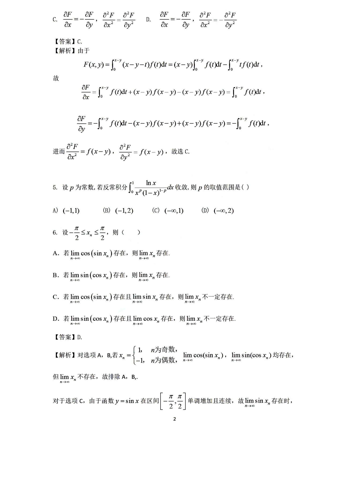

# 2022 数学二第 6 题

## 题目

已知数列 $\{x_n\}$，其中 $-\dfrac{\pi}{2}\le x_n\le \dfrac{\pi}{2}$，则

(A) 若 $\lim\limits_{n\to\infty}\cos(\sin x_n)$ 存在时，则 $\lim\limits_{n\to\infty}x_n$ 存在

(B) 若 $\lim\limits_{n\to\infty}\sin(\cos x_n)$ 存在时，则 $\lim\limits_{n\to\infty}x_n$ 存在

(C) 若 $\lim\limits_{n\to\infty}\cos(\sin x_n)$ 存在且 $\lim\limits_{n\to\infty}\sin x_n$ 存在，则 $\lim\limits_{n\to\infty}x_n$ 不一定存在

(D) 若 $\lim\limits_{n\to\infty}\sin(\cos x_n)$ 存在且 $\lim\limits_{n\to\infty}\cos x_n$ 存在，则 $\lim\limits_{n\to\infty}x_n$ 不一定存在

## 标准答案

D

## 解析

对于选项 (A)、(B)，取
$$
x_n=\begin{cases}
1,& n\text{ 为奇数},\\
-1,& n\text{ 为偶数},
\end{cases}
$$
则
$$
\cos(\sin x_n),\ \sin(\cos x_n)
$$
都有极限，但 $x_n$ 本身无极限，因此 (A)、(B) 错误。

对于 (C)，由于 $y=\sin x$ 在区间 $\left[-\dfrac\pi2,\dfrac\pi2\right]$ 上单调增加且连续，若 $\sin x_n$ 有极限，则 $x_n$ 必有极限，所以 (C) 错误。

对于 (D)，仍取上面的交错数列，则
$$
\cos x_n=\cos 1,\qquad \sin(\cos x_n)=\sin(\cos 1)
$$
都有极限，但 $x_n$ 无极限，因此 (D) 正确。

## 来源

- 题目来源：`math2_2022_questions.md`
- 答案来源：`math2_2022_answers.md`
