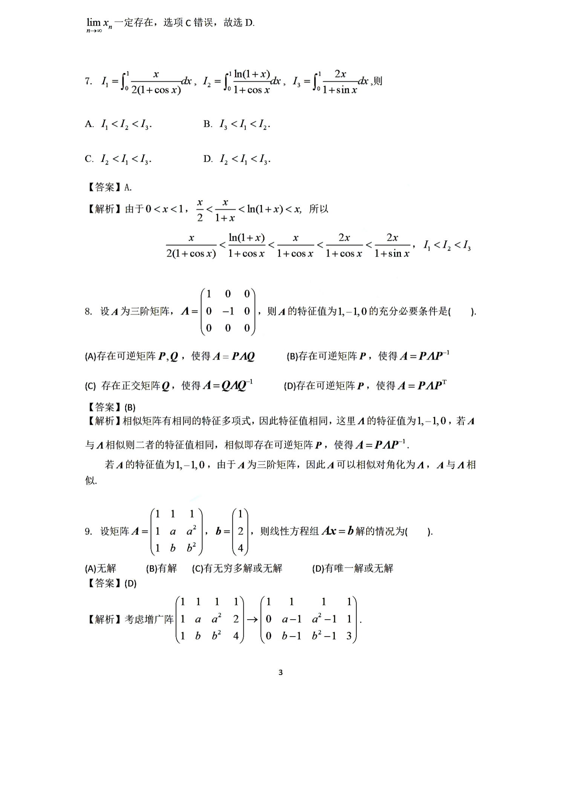
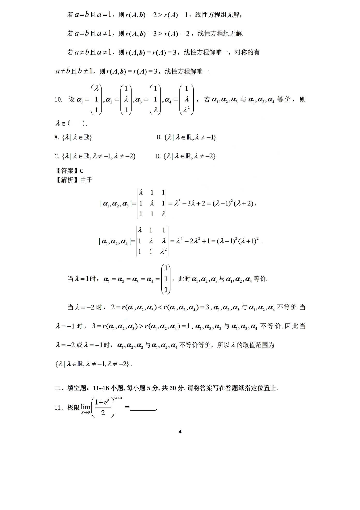

# 2022 数学二第 9 题

## 题目

设矩阵
$$
A=\begin{pmatrix}
1&1&1\\
1&a&a^2\\
1&b&b^2
\end{pmatrix},
\qquad
b=\begin{pmatrix}
1\\
2\\
4
\end{pmatrix},
$$
则线性方程组 $Ax=b$ 解的情况为

(A) 无解

(B) 有解

(C) 有无穷多解或无解

(D) 有唯一解或无解

## 标准答案

D

## 解析

考虑增广矩阵
$$
(A,b)=
\begin{pmatrix}
1&1&1&1\\
1&a&a^2&2\\
1&b&b^2&4
\end{pmatrix}
\xrightarrow{R_2-R_1,\ R_3-R_1}
\begin{pmatrix}
1&1&1&1\\
0&a-1&a^2-1&1\\
0&b-1&b^2-1&3
\end{pmatrix}.
$$
当 $a\ne b$ 且 $a\ne 1$ 时，系数矩阵满秩，线性方程组有唯一解；对称地，$a\ne b$ 且 $b\ne 1$ 时也有唯一解。

当 $a=b=1$ 时，
$$
r(A,b)=2>r(A)=1,
$$
无解。

当 $a=b\ne 1$ 时，
$$
r(A,b)=3>r(A)=2,
$$
也无解。

因此该方程组只可能“有唯一解或无解”，故选 $D$。

## 来源

- 题目来源：`math2_2022_questions.md`
- 答案来源：`math2_2022_answers.md`
