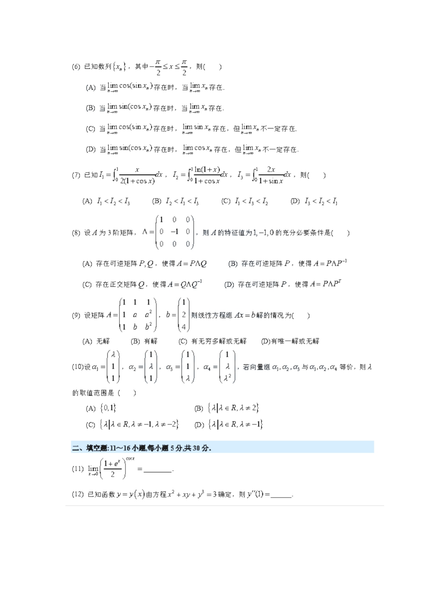

# 2022 数学二第 11 题

## 题目

求极限
$$
\lim_{x\to 0}\left(\frac{1+e^x}{2}\right)^{\cot x}.
$$

## 标准答案

$e^{1/2}$

## 解析

记原式为 $L$，取对数得
$$
\ln L=\cot x\cdot \ln\left(\frac{1+e^x}{2}\right).
$$
当 $x\to 0$ 时，
$$
\ln\left(\frac{1+e^x}{2}\right)
=\ln\left(1+\frac{e^x-1}{2}\right)
\sim \frac{e^x-1}{2}\sim \frac{x}{2}.
$$
又 $\cot x\sim \dfrac1x$，故
$$
\ln L\to \frac12.
$$
因而
$$
L=e^{1/2}.
$$

## 来源

- 题目来源：`math2_2022_questions.md`
- 答案来源：`math2_2022_answers.md`
