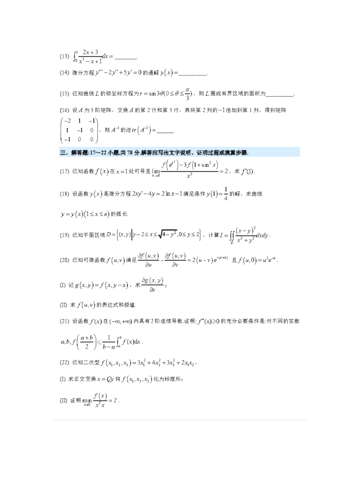
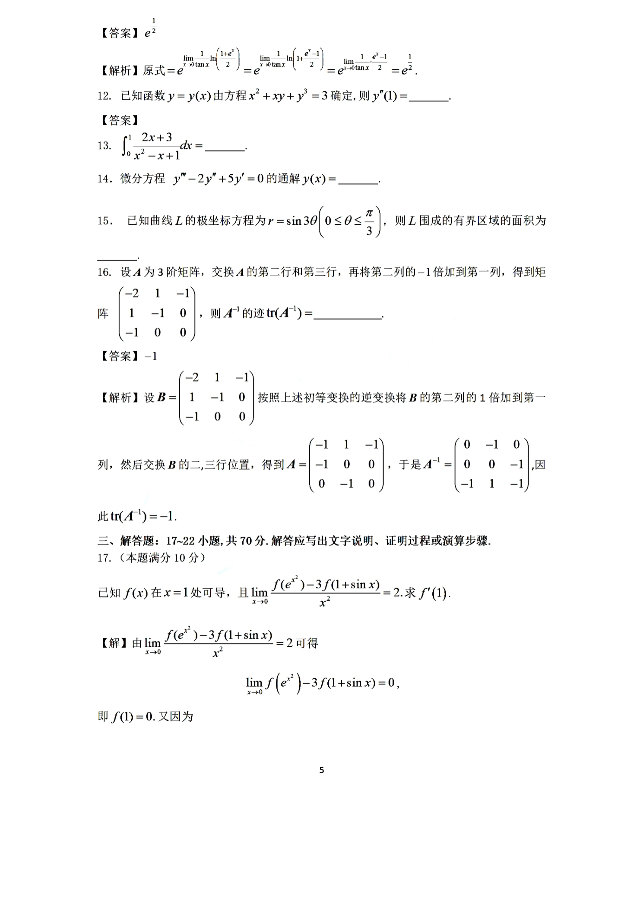

# 2022 数学二第 16 题

## 题目

设 $A$ 为 $3$ 阶矩阵，交换 $A$ 的第 $2$ 行和第 $3$ 行，再将第 $2$ 列的 $-1$ 倍加到第 $1$ 列，得到矩阵
$$
\begin{pmatrix}
-2&1&-1\\
1&-1&0\\
-1&0&0
\end{pmatrix},
$$
则 $A^{-1}$ 的迹 $\operatorname{tr}(A^{-1})=$ \underline{\qquad}。

## 标准答案

$-1$

## 解析

设
$$
B=\begin{pmatrix}
-2&1&-1\\
1&-1&0\\
-1&0&0
\end{pmatrix}.
$$
依题意，$B$ 是由 $A$ 经过两步初等变换得到的，因此按逆变换还原：

先将 $B$ 的第二列的 $1$ 倍加到第一列，再交换第二、三行，得到
$$
A=\begin{pmatrix}
-1&1&-1\\
-1&0&0\\
0&-1&0
\end{pmatrix}.
$$
计算得
$$
A^{-1}=
\begin{pmatrix}
0&-1&0\\
0&0&-1\\
-1&1&-1
\end{pmatrix}.
$$
因而
$$
\operatorname{tr}(A^{-1})=0+0+(-1)=-1.
$$

## 来源

- 题目来源：`math2_2022_questions.md`
- 答案来源：`math2_2022_answers.md`
