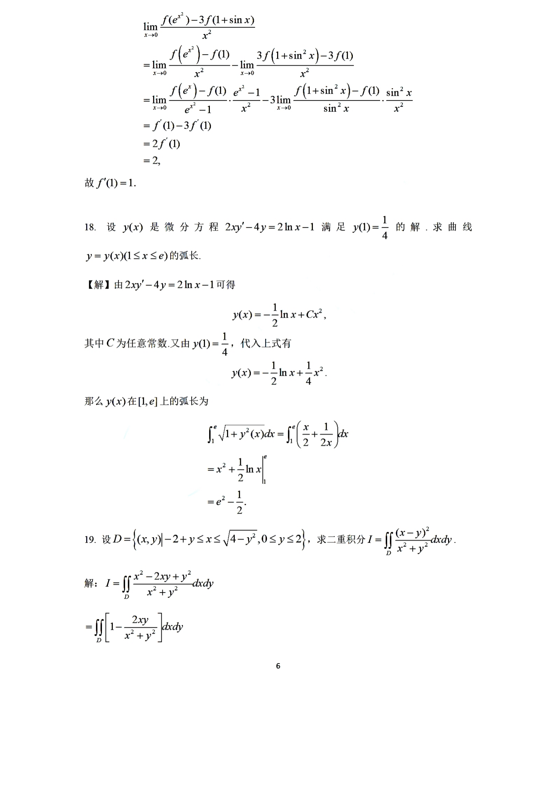

# 2022 数学二第 17 题

## 题目

已知函数 $f(x)$ 在 $x=1$ 处可导，且
$$
\lim_{x\to 0}\frac{f(e^{x^2})-3f(1+\sin^2x)}{x^2}=2,
$$
求 $f'(1)$。

## 标准答案

$f'(1)=1$

## 解析

由题设极限存在可得
$$
\lim_{x\to 0}\bigl(f(e^{x^2})-3f(1+\sin^2x)\bigr)=0,
$$
即 $f(1)=0$。

于是
$$
\lim_{x\to 0}\frac{f(e^{x^2})-3f(1+\sin^2x)}{x^2}
=
\lim_{x\to 0}\frac{f(e^{x^2})-f(1)}{x^2}
-3\lim_{x\to 0}\frac{f(1+\sin^2x)-f(1)}{x^2}.
$$
分别写成导数形式：
$$
\lim_{x\to 0}\frac{f(e^{x^2})-f(1)}{e^{x^2}-1}\cdot \frac{e^{x^2}-1}{x^2}
=f'(1),
$$
$$
\lim_{x\to 0}\frac{f(1+\sin^2x)-f(1)}{\sin^2x}\cdot \frac{\sin^2x}{x^2}
=f'(1).
$$
故原极限等于
$$
f'(1)-3f'(1)=-2f'(1).
$$
结合题设值为 $2$，得
$$
-2f'(1)=2,
$$
从而
$$
f'(1)=1.
$$

## 来源

- 题目来源：`math2_2022_questions.md`
- 答案来源：`math2_2022_answers.md`
