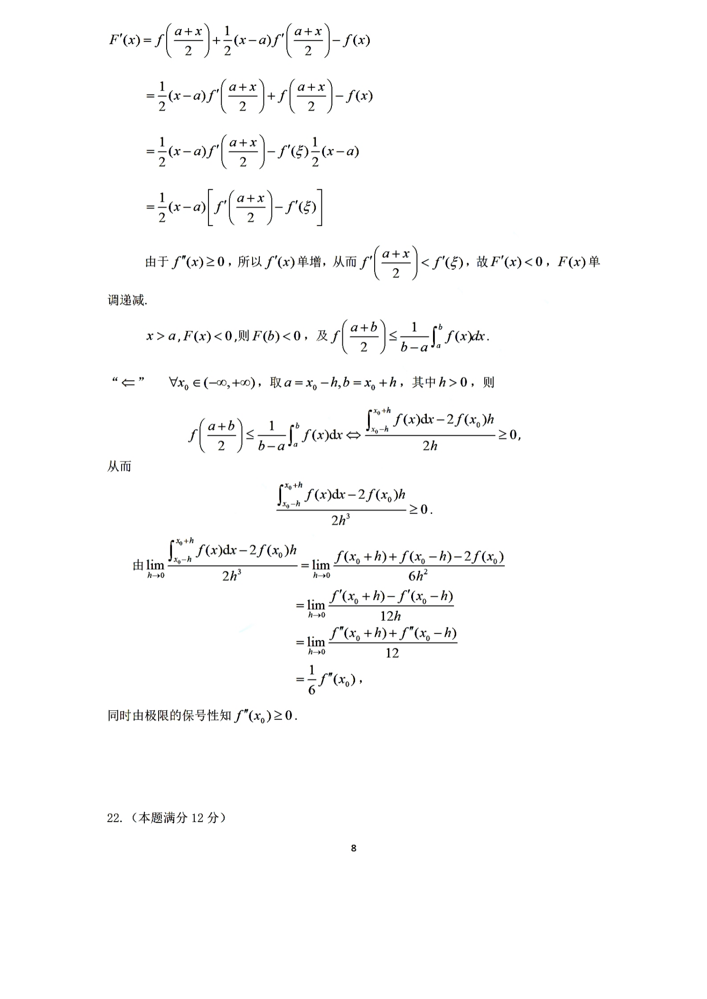
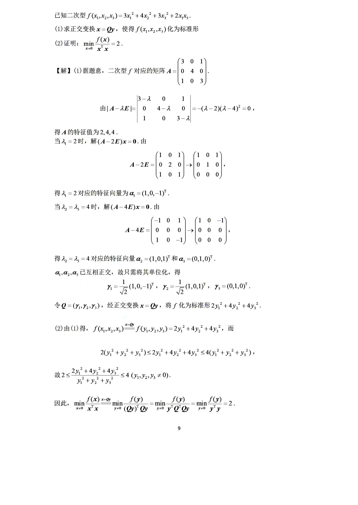

# 2022 数学二第 22 题

## 题目

已知二次型
$$
f(x_1,x_2,x_3)=3x_1^2+4x_2^2+3x_3^2+2x_1x_3.
$$

（I）求正交变换 $x=Qy$ 将 $f(x_1,x_2,x_3)$ 化为标准形；

（II）证明
$$
\min_{x\ne 0}\frac{f(x)}{x^{\mathsf T}x}=2.
$$

## 标准答案

（I）可化为标准形
$$
2y_1^2+4y_2^2+4y_3^2,
$$
其中可取
$$
Q=\begin{pmatrix}
\frac1{\sqrt2}&\frac1{\sqrt2}&0\\
0&0&1\\
-\frac1{\sqrt2}&\frac1{\sqrt2}&0
\end{pmatrix}.
$$

（II）
$$
\min_{x\ne 0}\frac{f(x)}{x^{\mathsf T}x}=2.
$$

## 解析

二次型对应矩阵为
$$
A=\begin{pmatrix}
3&0&1\\
0&4&0\\
1&0&3
\end{pmatrix}.
$$
其特征多项式为
$$
|A-\lambda E|
=\begin{vmatrix}
3-\lambda&0&1\\
0&4-\lambda&0\\
1&0&3-\lambda
\end{vmatrix}
=-(\lambda-2)(\lambda-4)^2.
$$
所以特征值为
$$
2,\ 4,\ 4.
$$

对应于 $\lambda=2$，可取特征向量
$$
\alpha_1=(1,0,-1)^{\mathsf T}.
$$
对应于 $\lambda=4$，可取两个线性无关的特征向量
$$
\alpha_2=(1,0,1)^{\mathsf T},\qquad \alpha_3=(0,1,0)^{\mathsf T}.
$$
这三个向量两两正交，单位化得
$$
\gamma_1=\frac1{\sqrt2}(1,0,-1)^{\mathsf T},\quad
\gamma_2=\frac1{\sqrt2}(1,0,1)^{\mathsf T},\quad
\gamma_3=(0,1,0)^{\mathsf T}.
$$
令
$$
Q=(\gamma_1,\gamma_2,\gamma_3),
$$
则 $Q$ 为正交矩阵，并且经正交变换 $x=Qy$，有
$$
f(x)=2y_1^2+4y_2^2+4y_3^2.
$$

于是
$$
f(x)=f(Qy)=2y_1^2+4y_2^2+4y_3^2.
$$
又因 $Q$ 为正交矩阵，
$$
x^{\mathsf T}x=y^{\mathsf T}y=y_1^2+y_2^2+y_3^2.
$$
因此
$$
2(y_1^2+y_2^2+y_3^2)\le 2y_1^2+4y_2^2+4y_3^2,
$$
从而
$$
\frac{f(x)}{x^{\mathsf T}x}\ge 2.
$$
当 $y_2=y_3=0,\ y_1\ne 0$ 时取等号，所以
$$
\min_{x\ne 0}\frac{f(x)}{x^{\mathsf T}x}=2.
$$

## 来源

- 题目来源：`math2_2022_questions.md`
- 答案来源：`math2_2022_answers.md`
