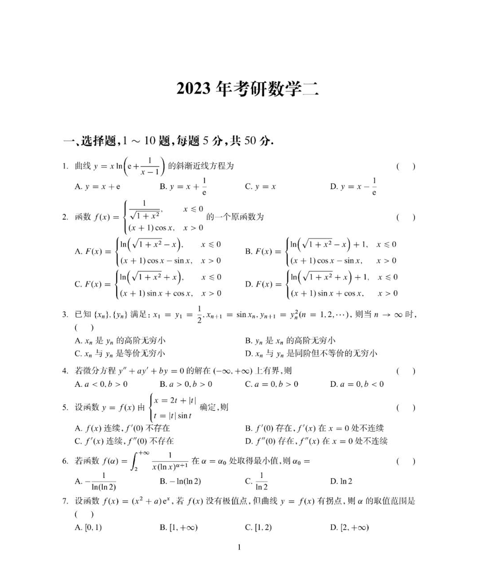

# 2023 数学二第 7 题

## 题目

设函数
$$
f(x)=(x^2+a)e^x,
$$
若 $f(x)$ 没有极值点，但曲线 $y=f(x)$ 有拐点，则 $a$ 的取值范围是

(A) $[0,1)$

(B) $[1,+\infty)$

(C) $[1,2)$

(D) $[2,+\infty)$

## 标准答案

C

## 解析

由
$$
f'(x)=e^x(x^2+2x+a)=e^x[(x+1)^2+a-1]
$$
知无极值点需 $a\ge1$；又
$$
f''(x)=e^x(x^2+4x+a+2)=e^x[(x+2)^2+a-2]
$$
有拐点需 $a<2$。综上 $1\le a<2$，选 $C$。

## 来源

- 题目来源：`math2_2023_questions.md`
- 答案来源：`math2_2023_answers.md`
