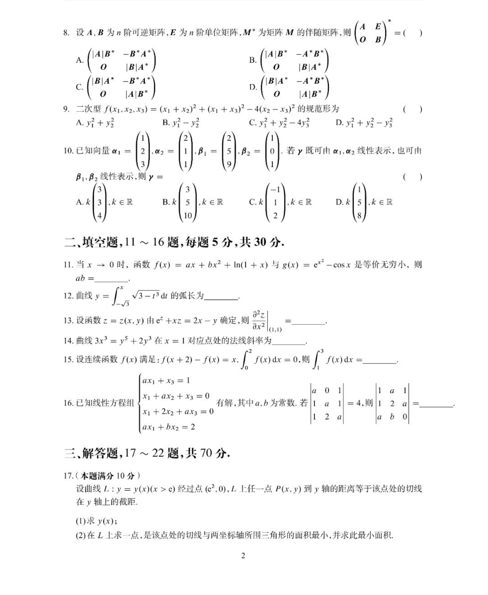
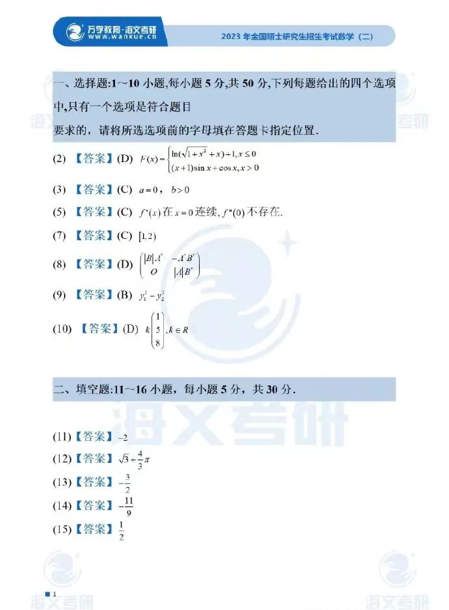

# 2023 数学二第 9 题

## 题目

二次型
$$
f(x_1,x_2,x_3)=(x_1+x_2)^2+(x_1+x_3)^2-4(x_2-x_3)^2
$$
的规范形为

(A) $y_1^2+y_2^2$

(B) $y_1^2-y_2^2$

(C) $y_1^2+y_2^2-4y_3^2$

(D) $y_1^2+y_2^2-y_3^2$

## 标准答案

B

## 解析

该二次型对应对称矩阵恰有一个正惯性指数和一个负惯性指数，秩为 $2$，故其规范形为 $y_1^2-y_2^2$，选 $B$。

## 来源

- 题目来源：`math2_2023_questions.md`
- 答案来源：`math2_2023_answers.md`
