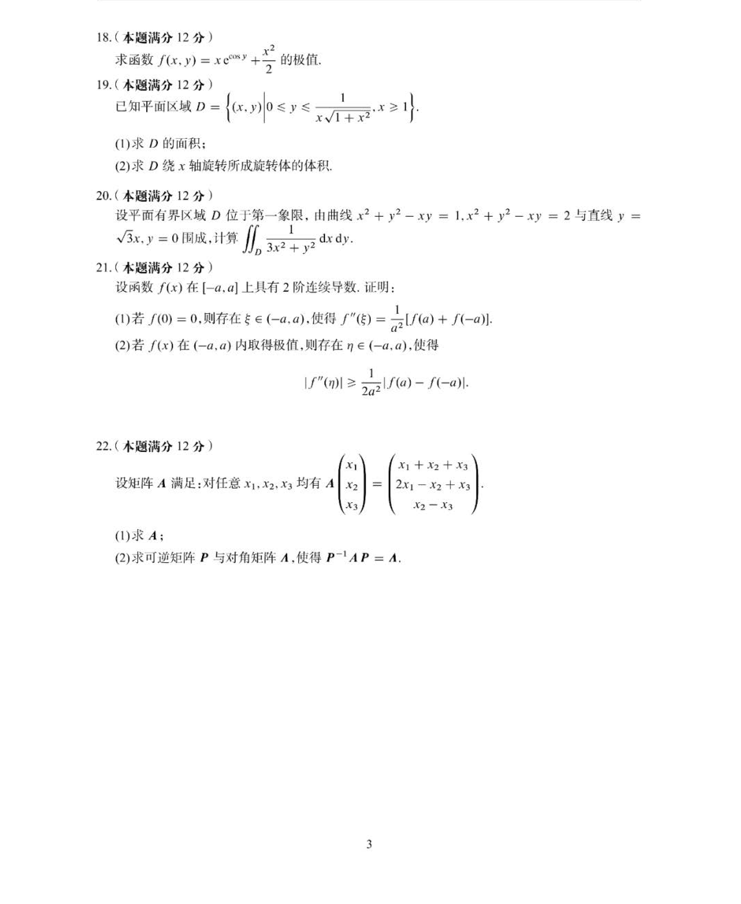
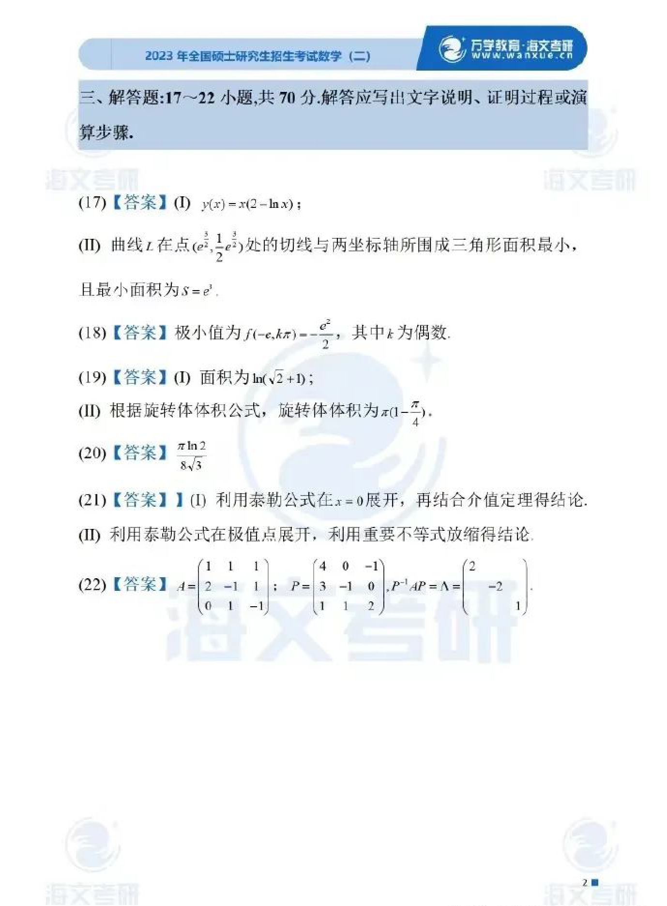

# 2023 数学二第 22 题

## 题目

设矩阵 $A$ 满足：对任意 $x_1,x_2,x_3$ 均有
$$
A\begin{pmatrix}x_1\\x_2\\x_3\end{pmatrix}=\begin{pmatrix}x_1+x_2+x_3\\2x_1-x_2+x_3\\x_2-x_3\end{pmatrix}.
$$

(1) 求 $A$；

(2) 求可逆矩阵 $P$ 与对角矩阵 $\Lambda$，使得 $P^{-1}AP=\Lambda$。

## 标准答案

(1) $A=\begin{pmatrix}1&1&1\\2&-1&1\\0&1&-1\end{pmatrix}$；

(2) 可取
$$
P=\begin{pmatrix}4&0&-1\\3&-1&0\\1&1&2\end{pmatrix},\qquad
\Lambda=\operatorname{diag}(2,-2,-1).
$$

## 解析

由线性变换对标准基的作用直接得到
$$
A=\begin{pmatrix}1&1&1\\2&-1&1\\0&1&-1\end{pmatrix}.
$$
再算得特征多项式为 $(\lambda-2)(\lambda+2)(\lambda+1)$，对应可取特征向量 $(4,3,1)^T,(0,-1,1)^T,(-1,0,2)^T$。以它们为列组成
$$
P=\begin{pmatrix}4&0&-1\\3&-1&0\\1&1&2\end{pmatrix},
$$
则 $P^{-1}AP=\operatorname{diag}(2,-2,-1)$。

## 来源

- 题目来源：`math2_2023_questions.md`
- 答案来源：`math2_2023_answers.md`
