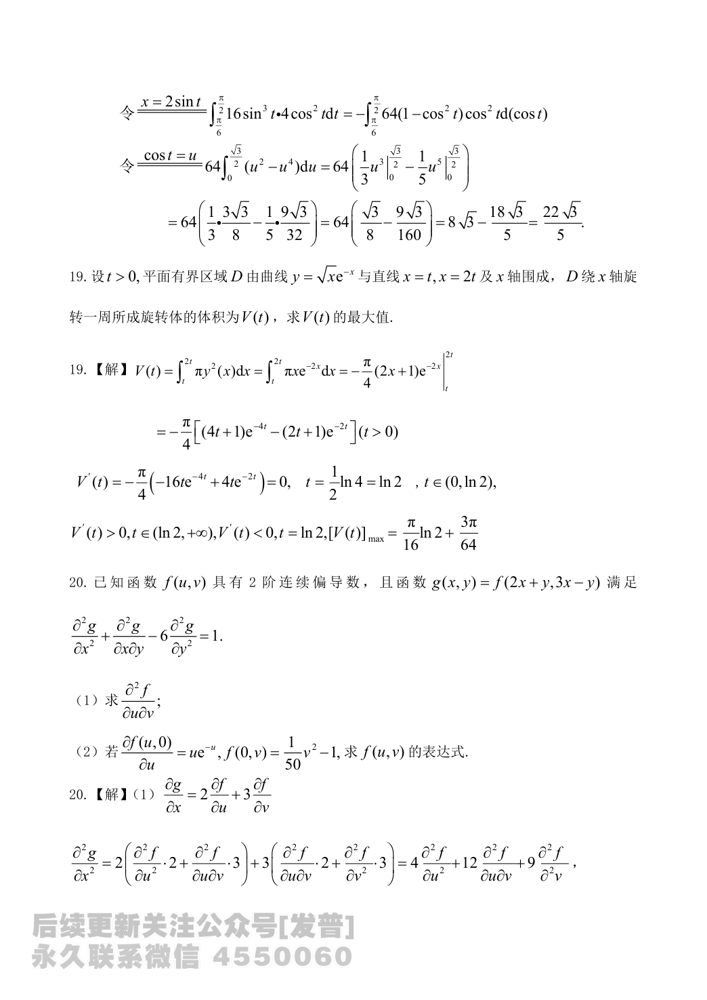

# 2024 年数学二答案解析

资料类型：考研数学二答案解析
年份：2024
科目：数学二
整理状态：以答案解析页图为主，并结合题面内容做人工校对与必要补全。

**答案页图 1**

**答案页图 2**

**答案页图 3**

**答案页图 4**

**答案页图 5**

**答案页图 6**

**答案页图 7**

**答案页图 8**

**答案页图 9**

**答案页图 10**

**答案页图 11**

**答案页图 12**

**答案页图 13**

**答案页图 14**

**答案页图 15**

**答案页图 16**

## 答案速查

| 题号 | 题型 | 答案 |
|---|---|---|
| 1 | 选择题 | C |
| 2 | 选择题 | B |
| 3 | 选择题 | D |
| 4 | 选择题 | D |
| 5 | 选择题 | C |
| 6 | 选择题 | A |
| 7 | 选择题 | B |
| 8 | 选择题 | C |
| 9 | 选择题 | D |
| 10 | 选择题 | B |
| 11 | 填空题 | $\left(x-\dfrac12\right)^2+y^2=\dfrac14$ |
| 12 | 填空题 | $(1,1)$ |
| 13 | 填空题 | $\arctan(x+y)=y+\dfrac{\pi}{4}$ |
| 14 | 填空题 | $31e$ |
| 15 | 填空题 | $\dfrac{3\pi}{2}$ |
| 16 | 填空题 | $-4$ |
| 17 | 解答题 | $\dfrac{8}{3}\ln 3$ |
| 18 | 解答题 | (1) $y(x)=2x^3$ (2) $\dfrac{22\sqrt3}{5}$ |
| 19 | 解答题 | $V(t)$ 在 $t=\ln 2$ 处取最大值，且 $V_{\max}=\dfrac{\pi}{16}\ln 2+\dfrac{3\pi}{64}$ |
| 20 | 解答题 | (1) $\displaystyle \frac{\partial^2f}{\partial u\partial v}=\frac{1}{25}$ (2) $\displaystyle f(u,v)=-(u+1)e^{-u}+\frac{1}{25}uv+\frac{1}{50}v^2$ |
| 21 | 证明题 | 结论成立： （1）当 $x\in(0,1)$ 时， $\left\lvertf(x)-f(0)(1-x)-f(1)x\right\rvert\le \frac{x(1-x)}{2}.$ （2） $\left\lvert\int_0^1f(x)\,dx-\frac{f(0)+f(1)}{2}\right\rvert\le \frac{1}{12}.$ |
| 22 | 解答题 | (1) $a=1,\ b=2$ (2) 标准形为 $6y_3^2$ |

## 详细解析

### 第 1 题

- 答案：C

无定义点为 $x=1,\ x=2$。

对于 $x=1$，
$$
\lim_{x\to 1}|x|^{\frac{1}{(1-x)(x-2)}}
=e^{\lim_{x\to 1}\frac{\ln|x|}{(1-x)(x-2)}}
=e,
$$
故 $x=1$ 是可去间断点。

对于 $x=2$，
$$
\lim_{x\to 2}|x|^{\frac{1}{(1-x)(x-2)}}=+\infty,
$$
故 $x=2$ 是第二类间断点。

另外，$x=0$ 是分段点，且
$$
\lim_{x\to 0}|x|^{\frac{1}{(1-x)(x-2)}}
=e^{\lim_{x\to 0}\frac{\ln|x|}{(1-x)(x-2)}}=+\infty,
$$
故 $x=0$ 也是第二类间断点。于是只有一个第一类间断点，选 $C$。

### 第 2 题

- 答案：B

原式
$$
=\lim_{x\to+\infty}\frac{f\left(2+\frac{2}{x}\right)-f(2)}{\frac{2}{x}}\cdot 2
=2f'_+(2).
$$
当 $x=2$ 时有 $1+t^3=2$，故 $t=1$。由参数方程求导，
$$
f'(x)=\frac{dy/dt}{dx/dt}=\frac{2te^{t^2}}{3t^2}=\frac{2e^{t^2}}{3t}.
$$
于是
$$
f'_+(2)=\left.\frac{2e^{t^2}}{3t}\right\rvert_{t=1}=\frac{2e}{3},
$$
所以原式等于
$$
2f'_+(2)=\frac{4e}{3}.
$$
选 $B$。

### 第 3 题

- 答案：D

由变上限积分求导，
$$
f'(x)=\sin\bigl((\sin x)^3\bigr)\cos x.
$$
其中 $\sin\bigl((\sin x)^3\bigr)$ 为奇函数，$\cos x$ 为偶函数，所以 $f'(x)$ 为奇函数。
又 $f(0)=0$，故 $f(x)$ 为偶函数。

再看
$$
g(x)=\int_0^x f(t)\,dt,
$$
因为 $f(t)$ 为偶函数，所以 $g(x)$ 为奇函数。选 $D$。

### 第 4 题

- 答案：D

选项 $A$：取 $a_n=2,\frac12,2,\frac12,\dots$，则
$$
a_n+\frac{1}{a_n}\equiv 2+\frac12,
$$
收敛，故 $A$ 错。

选项 $B$：取 $a_n=1,-1,1,-1,\dots$，则
$$
a_n-\frac{1}{a_n}\equiv 0,
$$
收敛，故 $B$ 错。

选项 $C$：取 $a_n=\ln2,-\ln2,\ln2,-\ln2,\dots$，则
$$
e^{a_n}+\frac{1}{e^{a_n}}\equiv 2+\frac12,
$$
收敛，故 $C$ 错。

选项 $D$：函数
$$
\varphi(x)=e^x-e^{-x}
$$
严格单调递增。若 $\{e^{a_n}-e^{-a_n}\}$ 收敛，由反函数存在可知 $\{a_n\}$ 必收敛，与题设矛盾，故 $D$ 正确。

### 第 5 题

- 答案：C

先证可微。因为
$$
\left\lvert\frac{f(x,y)-f(0,0)-0\cdot x-0\cdot y}{\sqrt{x^2+y^2}}\right\rvert
=\frac{|(x^2+y^2)\sin\frac{1}{xy}|}{\sqrt{x^2+y^2}}
\le \sqrt{x^2+y^2}\to 0,
$$
故 $f(x,y)$ 在 $(0,0)$ 处可微。

再看偏导。对 $xy\ne0$，
$$
\frac{\partial f}{\partial x}
=2x\sin\frac{1}{xy}+(x^2+y^2)\cos\frac{1}{xy}\left(-\frac{1}{x^2y}\right),
$$
而当 $xy=0$ 时，$\dfrac{\partial f}{\partial x}=0$。

取沿不同路径趋于 $(0,0)$，上式中含有
$$
\frac{x^2+y^2}{x^2y}\cos\frac{1}{xy}
$$
的振荡项，其极限不存在，故 $\dfrac{\partial f}{\partial x}$ 在 $(0,0)$ 处不连续。选 $C$。

### 第 6 题

- 答案：A

原积分区域为
$$
D=\{(x,y)\mid \pi/6\le x\le \pi/2,\ \sin x\le y\le 1\}.
$$
因为在区间 $\left[\pi/6,\pi/2\right]$ 上，$\sin x$ 单调递增，且
$$
\sin\frac{\pi}{6}=\frac12,\qquad \sin\frac{\pi}{2}=1,
$$
故换序后可写为
$$
D=\left\{(x,y)\mid \frac12\le y\le 1,\ \frac{\pi}{6}\le x\le \arcsin y\right\}.
$$
所以
$$
\int_{\pi/6}^{\pi/2}dx\int_{\sin x}^{1}f(x,y)\,dy
=\int_{1/2}^{1}dy\int_{\pi/6}^{\arcsin y}f(x,y)\,dx.
$$
选 $A$。

### 第 7 题

- 答案：B

(1) 不正确。取
$$
f(x)=\frac{1}{x+1},
$$
则
$$
\int_0^{+\infty}\frac{1}{(x+1)^2}\,dx
$$
收敛，但
$$
\int_0^{+\infty}\frac{1}{x+1}\,dx
$$
发散。

(2) 正确。若 $x^pf(x)\to L$ 且 $p>1$，则 $f(x)$ 与 $\dfrac{1}{x^p}$ 可作极限比较，从而
$$
\int_0^{+\infty}f(x)\,dx
$$
收敛。

(3) 不正确。取
$$
f(x)=\frac{1}{(x+1)\ln^2(x+1)},
$$
则 $\int_0^{+\infty}f(x)\,dx$ 收敛，但对任意 $p>1$，
$$
\lim_{x\to+\infty}x^pf(x)=+\infty.
$$
故正确命题只有一个，选 $B$。

### 第 8 题

- 答案：C

记
$$
B=P^{\mathsf T}AP^2=
\begin{pmatrix}
a+2c&0&c\\
0&b&0\\
2c&0&c
\end{pmatrix}.
$$
因为
$$
P=E_{31}(1),\qquad P^{-1}=E_{31}(-1),
$$
所以
$$
A=(P^{\mathsf T})^{-1}B(P^2)^{-1}
=\bigl[E_{31}(-1)\bigr]^{\mathsf T}BE_{31}(-1)E_{31}(-1).
$$
直接计算可得
$$
A=
\begin{pmatrix}
a&0&0\\
0&b&0\\
0&0&c
\end{pmatrix}.
$$
选 $C$。

### 第 9 题

- 答案：D

由题意
$$
A(A-A^*)=O,
$$
故
$$
r(A)+r(A-A^*)\le 4.
$$
又因为 $A\ne A^*$，所以 $A-A^*\ne O$，从而
$$
r(A-A^*)\ge 1,
$$
于是
$$
r(A)\le 3.
$$

另一方面，
$$
A(A-A^*)=A^2-AA^*=A^2-|A|E=0.
$$
若 $r(A)=3$，则 $A^*=0$，从而 $A^2=0$，这与 $r(A)=3$ 矛盾，所以 $r(A)\ne 3$。

因而 $r(A)\le 2$。又由 $A\ne A^*$ 可知 $A\ne O$，所以
$$
r(A)\ge 1.
$$
故 $r(A)$ 只能取 $1$ 或 $2$，选 $D$。

### 第 10 题

- 答案：B

充分性：若 $A$ 有两个不相等的特征值，设为 $\lambda_1,\lambda_2$，则 $A$ 可相似对角化。取可逆矩阵 $P$，使
$$
P^{-1}AP=
\begin{pmatrix}
\lambda_1&0\\
0&\lambda_2
\end{pmatrix},
\qquad \lambda_1\ne\lambda_2.
$$
由 $AB=BA$ 得
$$
P^{-1}BP
\begin{pmatrix}
\lambda_1&0\\
0&\lambda_2
\end{pmatrix}
=
\begin{pmatrix}
\lambda_1&0\\
0&\lambda_2
\end{pmatrix}
P^{-1}BP.
$$
设 $P^{-1}BP=\begin{pmatrix}b_1&b_2\\ b_3&b_4\end{pmatrix}$，比较元素可得 $b_2=b_3=0$，故 $P^{-1}BP$ 为对角矩阵，于是 $B$ 可对角化。

必要性不成立。取
$$
A=E,\qquad B=E,
$$
则 $AB=BA$ 且 $B$ 可对角化，但 $A$ 不具有两个不相等的特征值。

因此该条件是“$B$ 可对角化”的充分非必要条件，选 $B$。

### 第 11 题

- 答案：$\left(x-\dfrac12\right)^2+y^2=\dfrac14$

将曲线改写为
$$
x=y^2.
$$
在点 $(0,0)$ 处有
$$
x'(y)=2y,\qquad x''(y)=2.
$$
曲率为
$$
k=\frac{|x''|}{\bigl(1+(x')^2\bigr)^{3/2}}=2,
$$
故曲率半径
$$
R=\frac{1}{k}=\frac12.
$$
由图形可知曲率圆圆心为 $\left(\dfrac12,0\right)$，因此曲率圆方程是
$$
\left(x-\frac12\right)^2+y^2=\frac14.
$$

### 第 12 题

- 答案：$(1,1)$

由
$$
f'_x=6x^2-18x+12=0,\qquad f'_y=-24y^3+24=0,
$$
得驻点为 $(1,1)$ 与 $(2,1)$。

再算二阶偏导：
$$
A=f''_{xx}=12x-18,\qquad B=f''_{xy}=0,\qquad C=f''_{yy}=-72y^2.
$$
在 $(1,1)$ 处，
$$
AC-B^2=432>0,\qquad A=-6<0,
$$
所以 $(1,1)$ 是极大值点。

在 $(2,1)$ 处，
$$
AC-B^2=-432<0,
$$
不是极值点。故极值点为 $(1,1)$。

### 第 13 题

- 答案：$\arctan(x+y)=y+\dfrac{\pi}{4}$

将方程改写为
$$
\frac{dx}{dy}=(x+y)^2.
$$
令
$$
u=x+y,
$$
则
$$
\frac{dx}{dy}=\frac{du}{dy}-1.
$$
因而
$$
\frac{du}{dy}=u^2+1.
$$
分离变量得
$$
\int\frac{1}{u^2+1}\,du=\int dy,
$$
即
$$
\arctan u=y+c.
$$
代入初值 $x=1,\ y=0$，此时 $u=1$，得
$$
c=\frac{\pi}{4}.
$$
所以解为
$$
\arctan(x+y)=y+\frac{\pi}{4}.
$$

### 第 14 题

- 答案：$31e$

利用莱布尼茨公式，
$$
\bigl((e^x+1)x^2\bigr)^{(5)}
=(e^x+1)^{(5)}x^2+5(e^x+1)^{(4)}(x^2)'+C_5^2(e^x+1)^{(3)}(x^2)''.
$$
因为 $x^2$ 的三阶以上导数为 $0$，故
$$
f^{(5)}(x)=e^x\cdot x^2+5e^x\cdot 2x+10e^x\cdot 2.
$$
代入 $x=1$ 得
$$
f^{(5)}(1)=e+10e+20e=31e.
$$

### 第 15 题

- 答案：$\dfrac{3\pi}{2}$

由平均速度公式，
$$
\frac{1}{3}\int_0^3(t+k\sin\pi t)\,dt=\frac52.
$$
所以
$$
\int_0^3(t+k\sin\pi t)\,dt=\frac{15}{2}.
$$
计算得
$$
\int_0^3 t\,dt=\frac92,\qquad
\int_0^3 \sin\pi t\,dt=-\frac{1}{\pi}\cos\pi t\Big|_0^3=\frac{2}{\pi}.
$$
因此
$$
\frac92+\frac{2k}{\pi}=\frac{15}{2},
$$
解得
$$
k=\frac{3\pi}{2}.
$$

### 第 16 题

- 答案：$-4$

记
$$
A=(\alpha_1,\alpha_2,\alpha_3)
=\begin{pmatrix}
a&1&1\\
1&1&a\\
-1&b&-1\\
1&a&1
\end{pmatrix}.
$$
由题意知 $r(\alpha_1,\alpha_2,\alpha_3)\le 2$，且任意两向量线性无关，所以
$$
r(\alpha_i,\alpha_j)=2\quad(i\ne j).
$$

先化简可得
$$
\begin{pmatrix}
1&1&a\\
0&1&1+a\\
0&b+1&a-1\\
0&0&a+2
\end{pmatrix}.
$$
若 $a=1$，则 $\alpha_1$ 与 $\alpha_3$ 相关，不合题意。

当 $a\ne1$ 时，由线性相关得
$$
a+2=0,\qquad -b(a+1)-2=0.
$$
解得
$$
a=-2,\qquad b=2.
$$
故
$$
ab=-4.
$$

### 第 17 题

- 答案：$\dfrac{8}{3}\ln 3$

令
$$
u=xy,\qquad v=\frac{y}{x}.
$$
则
$$
x=\sqrt{\frac{u}{v}},\qquad y=\sqrt{uv}.
$$
雅可比行列式为
$$
J=\left\lvert\frac{\partial(x,y)}{\partial(u,v)}\right\rvert=\frac{1}{2v}.
$$

由边界条件知
$$
\frac13\le u\le 3,\qquad \frac13\le v\le 3.
$$
原积分化为
$$
\int_{1/3}^3du\int_{1/3}^3\left(1+\sqrt{\frac{u}{v}}-\sqrt{uv}\right)\frac{1}{2v}\,dv.
$$
计算后得
$$
\iint_D(1+x-y)\,dxdy=\frac{8}{3}\ln 3.
$$

### 第 18 题

- 答案：(1) $y(x)=2x^3$

(2) $\dfrac{22\sqrt3}{5}$

令 $x=e^t$，则
$$
\frac{dy}{dx}=\frac{dy}{dt}\frac{dt}{dx}=\frac{1}{x}\frac{dy}{dt},
$$
进一步可得
$$
x^2y''+xy'-9y=0
\Longrightarrow
\frac{d^2y}{dt^2}-9y=0.
$$
故
$$
y=C_1e^{3t}+C_2e^{-3t}=C_1x^3+\frac{C_2}{x^3}.
$$
由条件
$$
y(1)=C_1+C_2=2,\qquad
y'(1)=3C_1-3C_2=6,
$$
解得 $C_1=2,\ C_2=0$，所以
$$
y(x)=2x^3.
$$

于是
$$
\int_1^2y(x)\sqrt{4-x^2}\,dx
=\int_1^2 2x^3\sqrt{4-x^2}\,dx.
$$
令 $x=2\sin t$，则
$$
dx=2\cos t\,dt,\qquad \sqrt{4-x^2}=2\cos t,
$$
积分限由 $x=1,2$ 变为 $t=\pi/6,\pi/2$。因此
$$
\int_1^2 2x^3\sqrt{4-x^2}\,dx
=\int_{\pi/6}^{\pi/2}16\sin^3t\cdot 4\cos^2t\,dt.
$$
再令 $u=\cos t$，可得
$$
64\int_0^{\sqrt3/2}(u^2-u^4)\,du
=64\left(\frac{u^3}{3}-\frac{u^5}{5}\right)\Big|_0^{\sqrt3/2}
=\frac{22\sqrt3}{5}.
$$

### 第 19 题

- 答案：$V(t)$ 在 $t=\ln 2$ 处取最大值，且 $V_{\max}=\dfrac{\pi}{16}\ln 2+\dfrac{3\pi}{64}$

由旋转体体积公式，
$$
V(t)=\int_t^{2t}\pi y^2(x)\,dx
=\int_t^{2t}\pi xe^{-2x}\,dx
=-\frac{\pi}{4}(2x+1)e^{-2x}\Big|_t^{2t}.
$$
故
$$
V(t)=-\frac{\pi}{4}\Bigl[(4t+1)e^{-4t}-(2t+1)e^{-2t}\Bigr]\qquad (t>0).
$$

求导得
$$
V'(t)=-\frac{\pi}{4}\bigl(-16te^{-4t}+4te^{-2t}\bigr).
$$
令 $V'(t)=0$，得
$$
t=\frac12\ln4=\ln2.
$$
并且当 $t\in(0,\ln2)$ 时 $V'(t)>0$，当 $t>\ln2$ 时 $V'(t)<0$，故 $t=\ln2$ 处取最大值。

代入得
$$
V_{\max}=V(\ln2)=\frac{\pi}{16}\ln2+\frac{3\pi}{64}.
$$

### 第 20 题

- 答案：(1) $\displaystyle \frac{\partial^2f}{\partial u\partial v}=\frac{1}{25}$

(2) $\displaystyle f(u,v)=-(u+1)e^{-u}+\frac{1}{25}uv+\frac{1}{50}v^2$

设
$$
u=2x+y,\qquad v=3x-y.
$$
则由链式法则
$$
g_x=2f_u+3f_v,\qquad g_y=f_u-f_v.
$$
进一步有
$$
g_{xx}=4f_{uu}+12f_{uv}+9f_{vv},
$$
$$
g_{xy}=2f_{uu}+f_{uv}-3f_{vv},
$$
$$
g_{yy}=f_{uu}-2f_{uv}+f_{vv}.
$$
代入条件得
$$
g_{xx}+g_{xy}-6g_{yy}=25f_{uv}=1,
$$
所以
$$
f_{uv}=\frac{1}{25}.
$$

对 $v$ 积分，
$$
f_u=\int \frac{1}{25}\,dv=\frac{1}{25}v+c_1(u).
$$
由
$$
f_u(u,0)=ue^{-u}
$$
得
$$
c_1(u)=ue^{-u},
$$
因而
$$
f_u=ue^{-u}+\frac{1}{25}v.
$$
再对 $u$ 积分，
$$
f(u,v)=\int\left(ue^{-u}+\frac{1}{25}v\right)\,du
=-(u+1)e^{-u}+\frac{1}{25}uv+c_2(v).
$$
利用
$$
f(0,v)=\frac{1}{50}v^2-1
$$
可得
$$
c_2(v)=\frac{1}{50}v^2.
$$
故
$$
f(u,v)=-(u+1)e^{-u}+\frac{1}{25}uv+\frac{1}{50}v^2.
$$

### 第 21 题

- 答案：结论成立：

（1）当 $x\in(0,1)$ 时，
$$
\left\lvertf(x)-f(0)(1-x)-f(1)x\right\rvert\le \frac{x(1-x)}{2}.
$$

（2）
$$
\left\lvert\int_0^1f(x)\,dx-\frac{f(0)+f(1)}{2}\right\rvert\le \frac{1}{12}.
$$

由带拉格朗日余项的泰勒公式，
$$
f(x)=f(0)+f'(0)x+\frac{f''(\xi_1)}{2}x^2,\qquad \xi_1\in(0,x),
$$
以及
$$
f(x)=f(1)+f'(1)(x-1)+\frac{f''(\xi_2)}{2}(x-1)^2,\qquad \xi_2\in(x,1).
$$
将第一式乘以 $(1-x)$，第二式乘以 $x$，并利用 $f'(0)=f'(1)$，相加得
$$
f(x)-f(0)(1-x)-f(1)x
=\frac{f''(\xi_1)}{2}x^2(1-x)+\frac{f''(\xi_2)}{2}(x-1)^2x.
$$
因为 $|f''(x)|\le1$，故
$$
|f(x)-f(0)(1-x)-f(1)x|
\le \frac12x^2(1-x)+\frac12x(1-x)^2
=\frac{x(1-x)}{2}.
$$
这就证明了 (1)。

对 (1) 在 $[0,1]$ 上积分，
$$
\left\lvert\int_0^1\bigl[f(x)-f(0)(1-x)-f(1)x\bigr]\,dx\right\rvert
\le \int_0^1\frac{x(1-x)}{2}\,dx=\frac{1}{12}.
$$
又
$$
\int_0^1f(0)(1-x)\,dx+\int_0^1f(1)x\,dx=\frac{f(0)+f(1)}{2},
$$
所以
$$
\left\lvert\int_0^1f(x)\,dx-\frac{f(0)+f(1)}{2}\right\rvert\le\frac{1}{12}.
$$

### 第 22 题

- 答案：(1) $a=1,\ b=2$

(2) 标准形为 $6y_3^2$

由题意可知，$Ax=0$ 的解均为 $B^{\mathsf T}x=0$ 的解，因此
$$
r(A)=r\binom{A}{B^{\mathsf T}}.
$$
又因为 $A$ 为 $2\times3$ 矩阵，且两个方程组不同解，所以
$$
r(A)=2.
$$
将
$$
\binom{A}{B^{\mathsf T}}
=
\begin{pmatrix}
0&1&a\\
1&0&1\\
1&1&b\\
1&1&2
\end{pmatrix}
$$
作初等行变换，可化为
$$
\begin{pmatrix}
1&0&1\\
0&1&a\\
0&0&b-a-1\\
0&0&1-a
\end{pmatrix}.
$$
由秩等于 $2$，得
$$
1-a=0,\qquad b-a-1=0,
$$
即
$$
a=1,\qquad b=2.
$$

此时
$$
BA=
\begin{pmatrix}
1&1\\
1&1\\
2&2
\end{pmatrix}
\begin{pmatrix}
0&1&1\\
1&0&1
\end{pmatrix}
=
\begin{pmatrix}
1&1&2\\
1&1&2\\
2&2&4
\end{pmatrix}
=C.
$$
所以
$$
f=x^{\mathsf T}Cx.
$$
由 $r(C)=1$，知其特征值为
$$
\lambda_1=\lambda_2=0,\qquad \lambda_3=\operatorname{tr}(C)=6.
$$
当 $\lambda=0$ 时，可取两个线性无关特征向量
$$
\xi_1=(1,-1,0)^{\mathsf T},\qquad \xi_2=(1,1,-1)^{\mathsf T},
$$
单位化得
$$
\eta_1=\frac{1}{\sqrt2}(1,-1,0)^{\mathsf T},\qquad
\eta_2=\frac{1}{\sqrt3}(1,1,-1)^{\mathsf T}.
$$
当 $\lambda=6$ 时，可取特征向量
$$
\xi_3=(1,1,2)^{\mathsf T},
$$
单位化得
$$
\eta_3=\frac{1}{\sqrt6}(1,1,2)^{\mathsf T}.
$$
取正交矩阵
$$
Q=(\eta_1,\eta_2,\eta_3)
=
\begin{pmatrix}
\frac{1}{\sqrt2}&\frac{1}{\sqrt3}&\frac{1}{\sqrt6}\\
-\frac{1}{\sqrt2}&\frac{1}{\sqrt3}&\frac{1}{\sqrt6}\\
0&-\frac{1}{\sqrt3}&\frac{2}{\sqrt6}
\end{pmatrix},
$$
则在变换 $x=Qy$ 下，
$$
f=x^{\mathsf T}Cx=6y_3^2.
$$
