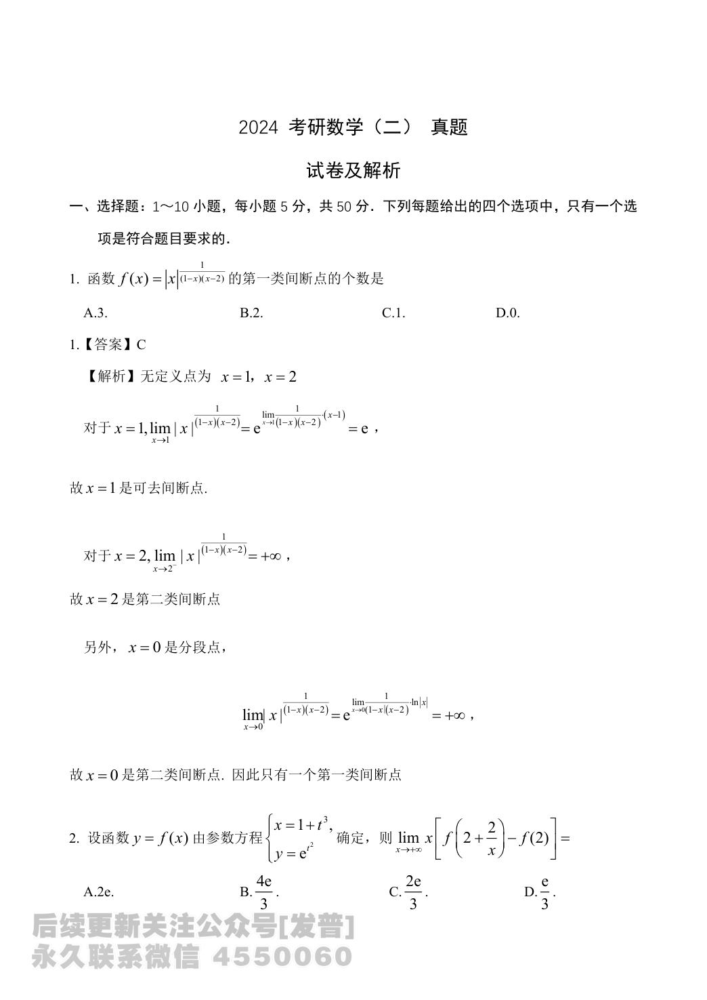

# 2024 数学二第 2 题

## 题目

已知函数 $y=f(x)$ 由参数方程
$$
\begin{cases}
x=1+t^3,\\
y=e^{t^2}
\end{cases}
$$
确定，则
$$
\lim_{x\to+\infty}x\left[f\left(2+\frac{2}{x}\right)-f(2)\right]=
$$

(A) $2e$

(B) $\dfrac{4e}{3}$

(C) $\dfrac{2e}{3}$

(D) $\dfrac{e}{3}$

## 标准答案

B

## 解析

原式
$$
=\lim_{x\to+\infty}\frac{f\left(2+\frac{2}{x}\right)-f(2)}{\frac{2}{x}}\cdot 2
=2f'_+(2).
$$
当 $x=2$ 时有 $1+t^3=2$，故 $t=1$。由参数方程求导，
$$
f'(x)=\frac{dy/dt}{dx/dt}=\frac{2te^{t^2}}{3t^2}=\frac{2e^{t^2}}{3t}.
$$
于是
$$
f'_+(2)=\left.\frac{2e^{t^2}}{3t}\right|_{t=1}=\frac{2e}{3},
$$
所以原式等于
$$
2f'_+(2)=\frac{4e}{3}.
$$
选 $B$。

## 来源

- 题目来源：`math2_2024_questions.md`
- 答案来源：`math2_2024_answers.md`
