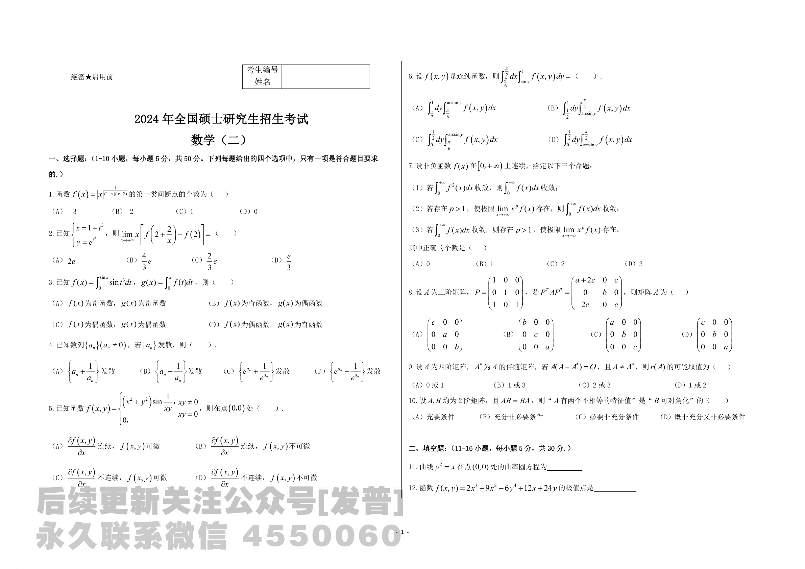
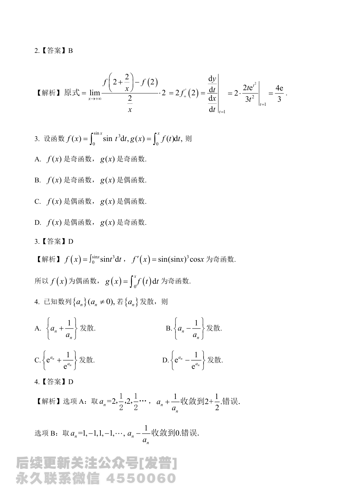

# 2024 数学二第 3 题

## 题目

已知
$$
f(x)=\int_0^{\sin x}\sin t^3\,dt,\qquad
g(x)=\int_0^x f(t)\,dt,
$$
则

(A) $f(x)$ 为奇函数，$g(x)$ 为奇函数

(B) $f(x)$ 为奇函数，$g(x)$ 为偶函数

(C) $f(x)$ 为偶函数，$g(x)$ 为偶函数

(D) $f(x)$ 为偶函数，$g(x)$ 为奇函数

## 标准答案

D

## 解析

由变上限积分求导，
$$
f'(x)=\sin\bigl((\sin x)^3\bigr)\cos x.
$$
其中 $\sin\bigl((\sin x)^3\bigr)$ 为奇函数，$\cos x$ 为偶函数，所以 $f'(x)$ 为奇函数。
又 $f(0)=0$，故 $f(x)$ 为偶函数。

再看
$$
g(x)=\int_0^x f(t)\,dt,
$$
因为 $f(t)$ 为偶函数，所以 $g(x)$ 为奇函数。选 $D$。

## 来源

- 题目来源：`math2_2024_questions.md`
- 答案来源：`math2_2024_answers.md`
