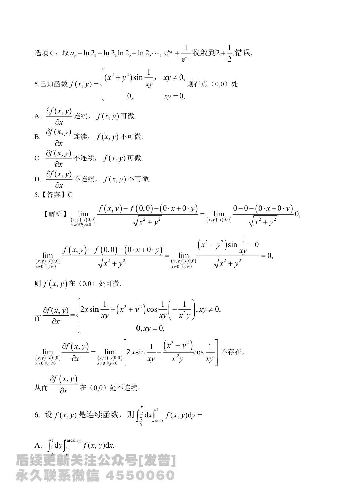
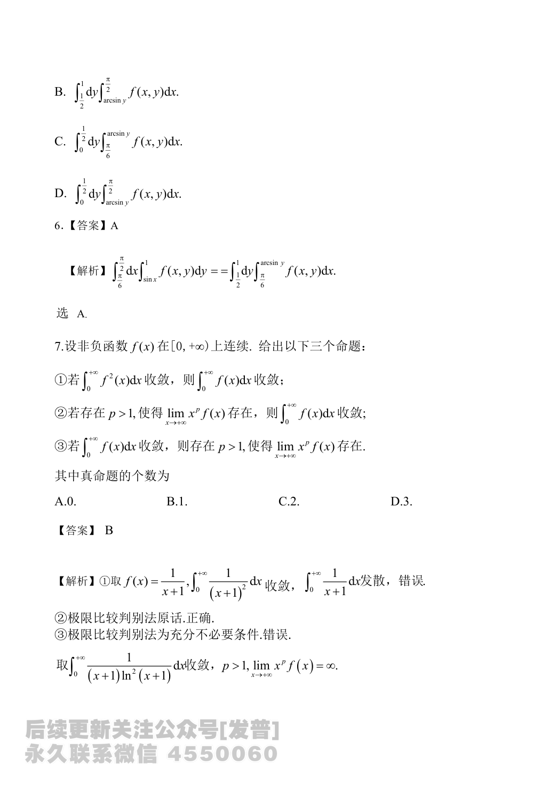

# 2024 数学二第 6 题

## 题目

设 $f(x,y)$ 是连续函数，则
$$
\int_{\pi/6}^{\pi/2}dx\int_{\sin x}^{1}f(x,y)\,dy=
$$

(A) $\displaystyle \int_{1/2}^{1}dy\int_{\pi/6}^{\arcsin y}f(x,y)\,dx$

(B) $\displaystyle \int_{1/2}^{1}dy\int_{\arcsin y}^{\pi/2}f(x,y)\,dx$

(C) $\displaystyle \int_{0}^{1/2}dy\int_{\pi/6}^{\arcsin y}f(x,y)\,dx$

(D) $\displaystyle \int_{0}^{1/2}dy\int_{\arcsin y}^{\pi/2}f(x,y)\,dx$

## 标准答案

A

## 解析

原积分区域为
$$
D=\{(x,y)\mid \pi/6\le x\le \pi/2,\ \sin x\le y\le 1\}.
$$
因为在区间 $\left[\pi/6,\pi/2\right]$ 上，$\sin x$ 单调递增，且
$$
\sin\frac{\pi}{6}=\frac12,\qquad \sin\frac{\pi}{2}=1,
$$
故换序后可写为
$$
D=\left\{(x,y)\mid \frac12\le y\le 1,\ \frac{\pi}{6}\le x\le \arcsin y\right\}.
$$
所以
$$
\int_{\pi/6}^{\pi/2}dx\int_{\sin x}^{1}f(x,y)\,dy
=\int_{1/2}^{1}dy\int_{\pi/6}^{\arcsin y}f(x,y)\,dx.
$$
选 $A$。

## 来源

- 题目来源：`math2_2024_questions.md`
- 答案来源：`math2_2024_answers.md`
