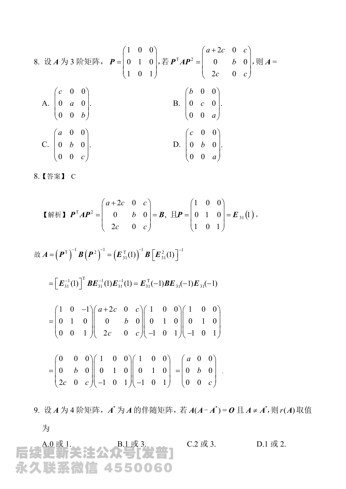

# 2024 数学二第 8 题

## 题目

设 $A$ 为 $3$ 阶矩阵，
$$
P=\begin{pmatrix}
1&0&0\\
0&1&0\\
1&0&1
\end{pmatrix},
$$
若
$$
P^{\mathsf T}AP^2=
\begin{pmatrix}
a+2c&0&c\\
0&b&0\\
2c&0&c
\end{pmatrix},
$$
则矩阵 $A$ 为

(A) $\begin{pmatrix}c&0&0\\0&a&0\\0&0&b\end{pmatrix}$

(B) $\begin{pmatrix}b&0&0\\0&c&0\\0&0&a\end{pmatrix}$

(C) $\begin{pmatrix}a&0&0\\0&b&0\\0&0&c\end{pmatrix}$

(D) $\begin{pmatrix}c&0&0\\0&b&0\\0&0&a\end{pmatrix}$

## 标准答案

C

## 解析

记
$$
B=P^{\mathsf T}AP^2=
\begin{pmatrix}
a+2c&0&c\\
0&b&0\\
2c&0&c
\end{pmatrix}.
$$
因为
$$
P=E_{31}(1),\qquad P^{-1}=E_{31}(-1),
$$
所以
$$
A=(P^{\mathsf T})^{-1}B(P^2)^{-1}
=\bigl[E_{31}(-1)\bigr]^{\mathsf T}BE_{31}(-1)E_{31}(-1).
$$
直接计算可得
$$
A=
\begin{pmatrix}
a&0&0\\
0&b&0\\
0&0&c
\end{pmatrix}.
$$
选 $C$。

## 来源

- 题目来源：`math2_2024_questions.md`
- 答案来源：`math2_2024_answers.md`
