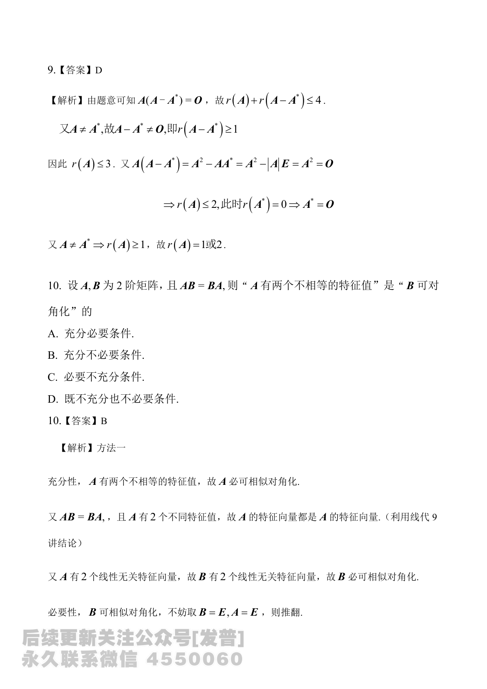

# 2024 数学二第 9 题

## 题目

设 $A$ 为 $4$ 阶矩阵，$A^*$ 为 $A$ 的伴随矩阵，若 $A(A-A^*)=O$，且 $A\ne A^*$，则 $r(A)$ 的可能取值为

(A) 0 或 1

(B) 1 或 3

(C) 2 或 3

(D) 1 或 2

## 标准答案

D

## 解析

由题意
$$
A(A-A^*)=O,
$$
故
$$
r(A)+r(A-A^*)\le 4.
$$
又因为 $A\ne A^*$，所以 $A-A^*\ne O$，从而
$$
r(A-A^*)\ge 1,
$$
于是
$$
r(A)\le 3.
$$

另一方面，
$$
A(A-A^*)=A^2-AA^*=A^2-|A|E=0.
$$
若 $r(A)=3$，则 $A^*=0$，从而 $A^2=0$，这与 $r(A)=3$ 矛盾，所以 $r(A)\ne 3$。

因而 $r(A)\le 2$。又由 $A\ne A^*$ 可知 $A\ne O$，所以
$$
r(A)\ge 1.
$$
故 $r(A)$ 只能取 $1$ 或 $2$，选 $D$。

## 来源

- 题目来源：`math2_2024_questions.md`
- 答案来源：`math2_2024_answers.md`
