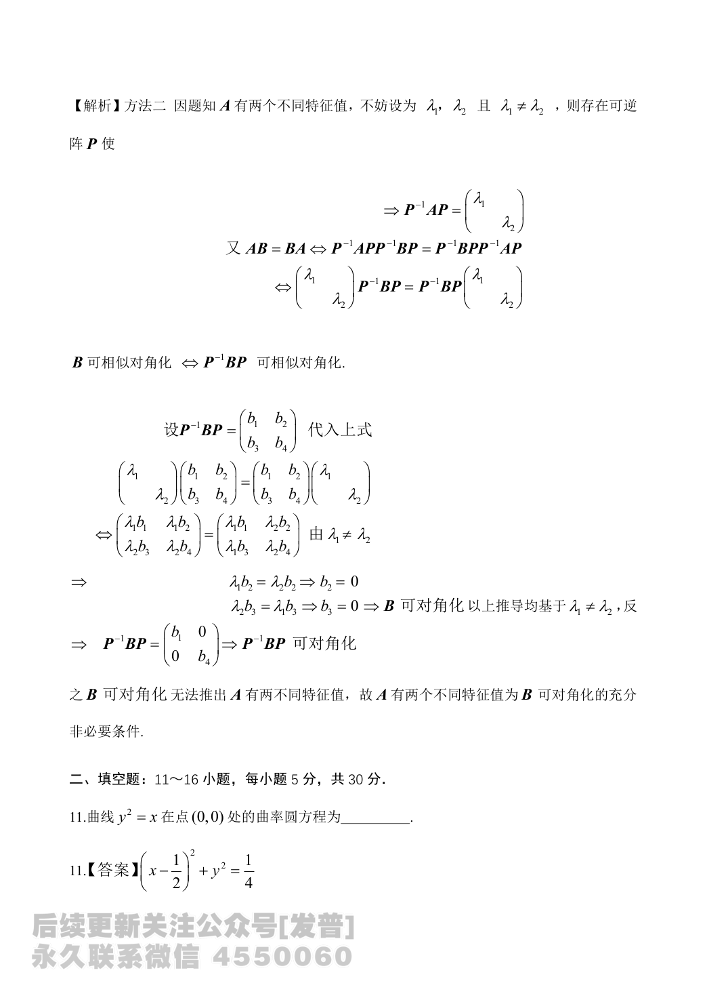

# 2024 数学二第 11 题

## 题目

曲线 $y^2=x$ 在点 $(0,0)$ 处的曲率圆方程为 \underline{\qquad} 。

## 标准答案

$\left(x-\dfrac12\right)^2+y^2=\dfrac14$

## 解析

将曲线改写为
$$
x=y^2.
$$
在点 $(0,0)$ 处有
$$
x'(y)=2y,\qquad x''(y)=2.
$$
曲率为
$$
k=\frac{|x''|}{\bigl(1+(x')^2\bigr)^{3/2}}=2,
$$
故曲率半径
$$
R=\frac{1}{k}=\frac12.
$$
由图形可知曲率圆圆心为 $\left(\dfrac12,0\right)$，因此曲率圆方程是
$$
\left(x-\frac12\right)^2+y^2=\frac14.
$$

## 来源

- 题目来源：`math2_2024_questions.md`
- 答案来源：`math2_2024_answers.md`
