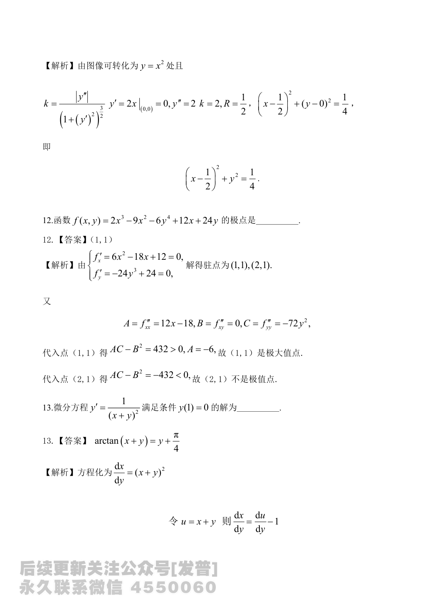

# 2024 数学二第 13 题

## 题目

微分方程
$$
y'=\frac{1}{(x+y)^2}
$$
满足初始条件 $y(1)=0$ 的解为 ________ 。

## 标准答案

$\arctan(x+y)=y+\dfrac{\pi}{4}$

## 解析

将方程改写为
$$
\frac{dx}{dy}=(x+y)^2.
$$
令
$$
u=x+y,
$$
则
$$
\frac{dx}{dy}=\frac{du}{dy}-1.
$$
因而
$$
\frac{du}{dy}=u^2+1.
$$
分离变量得
$$
\int\frac{1}{u^2+1}\,du=\int dy,
$$
即
$$
\arctan u=y+c.
$$
代入初值 $x=1,\ y=0$，此时 $u=1$，得
$$
c=\frac{\pi}{4}.
$$
所以解为
$$
\arctan(x+y)=y+\frac{\pi}{4}.
$$

## 来源

- 题目来源：`math2_2024_questions.md`
- 答案来源：`math2_2024_answers.md`
