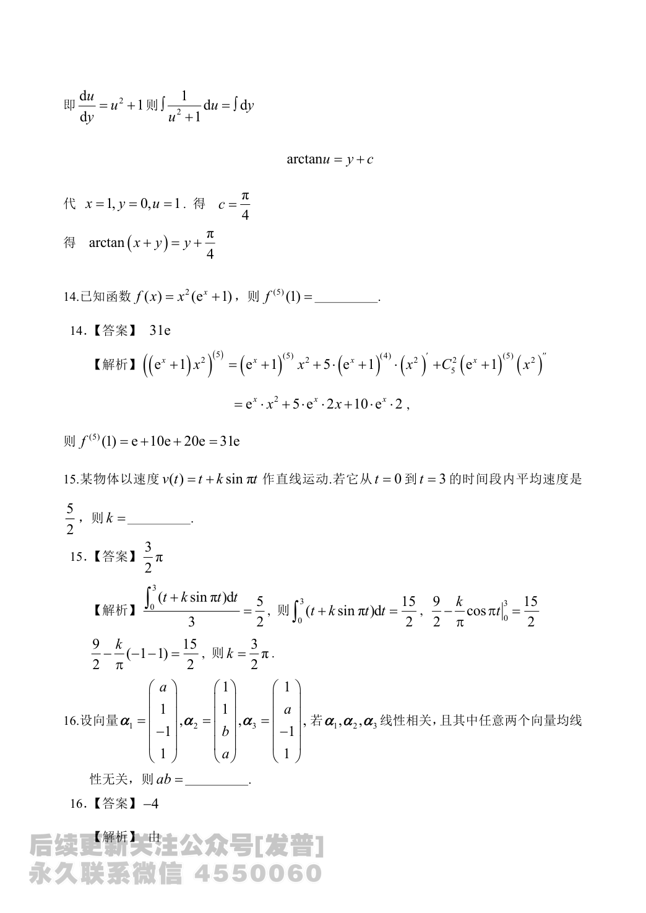
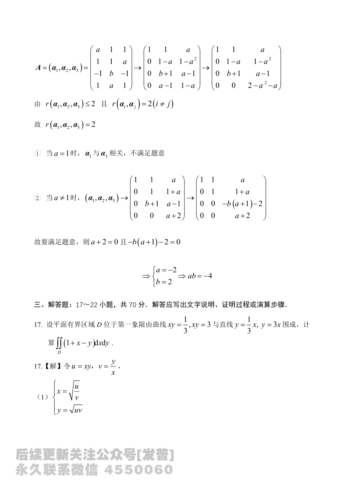

# 2024 数学二第 16 题

## 题目

设向量
$$
\alpha_1=\begin{pmatrix}a\\1\\-1\\1\end{pmatrix},\quad
\alpha_2=\begin{pmatrix}1\\1\\b\\a\end{pmatrix},\quad
\alpha_3=\begin{pmatrix}1\\a\\-1\\1\end{pmatrix},
$$
若 $\alpha_1,\alpha_2,\alpha_3$ 线性相关，且其中任意两个向量均线性无关，则
$$
ab=
$$
________ 。

## 标准答案

$-4$

## 解析

记
$$
A=(\alpha_1,\alpha_2,\alpha_3)
=\begin{pmatrix}
a&1&1\\
1&1&a\\
-1&b&-1\\
1&a&1
\end{pmatrix}.
$$
由题意知 $r(\alpha_1,\alpha_2,\alpha_3)\le 2$，且任意两向量线性无关，所以
$$
r(\alpha_i,\alpha_j)=2\quad(i\ne j).
$$

先化简可得
$$
\begin{pmatrix}
1&1&a\\
0&1&1+a\\
0&b+1&a-1\\
0&0&a+2
\end{pmatrix}.
$$
若 $a=1$，则 $\alpha_1$ 与 $\alpha_3$ 相关，不合题意。

当 $a\ne1$ 时，由线性相关得
$$
a+2=0,\qquad -b(a+1)-2=0.
$$
解得
$$
a=-2,\qquad b=2.
$$
故
$$
ab=-4.
$$

## 来源

- 题目来源：`math2_2024_questions.md`
- 答案来源：`math2_2024_answers.md`
