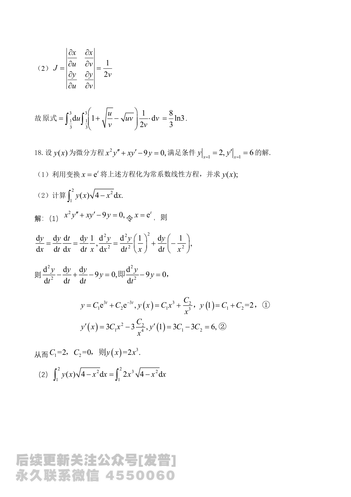

# 2024 数学二第 17 题

## 题目

设平面有界区域 $D$ 位于第一象限，由曲线 $xy=\dfrac13$，$xy=3$ 与直线 $y=\dfrac13x$，$y=3x$ 围成，计算
$$
\iint_D(1+x-y)\,dxdy.
$$

## 标准答案

$\dfrac{8}{3}\ln 3$

## 解析

令
$$
u=xy,\qquad v=\frac{y}{x}.
$$
则
$$
x=\sqrt{\frac{u}{v}},\qquad y=\sqrt{uv}.
$$
雅可比行列式为
$$
J=\left|\frac{\partial(x,y)}{\partial(u,v)}\right|=\frac{1}{2v}.
$$

由边界条件知
$$
\frac13\le u\le 3,\qquad \frac13\le v\le 3.
$$
原积分化为
$$
\int_{1/3}^3du\int_{1/3}^3\left(1+\sqrt{\frac{u}{v}}-\sqrt{uv}\right)\frac{1}{2v}\,dv.
$$
计算后得
$$
\iint_D(1+x-y)\,dxdy=\frac{8}{3}\ln 3.
$$

## 来源

- 题目来源：`math2_2024_questions.md`
- 答案来源：`math2_2024_answers.md`
