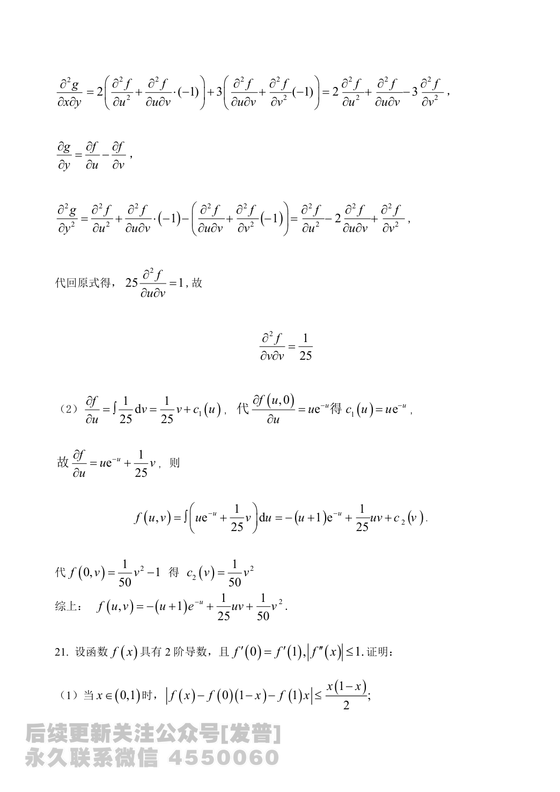
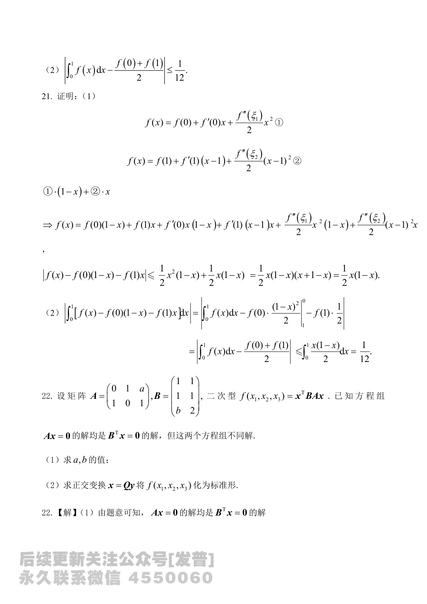

# 2024 数学二第 20 题

## 题目

已知函数 $f(u,v)$ 具有 $2$ 阶连续偏导，且函数
$$
g(x,y)=f(2x+y,3x-y)
$$
满足
$$
\frac{\partial^2g}{\partial x^2}
+\frac{\partial^2g}{\partial x\partial y}
-6\frac{\partial^2g}{\partial y^2}=1.
$$

(1) 求 $\dfrac{\partial^2f}{\partial u\partial v}$；

(2) 若 $\dfrac{\partial f(u,0)}{\partial u}=ue^{-u}$，且 $f(0,v)=\dfrac{1}{50}v^2-1$，求 $f(u,v)$ 的表达式。

## 标准答案

(1) $\displaystyle \frac{\partial^2f}{\partial u\partial v}=\frac{1}{25}$

(2) $\displaystyle f(u,v)=-(u+1)e^{-u}+\frac{1}{25}uv+\frac{1}{50}v^2$

## 解析

设
$$
u=2x+y,\qquad v=3x-y.
$$
则由链式法则
$$
g_x=2f_u+3f_v,\qquad g_y=f_u-f_v.
$$
进一步有
$$
g_{xx}=4f_{uu}+12f_{uv}+9f_{vv},
$$
$$
g_{xy}=2f_{uu}+f_{uv}-3f_{vv},
$$
$$
g_{yy}=f_{uu}-2f_{uv}+f_{vv}.
$$
代入条件得
$$
g_{xx}+g_{xy}-6g_{yy}=25f_{uv}=1,
$$
所以
$$
f_{uv}=\frac{1}{25}.
$$

对 $v$ 积分，
$$
f_u=\int \frac{1}{25}\,dv=\frac{1}{25}v+c_1(u).
$$
由
$$
f_u(u,0)=ue^{-u}
$$
得
$$
c_1(u)=ue^{-u},
$$
因而
$$
f_u=ue^{-u}+\frac{1}{25}v.
$$
再对 $u$ 积分，
$$
f(u,v)=\int\left(ue^{-u}+\frac{1}{25}v\right)\,du
=-(u+1)e^{-u}+\frac{1}{25}uv+c_2(v).
$$
利用
$$
f(0,v)=\frac{1}{50}v^2-1
$$
可得
$$
c_2(v)=\frac{1}{50}v^2.
$$
故
$$
f(u,v)=-(u+1)e^{-u}+\frac{1}{25}uv+\frac{1}{50}v^2.
$$

## 来源

- 题目来源：`math2_2024_questions.md`
- 答案来源：`math2_2024_answers.md`
