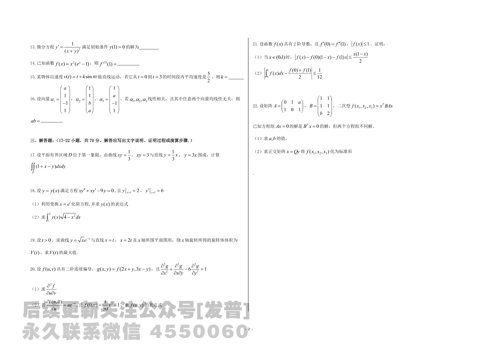
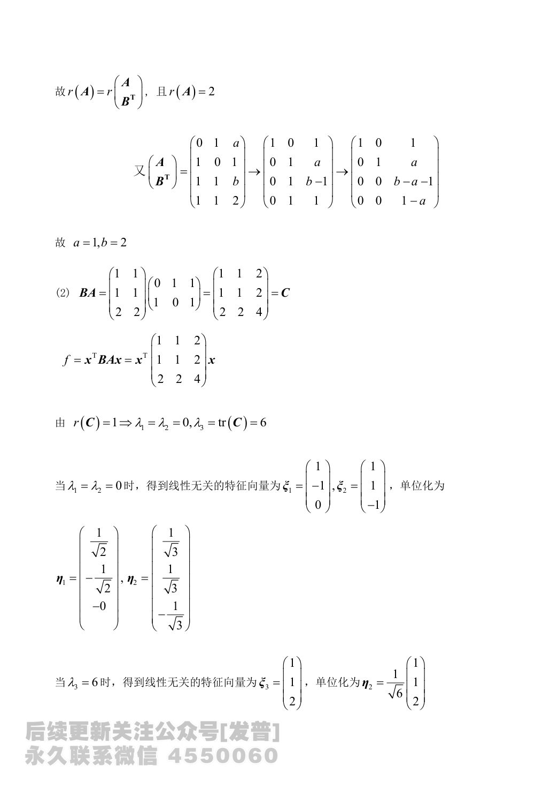
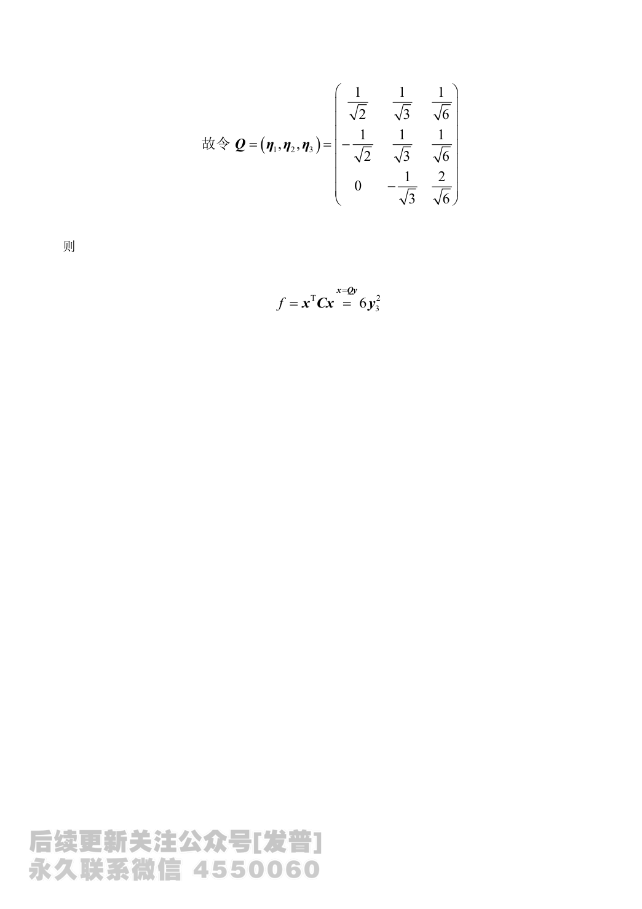

# 2024 数学二第 22 题

## 题目

设矩阵
$$
A=\begin{pmatrix}
0&1&a\\
1&0&1
\end{pmatrix},\qquad
B=\begin{pmatrix}
1&1\\
1&1\\
b&2
\end{pmatrix},
$$
二次型 $f(x_1,x_2,x_3)=x^{\mathsf T}BAx$。已知方程组 $Ax=0$ 的解是 $B^{\mathsf T}x=0$ 的解，但两个方程组不同解。

(1) 求 $a,b$ 的值；

(2) 求正交矩阵 $x=Qy$ 将 $f(x_1,x_2,x_3)$ 化为标准形。

## 标准答案

(1) $a=1,\ b=2$

(2) 标准形为 $6y_3^2$

## 解析

由题意可知，$Ax=0$ 的解均为 $B^{\mathsf T}x=0$ 的解，因此
$$
r(A)=r\binom{A}{B^{\mathsf T}}.
$$
又因为 $A$ 为 $2\times3$ 矩阵，且两个方程组不同解，所以
$$
r(A)=2.
$$
将
$$
\binom{A}{B^{\mathsf T}}
=
\begin{pmatrix}
0&1&a\\
1&0&1\\
1&1&b\\
1&1&2
\end{pmatrix}
$$
作初等行变换，可化为
$$
\begin{pmatrix}
1&0&1\\
0&1&a\\
0&0&b-a-1\\
0&0&1-a
\end{pmatrix}.
$$
由秩等于 $2$，得
$$
1-a=0,\qquad b-a-1=0,
$$
即
$$
a=1,\qquad b=2.
$$

此时
$$
BA=
\begin{pmatrix}
1&1\\
1&1\\
2&2
\end{pmatrix}
\begin{pmatrix}
0&1&1\\
1&0&1
\end{pmatrix}
=
\begin{pmatrix}
1&1&2\\
1&1&2\\
2&2&4
\end{pmatrix}
=C.
$$
所以
$$
f=x^{\mathsf T}Cx.
$$
由 $r(C)=1$，知其特征值为
$$
\lambda_1=\lambda_2=0,\qquad \lambda_3=\operatorname{tr}(C)=6.
$$
当 $\lambda=0$ 时，可取两个线性无关特征向量
$$
\xi_1=(1,-1,0)^{\mathsf T},\qquad \xi_2=(1,1,-1)^{\mathsf T},
$$
单位化得
$$
\eta_1=\frac{1}{\sqrt2}(1,-1,0)^{\mathsf T},\qquad
\eta_2=\frac{1}{\sqrt3}(1,1,-1)^{\mathsf T}.
$$
当 $\lambda=6$ 时，可取特征向量
$$
\xi_3=(1,1,2)^{\mathsf T},
$$
单位化得
$$
\eta_3=\frac{1}{\sqrt6}(1,1,2)^{\mathsf T}.
$$
取正交矩阵
$$
Q=(\eta_1,\eta_2,\eta_3)
=
\begin{pmatrix}
\frac{1}{\sqrt2}&\frac{1}{\sqrt3}&\frac{1}{\sqrt6}\\
-\frac{1}{\sqrt2}&\frac{1}{\sqrt3}&\frac{1}{\sqrt6}\\
0&-\frac{1}{\sqrt3}&\frac{2}{\sqrt6}
\end{pmatrix},
$$
则在变换 $x=Qy$ 下，
$$
f=x^{\mathsf T}Cx=6y_3^2.
$$

## 来源

- 题目来源：`math2_2024_questions.md`
- 答案来源：`math2_2024_answers.md`
