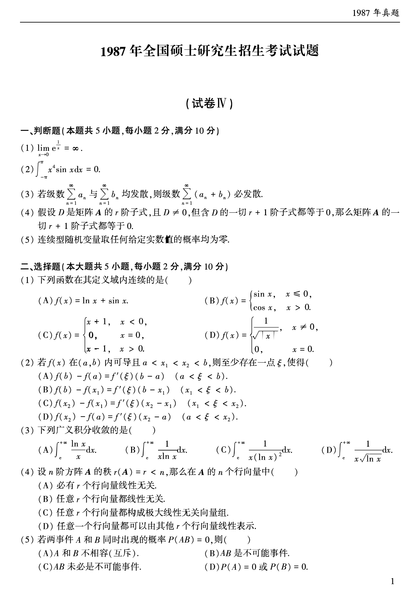
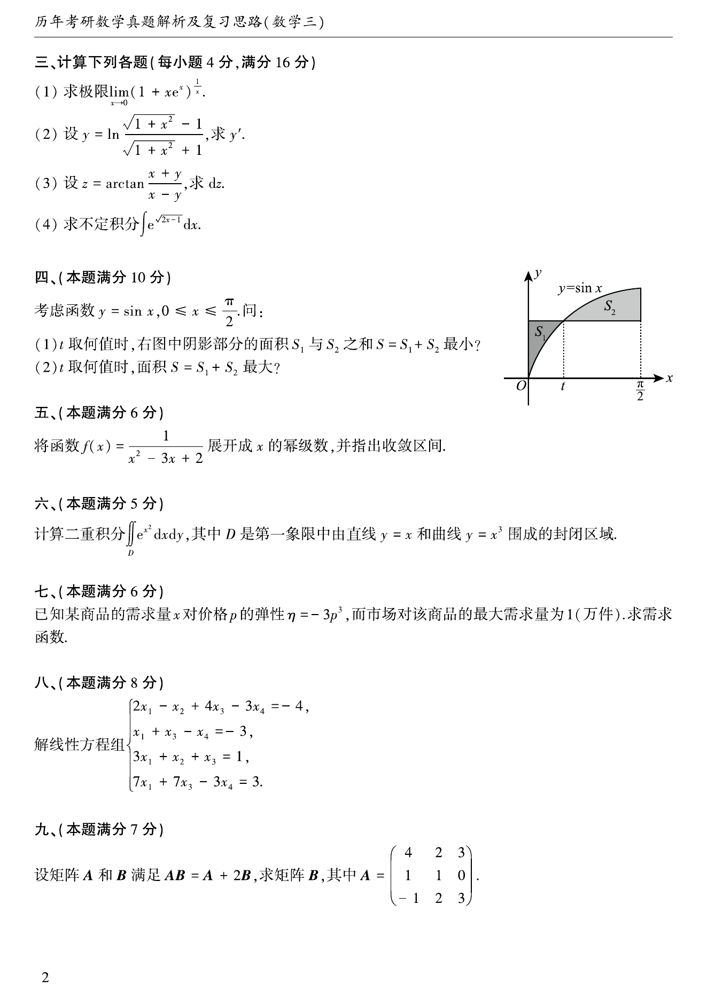
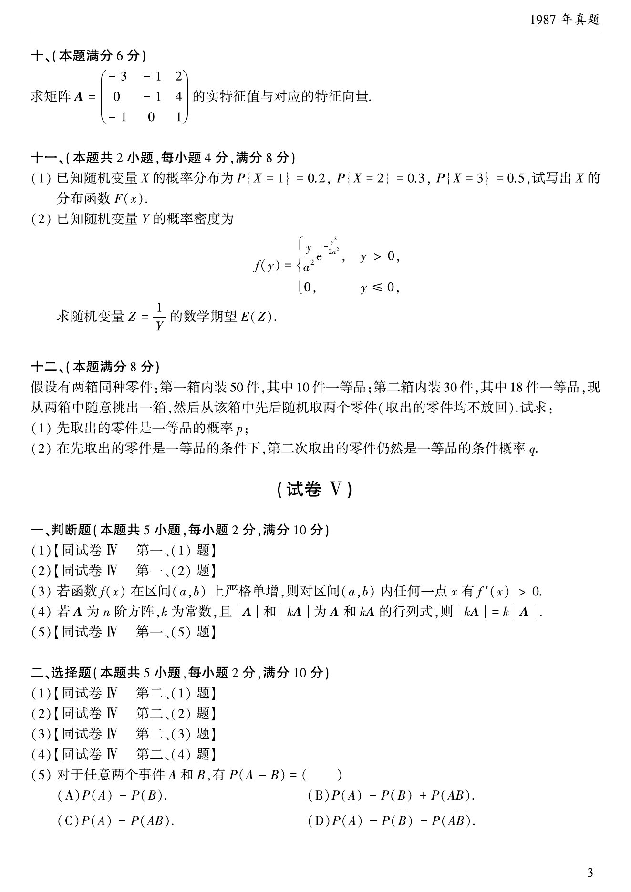
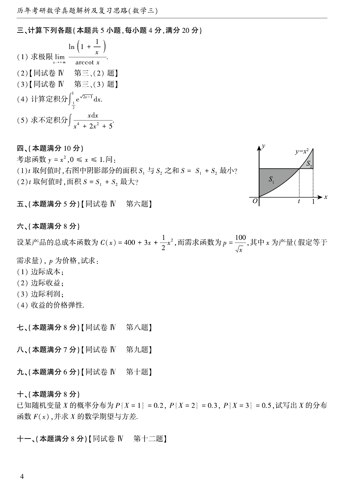
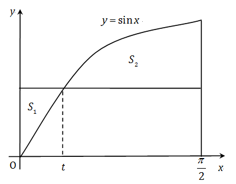

# 1987 年考研数学三真题

资料类型：考研数学三历年真题
年份：1987
科目：数学三
整理状态：TeX 题干源整理，答案解析 PDF 文本层拆分

## 原卷页图

## 判断题（本题满分10分，每小题2分）

### 第 1 题

- 题型：判断题
- 题号：1
- 分值：2
- 模块：高等数学
- 校对状态：已按 TeX 源整理

$\lim_{x \to 0} \mathrm{e}^{\tfrac{1}{x}} = \infty$．（ ）

### 第 2 题

- 题型：判断题
- 题号：2
- 分值：2
- 模块：高等数学
- 校对状态：已按 TeX 源整理

$\int_{-\pi}^{\pi} x^4\sin x\,\mathrm{d}x = 0$．（ ）

### 第 3 题

- 题型：判断题
- 题号：3
- 分值：2
- 模块：高等数学
- 校对状态：已按 TeX 源整理

若级数$\sum_{n = 1}^{\infty}a_n$和$\sum_{n = 1}^{\infty}b_n$均发散，
则级数$\sum_{n = 1}^{\infty}(a_n + b_n)$也必发散．（ ）

### 第 4 题

- 题型：判断题
- 题号：4
- 分值：2
- 模块：线性代数
- 校对状态：已按 TeX 源整理

假设$D$是矩阵$A$的$r$阶子式，且$D \ne 0$，但含$D$的一切$r + 1$阶子式都等于$0$，
那么矩阵$A$的一切$r + 1$阶子式都等于$0$．（ ）

### 第 5 题

- 题型：判断题
- 题号：5
- 分值：2
- 模块：概率统计
- 校对状态：已按 TeX 源整理

连续型随机变量取任何给定实数值的概率都等于$0$．（ ）

## 选择题（本题满分10分，每小题2分）

### 第 6 题

- 题型：选择题
- 题号：6
- 分值：2
- 模块：高等数学
- 校对状态：已按 TeX 源整理

函数（ ）在其定义域内连续．

A. $f(x) = \ln x + \sin x$

B. $f(x) = \begin{cases}
\sin x, & x \le 0, \\
\cos x, & x > 0 \\
\end{cases}$

C. $f(x) = \begin{cases}
x + 1, & x < 0, \\
0, & x = 0, \\
x - 1, & x > 0 \\
\end{cases}$

D. $f(x) = \begin{cases}
\frac{1}{\sqrt{|x|}}, & x \ne 0, \\
0, & x = 0 \\
\end{cases}$

### 第 7 题

- 题型：选择题
- 题号：7
- 分值：2
- 模块：高等数学
- 校对状态：已按 TeX 源整理

若函数$f(x)$在区间$(a,b)$内可导，$x_1$和$x_2$是区间$(a,b)$内任意两点，
且$x_1 < x_2$，则至少存在一点$\xi$，使（ ）

A. $f(b) - f(a) = f'(\xi)(b - a)$，其中$a < \xi < b$．

B. $f(b) - f(x_1) = f'(\xi)(b - x_1)$，其中$x_1 < \xi < b$．

C. $f(x_2) - f(x_1) = f'(\xi)(x_2 - x_1)$，其中$x_1 < \xi < x_2$．

D. $f(x_2) - f(a) = f'(\xi)(x_2 - a)$，其中$a < \xi < x_2$．

### 第 8 题

- 题型：选择题
- 题号：8
- 分值：2
- 模块：高等数学
- 校对状态：已按 TeX 源整理

广义积分（ ）收敛．

A. $\int_{\mathrm{e}}^{+\infty} \frac{\ln x}{x}\,\mathrm{d}x$．

B. $\int_{\mathrm{e}}^{+\infty} \frac{\,\mathrm{d}x}{x\ln x}$．

C. $\int_{\mathrm{e}}^{+\infty} \frac{\,\mathrm{d}x}{x(\ln x)^2}$．

D. $\int_{\mathrm{e}}^{+\infty} \frac{\,\mathrm{d}x}{x\sqrt{\ln x}}$．

### 第 9 题

- 题型：选择题
- 题号：9
- 分值：2
- 模块：线性代数
- 校对状态：已按 TeX 源整理

假设$A$是$n$阶方阵，其秩$r<n$，那么在$A$的$n$个行向量中（ ）

A. 必有$r$个行向量线性无关．

B. 任意$r$个行向量都线性无关．

C. 任意$r$个行向量都构成极大线性无关向量组．

D. 任意$r$个行向量都可以由其他$r$个行向量线性表示．

### 第 10 题

- 题型：选择题
- 题号：10
- 分值：2
- 模块：概率统计
- 校对状态：已按 TeX 源整理

若二事件$A$和$B$同时出现的概率$P(AB)=0$，则（ ）

A. $A$和$B$不相容（相斥）．

B. $AB$是不可能事件．

C. $AB$未必是不可能事件．

D. $P(A) = 0$或$P(B) = 0$．

## 计算题（本题满分16分，每小题4分）

### 第 11 题

- 题型：解答题
- 题号：11
- 分值：4
- 模块：高等数学
- 校对状态：已按 TeX 源整理

求极限$\lim_{x \to 0} (1 + x\mathrm{e}^x)^{\tfrac{1}{x}}$．

### 第 12 题

- 题型：解答题
- 题号：12
- 分值：4
- 模块：高等数学
- 校对状态：已按 TeX 源整理

$y = \ln \frac{\sqrt{1 + x^2} - 1}{\sqrt{1 + x^2} + 1}$，求$y'$．

### 第 13 题

- 题型：解答题
- 题号：13
- 分值：4
- 模块：高等数学
- 校对状态：已按 TeX 源整理

$z = \arctan \frac{x + y}{x - y}$，求$\,\mathrm{d}z$．

### 第 14 题

- 题型：解答题
- 题号：14
- 分值：4
- 模块：高等数学
- 校对状态：已按 TeX 源整理

求不定积分$\int \mathrm{e}^{\sqrt{2x - 1}} \,\mathrm{d}x$．

## 第 4 部分（本题满分10分）

### 第 15 题

- 题型：解答题
- 题号：15
- 分值：10
- 模块：高等数学
- 校对状态：已按 TeX 源整理

考虑函数$y = \sin x$, $0 \le x \le \frac{\pi}{2}$（如图），问：

1. $t$取何值时，图中阴影部分的面积$S_1$与$S_2$之和$S = S_1 + S_2$最小？
2. $t$取何值时，面积$S = S_1 + S_2$最大？

## 第 5 部分（本题满分6分）

### 第 16 题

- 题型：解答题
- 题号：16
- 分值：6
- 模块：高等数学
- 校对状态：已按 TeX 源整理

将函数$f(x) = \frac{1}{x^2 - 3x + 2}$ 展成$x$的幂级数，并指出其收敛区间．

## 第 6 部分（本题满分5分）

### 第 17 题

- 题型：解答题
- 题号：17
- 分值：5
- 模块：高等数学
- 校对状态：已按 TeX 源整理

计算二重积分$I =\iint_D \mathrm{e}^{x^2} \,\mathrm{d}x\,\mathrm{d}y$，
其中$D$是第一象限中由直线$y=x$和$y=x^3$所围成的封闭区域．

## 第 7 部分（本题满分6分）

### 第 18 题

- 题型：解答题
- 题号：18
- 分值：6
- 模块：高等数学
- 校对状态：已按 TeX 源整理

已知某商品的需求量$x$对价格$p$的弹性为$\eta = -3p^3$，
而市场对该商品的最大需求量为$1$（万件），求需求函数．

## 第 8 部分（本题满分8分）

### 第 19 题

- 题型：解答题
- 题号：19
- 分值：8
- 模块：线性代数
- 校对状态：已按 TeX 源整理

解线性方程组$\begin{cases}
2x_1-x_2+4x_3-3x_4=-4, \\
x_1+x_3-x_4=-3,\\
3x_1+x_2+x_3=1,\\
7x_1+7x_3-3x_4=3.
\end{cases}$

## 第 9 部分（本题满分7分）

### 第 20 题

- 题型：解答题
- 题号：20
- 分值：7
- 模块：线性代数
- 校对状态：已按 TeX 源整理

假设矩阵$A$和$B$满足如下关系式$AB = A + 2B$，其中$A = \begin{pmatrix}
4 & 2 & 3 \\
1 & 1 & 0 \\
-1 & 2 & 3
\end{pmatrix}$，求矩阵$B$．

## 第 10 部分（本题满分6分）

### 第 21 题

- 题型：解答题
- 题号：21
- 分值：6
- 模块：线性代数
- 校对状态：已按 TeX 源整理

求矩阵$A = \begin{pmatrix}
-3 & -1 & 2 \\
0 & -1 & 4 \\
-1 & 0 & 1
\end{pmatrix}$的实特征值及对应的特征向量．

## 计算题（本题满分8分，每小题4分）

### 第 22 题

- 题型：解答题
- 题号：22
- 分值：4
- 模块：概率统计
- 校对状态：已按 TeX 源整理

已知随机变量$X$的概率分布为
$$P\{X = 1\} = 0.2,\ P\{X = 2\} = 0.3,\ P\{X = 3\} = 0.5,$$
试写出其分布函数$F(x)$．

### 第 23 题

- 题型：解答题
- 题号：23
- 分值：4
- 模块：概率统计
- 校对状态：已按 TeX 源整理

已知随机变量$Y$的概率密度为$f(y) = \begin{cases}
\frac{y}{a^2}\mathrm{e}^{-\frac{u^2}{a^2}}, & y > 0, \\
0, & y \le 0,
\end{cases}$ 求随机变量$Z=\frac{1}{Y}$的数学期望$EZ$．

## 第 12 部分（本题满分8分）

### 第 24 题

- 题型：解答题
- 题号：24
- 分值：8
- 模块：概率统计
- 校对状态：已按 TeX 源整理

假设有两箱同种零件：第一箱内装$50$件，其中$10$件一等品；第二箱内装$30$件，其中$18$件一等品，
现从两箱中任意挑出一箱，然后从该箱中先后随机取出两个零件（取出的零件均不放回）．试求：

1. 先取出的零件是一等品的概率$p$；
2. 在先取出的是一等品的条件下，第二次取出的零件仍然是一等品的条件概率$q$．
