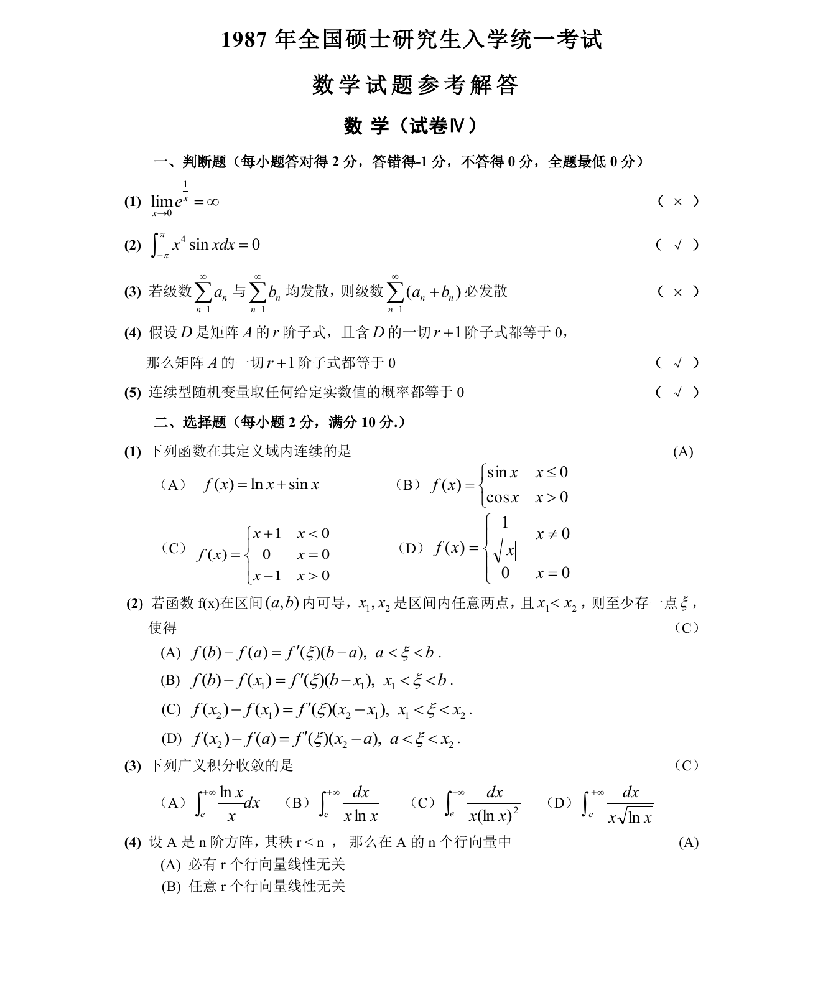

# 1987 数学三第 7 题

## 题目

若函数$f(x)$在区间$(a,b)$内可导，$x_1$和$x_2$是区间$(a,b)$内任意两点，
且$x_1 < x_2$，则至少存在一点$\xi$，使（ ）

A. $f(b) - f(a) = f'(\xi)(b - a)$，其中$a < \xi < b$．

B. $f(b) - f(x_1) = f'(\xi)(b - x_1)$，其中$x_1 < \xi < b$．

C. $f(x_2) - f(x_1) = f'(\xi)(x_2 - x_1)$，其中$x_1 < \xi < x_2$．

D. $f(x_2) - f(a) = f'(\xi)(x_2 - a)$，其中$a < \xi < x_2$．

## 标准答案

C

## 解析

答案为 C。解析见下方答案解析页图；PDF 文本层公式不稳定，未直接转写为 LaTeX。

## 答案解析页图

## 来源

- 题目来源：1987 年数学三 TeX 试卷源（试卷四）。
- 答案解析来源：1987数学三真题答案解析（试卷四）.pdf。
- 页面图只作为原卷/解析复核依据；题干正文已按 TeX 源整理为 LaTeX。
