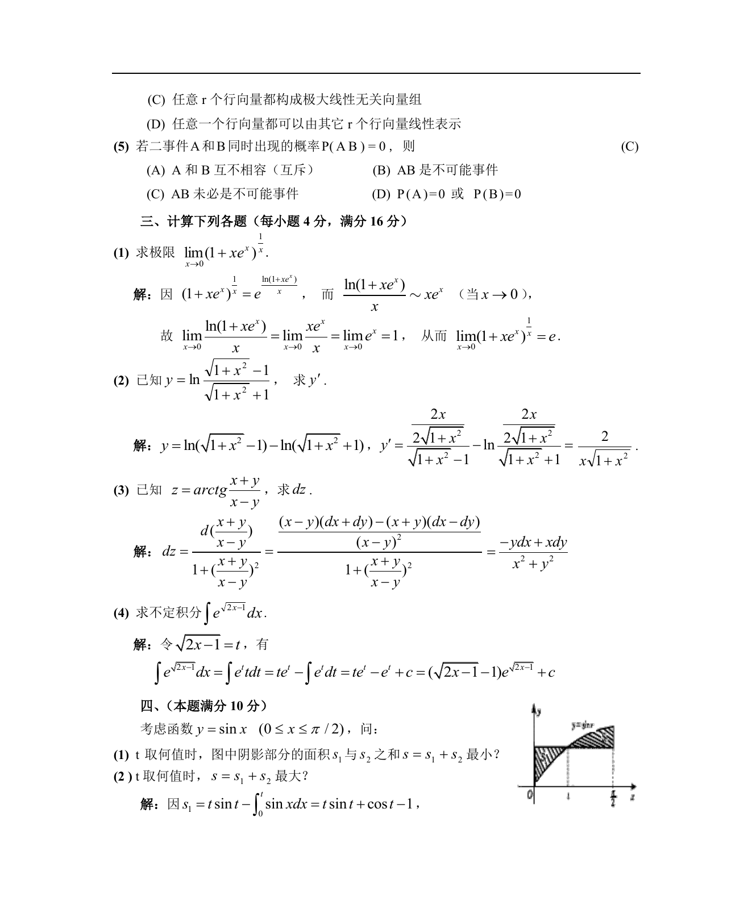

# 1987 数学三第 10 题

## 题目

若二事件$A$和$B$同时出现的概率$P(AB)=0$，则（ ）

A. $A$和$B$不相容（相斥）．

B. $AB$是不可能事件．

C. $AB$未必是不可能事件．

D. $P(A) = 0$或$P(B) = 0$．

## 标准答案

C

## 解析

答案为 C。解析见下方答案解析页图；PDF 文本层公式不稳定，未直接转写为 LaTeX。

## 答案解析页图

## 来源

- 题目来源：1987 年数学三 TeX 试卷源（试卷四）。
- 答案解析来源：1987数学三真题答案解析（试卷四）.pdf。
- 页面图只作为原卷/解析复核依据；题干正文已按 TeX 源整理为 LaTeX。
