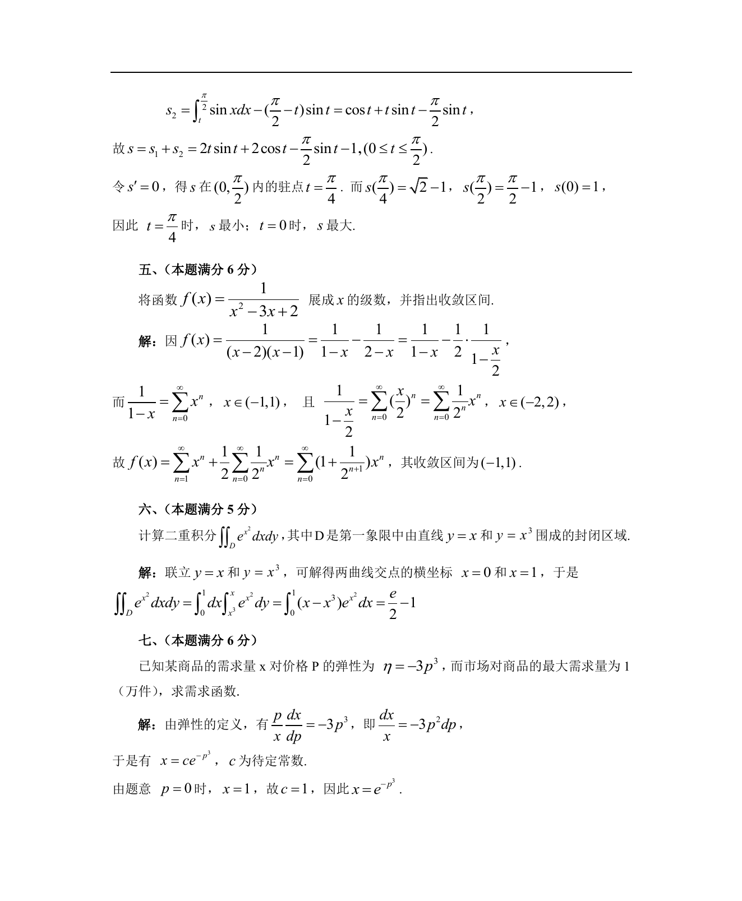

# 1987 数学三第 17 题

## 题目

计算二重积分$I =\iint_D \mathrm{e}^{x^2} \,\mathrm{d}x\,\mathrm{d}y$，
其中$D$是第一象限中由直线$y=x$和$y=x^3$所围成的封闭区域．

## 标准答案

见答案解析页图

## 解析

解析见下方答案解析页图；PDF 文本层公式不稳定，未直接转写为 LaTeX。

## 答案解析页图

## 来源

- 题目来源：1987 年数学三 TeX 试卷源（试卷四）。
- 答案解析来源：1987数学三真题答案解析（试卷四）.pdf。
- 页面图只作为原卷/解析复核依据；题干正文已按 TeX 源整理为 LaTeX。
